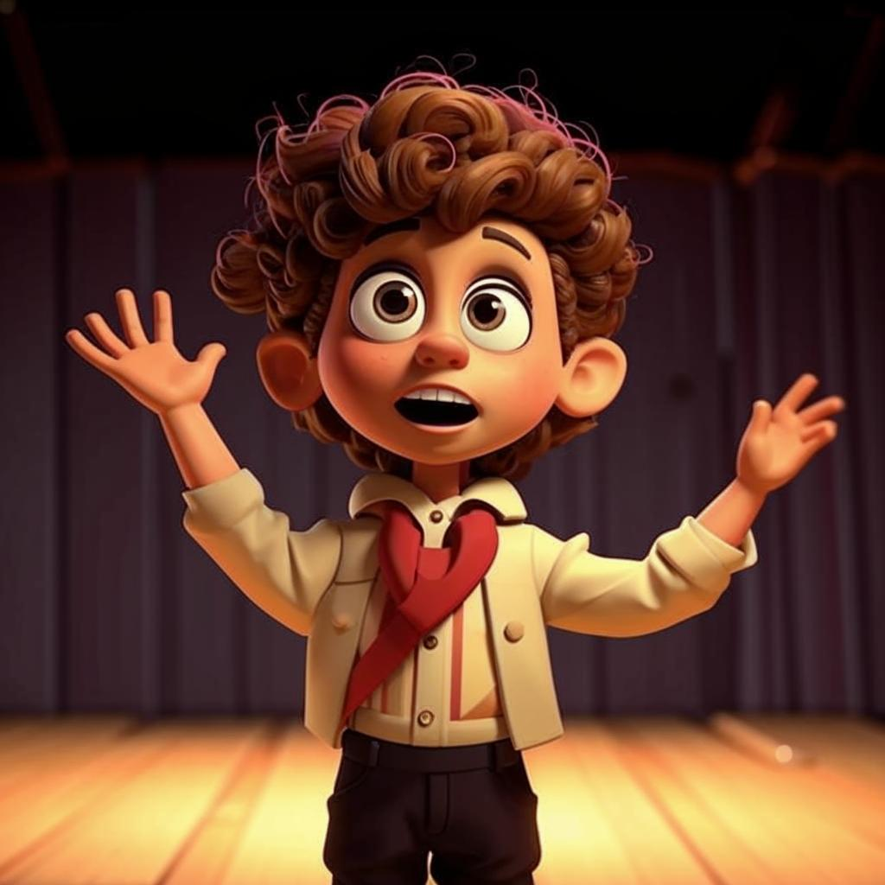

# **Актерское мастерство** 🎭

## Что такое актерское мастерство?

Актерское мастерство — это [искусство](хобби.md) перевоплощаться в разных персонажей, выражая эмоции через речь, жесты и мимику. Это возможность стать кем угодно: героем сказки, супергероем, учёным или даже животным! 🐱🦁

---

## Зачем нужно актерское мастерство?  

✨ Развивает уверенность в себе и умение выступать перед публикой.  
👂 Помогает лучше понимать чувства других людей.  
🧑‍🏫 Улучшает память и концентрацию внимания.  
🤝 Способствует развитию [творческих](творческие.md) способностей и [воображения](творческие.md).

---

## Как начать заниматься актерским мастерством?

Чтобы погрузиться в мир актёрского [искусства](хобби.md), необязательно сразу становиться звездой кино. Вот несколько простых шагов:

1. **Театральная студия**: Запишись в театральный кружок или студию рядом с [домом](домашние.md). Там тебе помогут освоить основы сценической речи, [движения](активные.md) и перевоплощений.

2. **Ролевые [игры](настольные_игры.md)**: Играй [дома](домашние.md) с друзьями в ролевые [игры](настольные_игры.md), где каждый примеряет разные роли. Например, устройте представление по любимой [книге](чтение.md) или мультфильму!

3. **Уроки импровизации**: Попробуй импровизировать вместе с [семьёй](домашние.md) или одноклассниками. Придумывайте истории прямо на ходу и разыгрывайте их.

4. **Просмотр спектаклей**: Посещай театры и смотри постановки. Обращай внимание на [игру](настольные_игры.md) актёров, их выражения лица и манеру говорить.

5. **Практика [дома](домашние.md)**: Репетируй сцены из [книг](чтение.md) или фильмов перед зеркалом. Пробуй менять голос, позы и выражение лица.

---

## Примеры из жизни

Представь, что ты играешь роль волшебника Гарри Поттера 🪄. Ты учишься произносить заклинания, создавать магические эффекты руками и вести диалоги с Драко Малфоем. Или представь, что ты героиня мультфильма «Холодное сердце», Эльза 💙. Тебе предстоит научиться петь [песни](музыка.md), управлять ледяной магией и преодолевать страхи.

---

## Известные личности

Многие знаменитости начинали свою карьеру именно с [занятий](хобби.md) актерским мастерством. Например:

- **Леонардо Ди Каприо** 🌊 стал известным благодаря ролям в фильмах «Титаник» и «Начало».
- **Эмма Уотсон** 📚 сыграла Гермиону Грейнджер в серии фильмов о Гарри Поттере.
- **Джонни Депп** 😇 получил известность после участия в фильме «Пираты Карибского моря».

---

## Положительные стороны и меры предосторожности

- Повышение самооценки и уверенности в себе.
- Освоение новых форм самовыражения.
- Возможность познакомиться с интересными людьми.
- Важно помнить о защите голоса (не кричать громко без подготовки).
- Следи за осанкой и дыханием во время репетиций.

---

## Заключение

Актерское мастерство открывает двери в удивительный мир [творчества](творческие.md) и эмоций. Оно помогает раскрыть внутренний потенциал и стать уверенным в любых ситуациях. Попробуй сам и почувствуй разницу! 🎉

---

*Теперь ты знаешь, как превратить своё [воображение](творческие.md) в реальность через актерское мастерство.* 🔥
