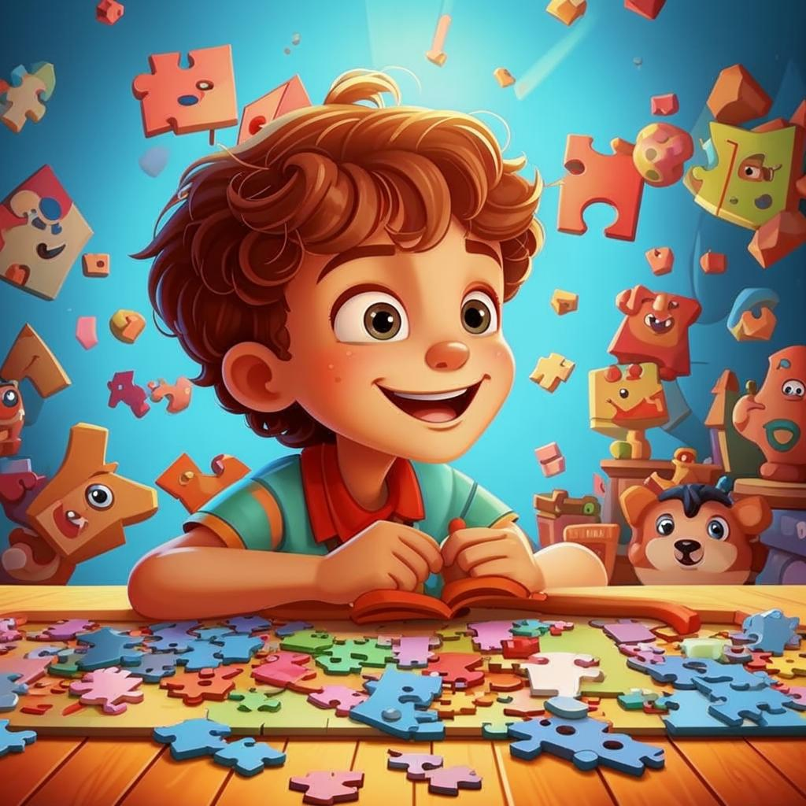

# **ИНТЕЛЛЕКТУАЛЬНЫЕ ХОББИ 🧠😎🔍**

## Что такое интеллектуальные хобби?

**Интеллектуальные [хобби](хобби.md)** — это такие [увлечения](хобби.md), которые помогают развивать мозг, тренируют память, внимание, логику и креативность. Это отличный способ стать умнее, интереснее и даже научиться решать проблемы быстрее!

---

## Почему важно заниматься интеллектуальными хобби?

### 💡 Мозг — наш главный инструмент

Заниматься интеллектуальными [хобби](хобби.md) полезно, потому что мозг работает точно так же, как мышцы: его нужно регулярно тренировать! Чем чаще мы думаем, ищем решения и учимся новому, тем сильнее становятся наши когнитивные способности.

### 📚 Знания расширяют границы мира

Чем больше знаешь, тем шире твой взгляд на мир. Можно понимать другие культуры, [науки](научные_эксперименты.md) и даже [технологии](конструирование.md). Это помогает находить новые [увлечения](хобби.md), друзей и интересные возможности в будущем.

### 😊 Весело и полезно одновременно

Не стоит думать, что учиться — это сложно и нудно. Многие интеллектуальные [хобби](хобби.md) невероятно увлекательны и захватывающие. Такие [занятия](хобби.md) делают жизнь ярче и интереснее!

---

## Примеры интеллектуальных хобби

- **[Чтение](чтение.md) 📚**: Погружайся в мир магии и приключений, исследуй будущее и [технологии](конструирование.md), узнавай о космосе и роботах!

- **[настольные игры](настольные_игры.md) 🎲**: Развивай стратегическе мышление и логику, работай в команде для достижения общей цели!

- **Научные эксперименты 🔬**: Смешивай вещества, изучай реакции, законы [природы](садоводство.md), проводи эксперименты с [механикой](конструирование.md), электричеством, оптикой!

- **[Конструирование](конструирование.md) 🧱**: Собирай модели по инструкциям и создавай самолеты, корабли, автомобили, а также собственные [конструкции](конструирование.md)!

- **[Видеоигры](видеоигры.md) 🎮**: Управляй виртуальным миром, погружайся в реалистичную среду!

---

## Как начать?

Вот несколько советов, чтобы погрузиться в интеллектуальное [хобби](хобби.md):

1. **Выбери интересное направление**. Подумай, что тебе [ближе](домашние.md) всего. Найди [занятие](хобби.md), которое тебя вдохновляет.

2. **Найди компанию единомышленников**. Вместе с друзьями играть в настолки или [проводить эксперименты](научные_эксперименты.md) гораздо веселее и продуктивнее.

3. **Используй современные ресурсы**. [Приложения](видеоигры.md) или онлайн-курсы помогут сделать процесс удобным и доступным.

4. **Ставь цели и отслеживай прогресс**. Важно видеть результаты своего труда. Начни с небольших целей и постепенно увеличивай сложность заданий.

5. **Наслаждайся процессом**. Не забывай получать удовольствие от самого процесса учёбы и размышлений. Иногда самое важное — это путь, а не конечный результат.

---

## Заключение

✨ Интеллектуальные [хобби](хобби.md) — это ключ к развитию ума, памяти и внимания. Занимайся ими, и твой мозг станет мощным инструментом для достижения любых целей. Главное — выбрать [занятие](хобби.md) по душе и наслаждаться каждым новым [открытием](научные_эксперименты.md)!

---

## Дополнительные заметки

- **Курсы/онлайн-ресурсы** — образовательные платформы, предлагающие уроки по различным дисциплинам.
- **Креативность ([творчество](творческие.md))** - это когда ты можешь придумать что-то новое и необычное.
- **Когнитивные способности (умственные)** - это всё, что помогает тебе думать, запоминать, учиться и решать задачки.
- **Стратегическое мышление (умение планировать)** - это когда ты умеешь думать на несколько шагов вперёд.
- **[Механика](конструирование.md) (как всё работает)** - это всё про то, как двигаются вещи, как они связаны друг с другом, и как они работают.
- **Электричество** - это энергия, которая бегает по проводам и заставляет работать разные приборы.
- **Оптика** - это всё про то, как свет себя ведёт, как он отражается, преломляется и помогает нам видеть.

---

*Запомни главное:* выбирай то, что интересно именно тебе, и пусть твои [увлечения](хобби.md) ведут тебя к успеху! 🌟🤝🏻❗️
