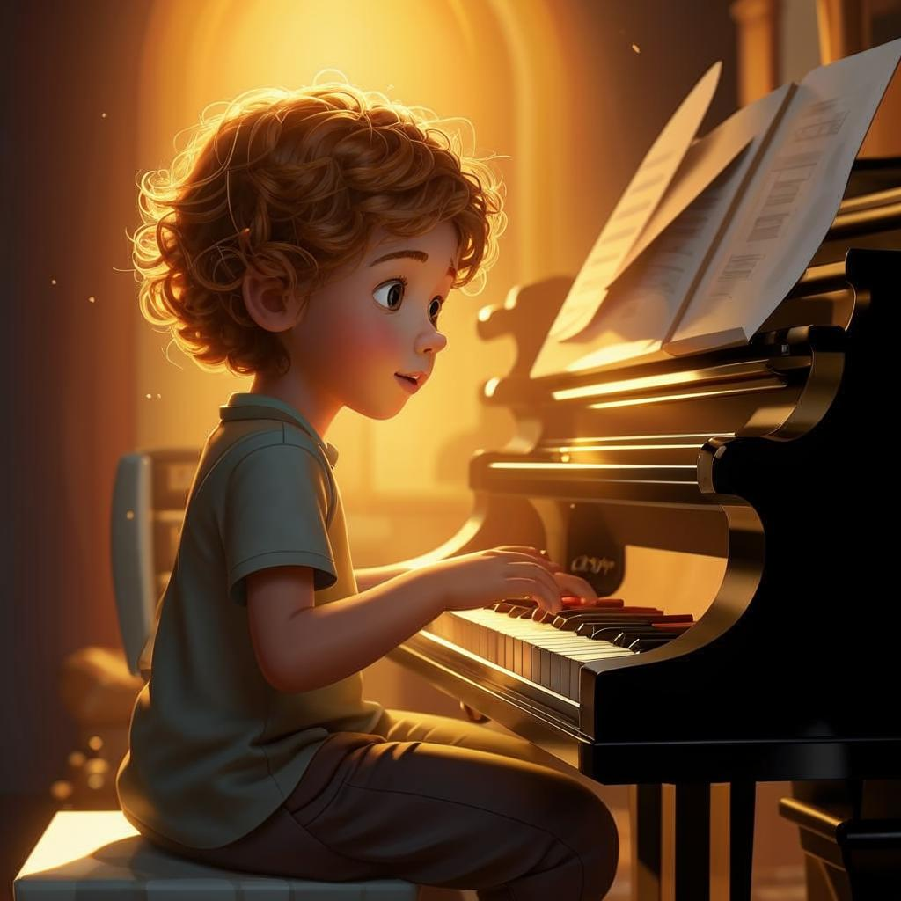

# **Музыкальное путешествие**

 

🎶💃🏽✨ Добро пожаловать в мир музыки! 🌟🎤

## Что такое музыка?

**Музыка** — это волшебный язык звуков, ритмов и мелодий, который способен передать чувства, эмоции и даже целые истории без единого слова. Она окружает нас повсюду: от песен, которые мы слышим по радио, до шумов [природы](садоводство.md), таких как пение птиц или шелест листьев 😍

Но знаете ли вы, что музыка — это не только удовольствие для слуха? Это настоящее [искусство](хобби.md), которое развивает [творческие](творческие.md) способности, улучшает настроение и помогает лучше понимать друг друга!

---

## Почему стоит заняться музыкой?

Вот несколько причин, почему музыка — отличное [занятие](хобби.md) для любого ребёнка (и взрослого тоже):

- **Развивает [мозг](интеллектуальные.md)**: [Игра](настольные_игры.md) на музыкальных инструментах активизирует разные части [мозга](интеллектуальные.md), улучшая память, координацию [движений](активные.md) и концентрацию внимания. 🧠
  
- **Учит терпению и упорству**: Чтобы научиться играть мелодию или песню, нужно [тренироваться](спорт.md) каждый день. Этот процесс учит дисциплине и настойчивости. 🔊

- **Дарит радость**: Создание собственной музыки приносит огромное удовлетворение и счастье. Ты можешь делиться своими [творческими](творческие.md) успехами с друзьями и [семьёй](домашние.md). ❤️

- **Помогает выражать эмоции**: Иногда сложно сказать словами, что чувствуешь внутри. Но музыка позволяет выразить эти чувства через звуки и ритм. 🎵

---

## Как начать своё музыкальное приключение?

### Изучай инструменты

Попробуй освоить какой-нибудь музыкальный инструмент! Вот несколько популярных вариантов:

- **Гитара**: Классика жанра. Можно учиться играть любимые песни прямо [дома](домашние.md). 🎸
- **Фортепиано**: Один из самых универсальных инструментов. Помогает развить слух и чувство гармонии. 🎹
- **Барабаны**: Если тебе нравятся сильные ритмы, барабаны — отличный выбор! 🏆

### Пой

Даже если кажется, что петь не получается сразу, не сдавайся! Пение — это уникальный способ самовыражения и отличная возможность развивать голосовые данные. Попробуй караоке или запишись в хор. 🗣️

---

## Известные музыканты 🌟

Некоторые известные личности добились больших успехов благодаря своему таланту и упорству:

- **Фредди Меркьюри**, лидер группы Queen, стал иконой рока благодаря уникальному стилю исполнения и харизме.
- **Майкл Джексон** прославился своими хитами и танцевальными [движениями](активные.md), став королём поп-музыки.
- **Бейонсе** вдохновляет миллионы девушек своим голосом и уверенностью в себе.

---

## Заключение

🎶📚🌈 Заниматься музыкой — значит открыть для себя целый новый мир эмоций, [творчества](творческие.md) и возможностей. Неважно, выберешь ты гитару, фортепиано или вокал, главное — получать удовольствие от процесса и наслаждаться каждым звуком, который создаёшь сам. Пусть музыка станет твоим верным спутником на пути к новым [открытиям](научные_эксперименты.md) и достижениям!

---

## Дополнительные заметки

- **Музыка** — совокупность звуков, организованных в мелодические и гармонические структуры.
- **Инструмент** — устройство, используемое для воспроизведения музыкальных звуков.
- **Мелодия** — последовательность нот, образующая основную линию музыкального произведения.
- **Ритм** — регулярное чередование сильных и слабых долей в музыке.
- **Гармоничность** — согласованность между звуками разных высот.

---

*Теперь самое время включить любимую песню и почувствовать магию музыки!* 🎶
