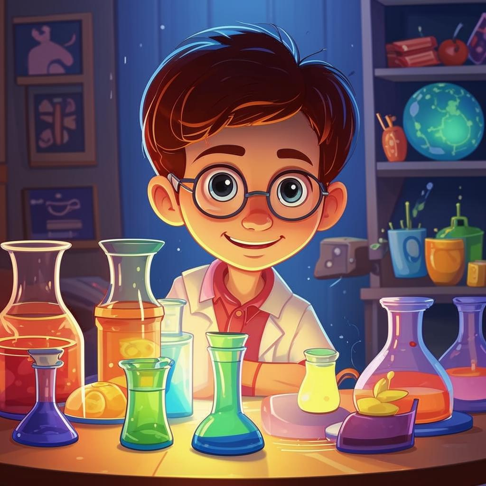

# **Научные эксперименты**

## Что такое научные эксперименты?

**Научный [эксперимент](интеллектуальные.md)** — это способ [исследовать](интеллектуальные.md) окружающий мир через наблюдения и проверки гипотез. Это увлекательное [занятие](хобби.md), которое помогает лучше понимать [природу](садоводство.md) вещей и явлений вокруг нас!

Экспериментатор ставит перед собой вопрос ("Что произойдет, если...?"), проводит серию действий, фиксирует результаты и делает выводы. Этот метод позволяет детям стать настоящими исследователями и почувствовать себя учеными! 😎

---

### Почему стоит заняться научными экспериментами?

#### Интересное изучение мира ✨

[Эксперименты](интеллектуальные.md) позволяют детям взглянуть на привычные вещи совершенно иначе! Даже обычная [вода](кулинария.md) становится волшебной жидкостью, когда её свойства изучаются подробно. Можно наблюдать химические реакции, проводить опыты с электричеством или создавать собственные вулканы [дома](домашние.md) 😊.

#### Развитие критического мышления 🧠

Проводя [эксперименты](интеллектуальные.md), ребенок учится [анализировать](интеллектуальные.md) результаты, строить предположения и проверять их. Это развивает способность мыслить логически и находить решения проблем самостоятельно.

#### Прикладная польза 💡

Знания, полученные в ходе [экспериментов](интеллектуальные.md), помогут ребенку лучше справляться с уроками по физике, химии и другим наукам. А ещё такие знания пригодятся в повседневной жизни: от ремонта до приготовления пищи.

---

## Примеры научных экспериментов

### Простые химические реакции

Можно провести простой [эксперимент](интеллектуальные.md) с пищевым красителем и [молоком](кулинария.md). Налей [молоко](кулинария.md) в тарелку, добавь несколько капель пищевого красителя разных цветов. Затем капни немного жидкого мыла в центр тарелки. Ты увидишь, как цвета начинают двигаться и смешиваться между собой. Почему так происходит? Жидкое мыло разрушает поверхностное натяжение [молока](кулинария.md), заставляя цвет перемещаться. Вот вам и маленькая химическая реакция прямо [дома](домашние.md)! 🧴

### Электростатический шарик

Возьми воздушный шарик и потри его о волосы или шерстяной свитер. Поднеси шарик к маленьким кусочкам бумаги, и ты увидишь, как они притягиваются к нему. Это эффект электростатики! Воздушный шарик заряжается статическим электричеством от трения, и бумага начинает к нему тянуться. Интересная физика в действии! ⚡️

---

## Как начать проводить эксперименты?

Вот несколько советов, чтобы сделать твои первые шаги в мире науки простыми и интересными:

1. **Найди [книгу](чтение.md) или сайт с научными [экспериментами](интеллектуальные.md)**. Важно выбирать проверенные источники, где описаны безопасные опыты.

2. **Собери материалы заранее**. Обычно большинство нужных предметов уже есть [дома](домашние.md): [вода](кулинария.md), [соль](кулинария.md), [сахар](кулинария.md), лимонный сок, воздушные шарики и многое другое.

3. **Не бойся ошибаться**. Иногда ошибки приводят к интересным открытиям!

4. **Делай записи**. Записывай свои наблюдения и делай выводы после каждого [эксперимента](интеллектуальные.md). Так ты будешь учиться быстрее.

5. **Работай вместе с друзьями или [семьей](домашние.md)**. Совместные [эксперименты](интеллектуальные.md) веселее и позволяют делиться идеями друг с другом.

---

## Важные правила безопасности

Безопасность важна при проведении любых [экспериментов](интеллектуальные.md). Всегда следуй следующим правилам:

- Никогда не проводи опасные [эксперименты](интеллектуальные.md) без присмотра взрослых.
- Используй защитные очки и перчатки, если это необходимо.
- Работай в хорошо проветриваемом помещении.
- Не пытайся повторять [эксперименты](интеллектуальные.md), которые требуют специального оборудования или опасных веществ.

---

## Заключение

Научные [эксперименты](интеллектуальные.md) — это захватывающее путешествие в мир знаний и открытий. Они помогут тебе развить [мышление](интеллектуальные.md), улучшить понимание законов [природы](садоводство.md) и найти новые [увлечения](хобби.md). Главное — начинать с простых и интересных идей, соблюдать безопасность и наслаждаться процессом исследований! Кто знает, возможно, именно твои [эксперименты](интеллектуальные.md) однажды приведут к новым научным открытиям! 💫

---

## Дополнительные заметки

- **Гипотеза** — предположение, выдвигаемое для объяснения какого-либо явления, подлежащее проверке.
- **Электростатика** — раздел физики, изучающий взаимодействие неподвижных электрических зарядов.
- **Поверхностное натяжение** — свойство жидкости создавать силу, стремящуюся уменьшить площадь поверхности капли или пленки.

---

✂️ 🤓 Приятного путешествия в мир науки!
