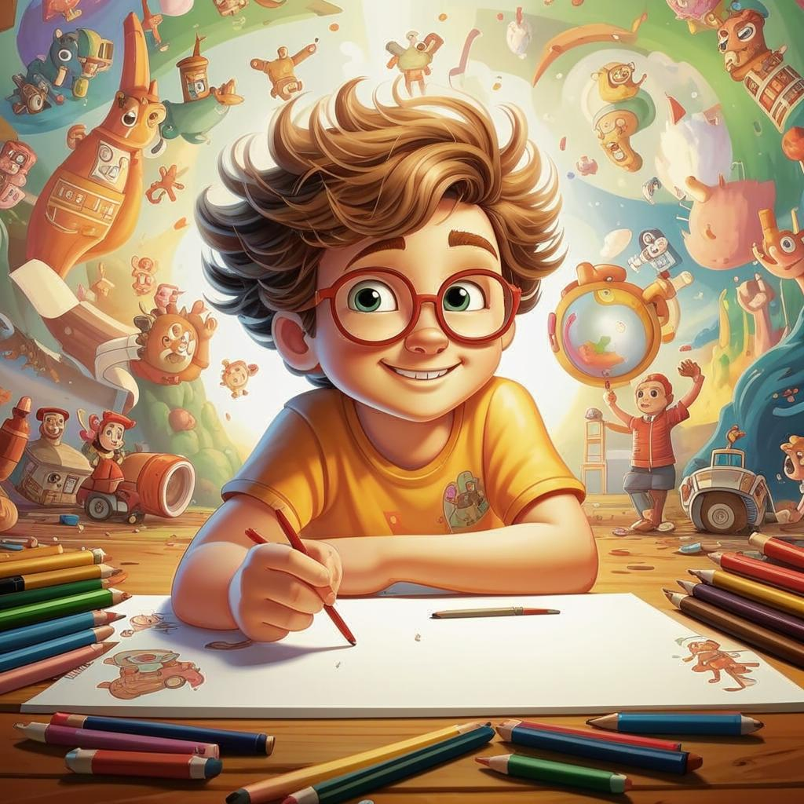

# **Рисование** 🎨

## Что такое рисование?

**Рисование** — это [искусство](хобби.md) создавать изображения с помощью карандашей, красок, мелков или даже пальцев! Оно помогает выразить чувства, мысли и [фантазии](творческие.md) через линии, формы и цвета. Можно рисовать всё, что угодно: от любимых героев мультфильмов до пейзажей и животных. Главное — включить [воображение](творческие.md)!

---

## Почему стоит заняться рисованием? 🌟

### Развивает креативность

Рисуя, ты тренируешь свою [фантазию](творческие.md) и учишься видеть мир вокруг глазами художника. Это особенно важно, когда хочется придумать что-то новое или необычное.

### Улучшает внимание к деталям

Чтобы нарисовать что-либо точно, нужно уметь замечать мелкие детали. Например, форма глаз у кошки отличается от собачьих, а листья разных деревьев имеют уникальные очертания. Чем чаще ты будешь наблюдать такие вещи, тем лучше станешь понимать окружающий мир.

### Помогает расслабиться

Иногда бывает сложно справиться с эмоциями или стрессом. Но рисование позволяет отвлечься и выплеснуть накопившиеся переживания на бумагу. Многие художники говорят, что процесс [творчества](творческие.md) успокаивает душу.

---

## Как начать рисовать? ✏️

1. **Выбери материалы**. Начни с простого набора цветных карандашей или фломастеров. Потом можешь перейти к акварельным краскам или пастелям.

2. **Найди вдохновение**. Посмотри иллюстрации в [книгах](чтение.md), комиксах или картинах великих художников (например, Ван Гога). Попробуй повторить понравившийся стиль или создать что-то своё.

3. **Не бойся ошибок**. Важно помнить, что ошибки — это нормально. Они помогают учиться и становиться лучше. Если рисунок не получился с первого раза, попробуй ещё раз.

4. **[Экспериментируй](научные_эксперименты.md)**. Пробуй разные техники: штриховка, растушёвка, смешивание цветов. Так ты найдёшь тот способ рисования, который понравится именно тебе.

---

## Примеры знаменитостей 🌈

- **Леонардо да Винчи**, известный художник, создавал невероятные картины и [изобретения](конструирование.md) одновременно. Его рисунки демонстрируют потрясающее сочетание [искусства](хобби.md) и [науки](научные_эксперименты.md).

- **Пабло Пикассо**, испанский художник, один из основателей кубизма. Его картины часто изображают мир через геометрические фигуры и необычные углы зрения.

---

## Полезные советы ⭐

- Не забывай сохранять свои работы. Со временем приятно увидеть прогресс и вспомнить, с чего начинал путь.

- Учись на мастер-классах или онлайн-курсах. Сегодня есть множество ресурсов, где опытные художники делятся секретами мастерства.

---

## Заключение 🔗

Рисование — это увлекательное [занятие](хобби.md), которое развивает [творческие](творческие.md) способности, учит внимательности и помогает справляться с эмоциями. Даже если сначала кажется, что ничего не получается, главное — продолжать пробовать и верить в себя. Ведь каждый великий художник тоже когда-то был новичком!

---

## Дополнительные заметки

**Креативность**: Умение придумать что-то новое и крутое.
**[Фантазия](творческие.md)**: Это когда ты представляешь что-то, чего нет на самом деле.
**Вдохновение**: Это как лампочка💡в голове загорелась, и тебе очень хочется что-то сделать.
**[Эксперимент](интеллектуальные.md)**: Это когда ты что-то пробуешь и смотришь, что получится.
**Мастер-класс**: Это когда кто-то показывает, как что-то делать, и ты повторяешь.
**Онлайн-курс**: Это когда ты учишься чему-то новому через интернет.

---

💫 Теперь ты знаешь, почему рисование — это классное [хобби](хобби.md) и как сделать первые шаги в мире [искусства](хобби.md). Вперед, твори и наслаждайся процессом!
