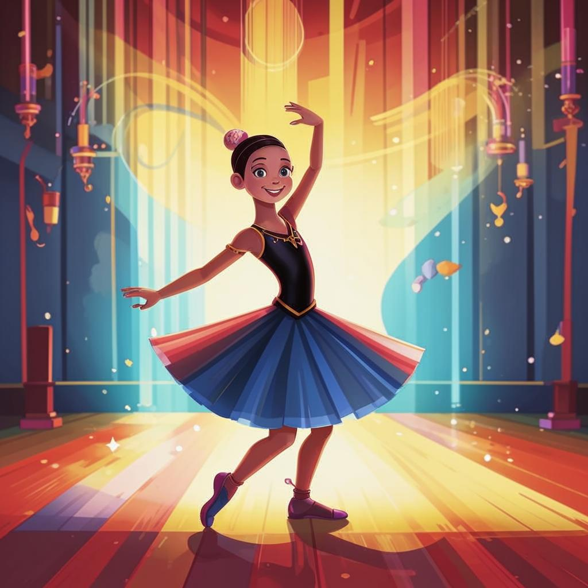

# **Танцы** 💃🕺

## Что такое танцы?

**Танцы** — это форма [искусства](хобби.md), где [движения](активные.md) тела выражают эмоции, рассказывают истории и создают настроение. Это отличный способ выразить себя через [музыку](музыка.md) и [ритм](музыка.md)! 😎👏

## Почему стоит заняться танцами?  

✨ **Самовыражение**: Через танец можно выразить чувства, когда слова бессильны. Это словно говоришь телом!

✨ **[физическая активность](активные.md)**: Занятия танцами помогают [поддерживать форму](активные.md), развивать координацию движений и гибкость.

✨ **Социальное взаимодействие**: Совместные [тренировки](спорт.md), участие в конкурсах и выступлениях позволяют найти новых друзей и единомышленников.

✨ **Уверенность в себе**: Овладев новыми [движениями](активные.md) и выступая перед публикой, человек становится увереннее в собственных силах.

---

## Примеры из жизни 🌟

Представь, что ты участвуешь в школьной постановке или даже на вечеринке с друзьями. Как здорово было бы показать классный номер, будь то зажигательная сальса или плавная вальсировка!

Или вспомни знаменитые фильмы вроде *Шаг вперед* 🔥— там главные герои постоянно соревнуются в уличных батлах, создавая невероятные комбинации шагов.

---

## Известные танцоры ✨

Многие звезды мирового уровня начинали именно с танцев. Например:

- Майкл Джексон был известен своими инновационными [движениями](активные.md) и знаменитым лунной походкой 👣
- Мадонна регулярно удивляет публику сложнейшими хореографическими постановками на концертах 🙌

---

## Важные советы ❗️

1. Не забывай разминку перед началом [тренировки](спорт.md), чтобы избежать травм.
2. Выбирай удобную одежду и обувь для [занятий](хобби.md).
3. Начинай с простых элементов и постепенно переходи к сложным комбинациям.
4. Если занимаешься [дома](домашние.md), убедись, что есть достаточно места для [движений](активные.md).
5. Пей [воду](кулинария.md) до, во время и после [тренировок](спорт.md).
6. Прислушивайся к своим ощущениям и делай паузы, когда нужно отдохнуть.

---

## Заключение 👉🏼

Итак, танцы — это увлекательное [занятие](хобби.md), которое объединяет физическую активность, [творчество](творческие.md) и общение. Они позволяют каждому человеку почувствовать себя звездой сцены и поделиться своей энергией с окружающими. Попробуй заняться танцами уже сегодня — возможно, это станет твоим новым любимым [увлечением](хобби.md)! 🤩

---

Надеюсь, эта статья вдохновила тебя начать двигаться под любимые мелодии и открыть для себя волшебный мир танцев! 💫
