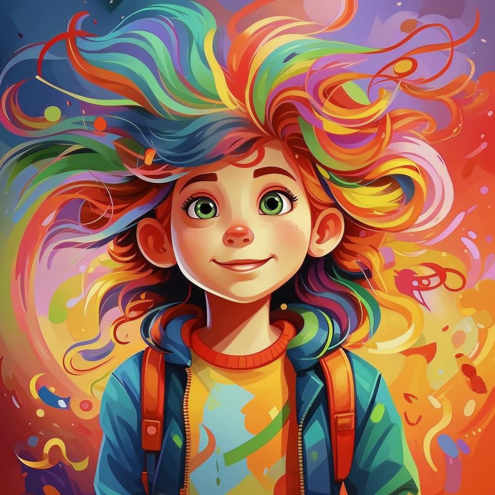

# **Творческие Хобби**

## Что такое творческие хобби?

**Творчество** — это волшебный мир фантазии и самовыражения! Когда мы занимаемся творческими хобби, мы даем волю своему воображению и создаем нечто уникальное своими руками. Это может быть рисунок, песня, танец или даже [кулинарное блюдо](кулинария.md)!

---

### Почему важно заниматься творчеством?

- **Развивает [мышление](интеллектуальные.md)**: Когда мы творим, наш [мозг](интеллектуальные.md) работает активно, ищет новые решения и идеи.
- **Улучшает настроение**: Рисуя, танцуя или [играя музыку](музыка.md), мы можем выразить эмоции и почувствовать радость.
- **Формирует личность**: Через творчество ребенок находит свою уникальность и учится понимать мир вокруг.

---

### Примеры творческих хобби

#### **Рисование ✏️**

Это один из самых популярных видов творчества среди детей. Можно рисовать карандашами, красками, фломастерами или даже песком! Многие известные художники начали свой путь именно с детских [рисунков](рисование.md).

*Примеры:* Ван Гог, Леонардо да Винчи, Микеланджело.

#### **Музыка 🎶**

[Игра](настольные_игры.md) на музыкальных инструментах или пение помогают выражать чувства и эмоции через звуки. [Музыка](музыка.md) делает нас счастливее и вдохновляет!

*Известные музыканты:* Бетховен, Майкл Джексон, Тейлор Свифт.

#### **Вышивание 🧵**

Рукоделия вроде [вышивания](вышивание.md) помогают создавать красивые узоры и картины. Этот вид [искусства](хобби.md) успокаивает и учит терпению.

*Результат:* Вышитые подушки, салфетки, одежда.

#### **[актерское мастерство](актерское_мастерство.md) 👀**

Театр и кино требуют от актеров умения перевоплощаться в разных персонажей. [Игра](настольные_игры.md) в театре развивает умение управлять эмоциями.

*Знаменитости:* Леонардо Ди Каприо, Эмма Уотсон, Джеки Чан.

#### **Контруирование 💡**

Ты можешь собирать различные модели из конструктора LEGO или других наборов!

---

## Как начать?

Чтобы погрузиться в творческий процесс, нужно всего лишь выбрать то, что тебе интересно. Например, если ты любишь рисовать, начни с простых эскизов и постепенно переходи к более сложным картинам. Если [музыка](музыка.md) вызывает восторг, попробуй научиться играть на гитаре или пианино.

Не бойся [экспериментировать](научные_эксперименты.md) и ошибаться — именно ошибки помогают нам расти и становиться лучше!

## Советы начинающим

- Не сравнивай себя с другими художниками или музыкантами. Каждый человек уникален, и твой стиль тоже особенный.
- Попробуй разные техники и материалы. Может оказаться, что акварель подходит тебе больше, чем масло, или наоборот.
- Запишись на мастер-классы или курсы. Там ты сможешь познакомиться с единомышленниками и получить полезные советы от профессионалов.
- Делай перерывы. Иногда полезно отвлечься и вернуться к творчеству позже с новыми идеями.

---

### Заключение

❇️ Творческие хобби делают нашу жизнь ярче и интереснее. Занимайся любимым делом, будь то рисование, танцы или [актерская игра](актерское_мастерство.md), ведь каждый человек способен создать нечто уникальное и прекрасное!

Не бойся пробовать новое и находить свое призвание! Пусть твое творчество приносит тебе счастье и вдохновение!

---

### Дополнительные заметки

*Фантазия*: Это когда ты придумываешь то, чего нет на самом деле.
*Самовыражение*: Это когда ты показываешь миру, какой ты есть, через то, что тебе нравится.
*Воображение*: Это когда ты рисуешь картинки в своей голове, как будто смотришь кино.
*Личность*: Это то, что делает тебя особенным и непохожим на других.
*Эскиз*: Это быстрый [рисунок](рисование.md), чтобы показать идею, как план для большой картины.
*[Эксперимент](интеллектуальные.md)*: Это когда ты пробуешь что-то новое, чтобы узнать, что получится.
*Мастер-класс*: Это когда профи учит тебя делать что-то крутое, шаг за шагом.

---

Создавайте, мечтайте и наслаждайтесь процессом творчества! 💫
