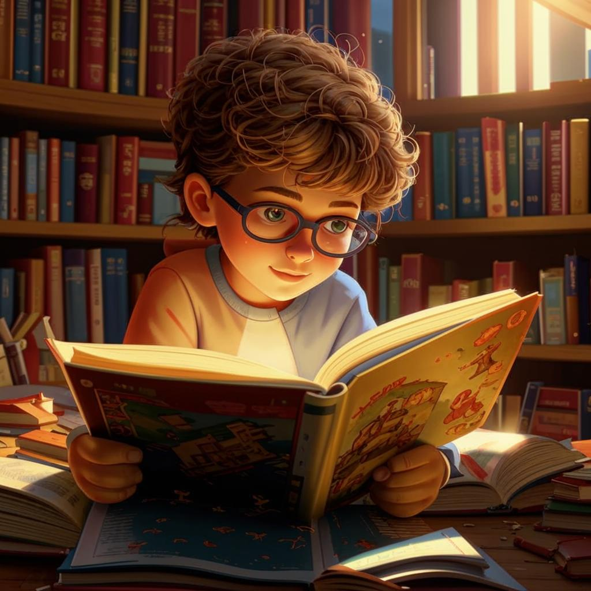

# **Чтение** 📚💫

## Что такое чтение?

Чтение — это увлекательное [занятие](хобби.md), которое помогает нам погружаться в мир книг, журналов, комиксов и даже блогов! Когда мы читаем, наш [мозг](интеллектуальные.md) активно работает, представляя образы персонажей, места событий и разные ситуации. Это настоящее приключение в мире [фантазии](творческие.md) и знаний!

---

### Почему важно читать? 🔍

- Развивает память и внимание 🧠
- Улучшает речь и умение выражать мысли ✍️
- Помогает лучше понимать эмоции других людей ❤️
- Способствует развитию креативности и [воображения](творческие.md) 🌈
- Позволяет отдохнуть от повседневной суеты и расслабиться 🛋️

---

## Какие бывают книги?

Существует огромное количество жанров и направлений литературы. Вот некоторые из них:

- **Фантастика**: рассказы о будущем, космосе и необычных мирах (например, *Гарри Поттер*).
- **Приключения**: истории о путешествиях и захватывающих приключениях (*Робинзон Крузо*, *Остров сокровищ*).
- **Детективы**: [загадки](интеллектуальны.md) и расследования преступлений (*Шерлок Холмс*).
- **Сказки**: волшебные истории с моралью и уроками (*Золушка*, *Красная Шапочка*).
- **Исторические романы**: повествования о прошлом, основанные на реальных событиях (*Война и мир* Льва Толстого).

---

## Примеры из жизни 🌟

Представь, что ты прочитал книгу о космосе. Теперь ты знаешь, сколько планет в Солнечной системе и какие бывают звёзды. Или, допустим, ты прочитал историю о древних цивилизациях. Как здорово будет удивлять друзей своими знаниями на уроках истории!

Или вот ещё пример: любимая серия комиксов про супергероев вдохновляет тебя нарисовать собственные приключения! Вот это [творчество](творческие.md)!

---

## Положительные стороны и безопасность 😊

- **Улучшение концентрации**: Книга требует внимания, что развивает твою способность сосредотачиваться.

- **Осознанность**: Чтение учит [анализировать](интеллектуальные.md) происходящее вокруг нас.

- **Экономия денег**: Библиотеки предлагают бесплатные книги, а электронные версии стоят дешевле бумажных.

- **Эмоциональная поддержка**: Книги помогают справляться с трудностями через примеры героев.

---

## Меры предосторожности 🛑

- Следи за освещением: Читай при хорошем свете, чтобы не напрягать глаза.

- Делай перерывы: Каждые полчаса отрывайся от книги, чтобы размяться и посмотреть вдаль.

---

## Заключение 🎁

Итак, друзья, читайте побольше! Пусть книги станут вашими верными спутниками в познании мира и самих себя. Кто знает, возможно, именно ваша следующая книга подарит вам незабываемые впечатления и вдохновение на всю жизнь! 🙌✨

---

### Дополнительнеы заметки

- **Библиотека:** Место хранения и выдачи книг.
- **Комиксы:** Иллюстрированные рассказы с диалоговыми облачками.
- **Электронные книги:** Цифровые копии печатных изданий.

---

Надеюсь, статья получилась интересной и полезной, а книги будут тебе приносить одно удовольствие!
