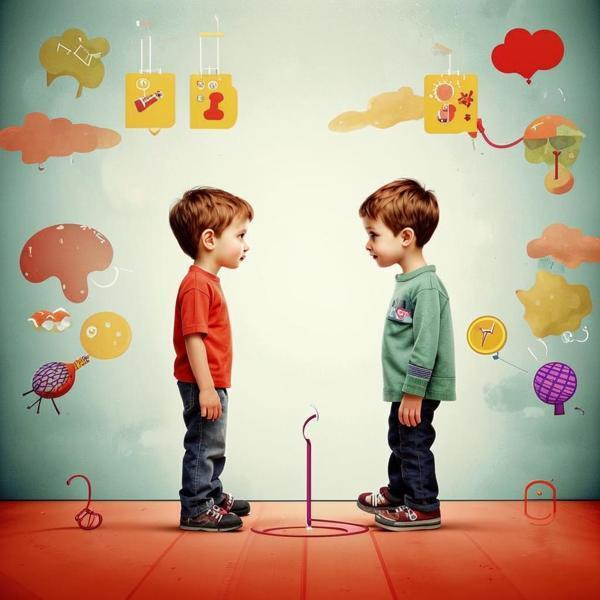

### Определение 📖
Антипатия — это чувство, когда тебе кто-то или что-то не нравится, и ты не хочешь с этим человеком или вещью общаться. Это похоже на [недовольство](недовольство.md) или [отвращение](отвращение.md), когда ты чувствуешь, что что-то не так, и это вызывает у тебя неприятные эмоции. Например, если кто-то ведет себя грубо или делает что-то, что тебе не нравится, ты можешь почувствовать антипатию к этому человеку.

### Примеры 🌟
1. **В школе**: Представь, что в классе есть мальчик или девочка, которые всегда дразнят других. Ты можешь почувствовать антипатию к ним, потому что их поведение вызывает у тебя [грусть](грусть.md) и [раздражение](раздражение.md).
   
2. **На площадке**: Если ты играешь с друзьями, и кто-то начинает нарушать правила игры или обижать других, ты можешь почувствовать антипатию к этому человеку, потому что он делает игру неприятной.

3. **В семье**: Иногда, когда кто-то из твоих братьев или сестер постоянно забирает у тебя игрушки, ты можешь почувствовать антипатию к нему, потому что это вызывает у тебя [гнев](гнев.md) и [недовольство](недовольство.md).

### Способы решения 🛠️
1. **Поговори об этом**: Если ты чувствуешь антипатию к кому-то, попробуй поговорить с ним. Может быть, он не понимает, что его поведение тебя расстраивает. Объясни, как ты себя чувствуешь.

2. **Сосредоточься на положительном**: Попробуй найти что-то хорошее в этом человеке. Может быть, у него есть интересные увлечения или он хорошо играет в футбол. Это поможет уменьшить антипатию.

3. **Избегай конфликтов**: Если ты понимаешь, что общение с этим человеком вызывает у тебя только негативные эмоции, лучше избегать его, чтобы не испытывать [стресс](стресс.md) и [тревожность](тревожность.md).

### Заключение 🎉
Антипатия — это нормальное чувство, которое может возникать у каждого из нас. Важно понимать, что это не значит, что мы должны ненавидеть людей, к которым испытываем антипатию. Мы можем научиться справляться с этими чувствами и находить способы общаться с другими, даже если они нам не нравятся. Помни, что все люди разные, и иногда стоит попробовать понять их лучше!