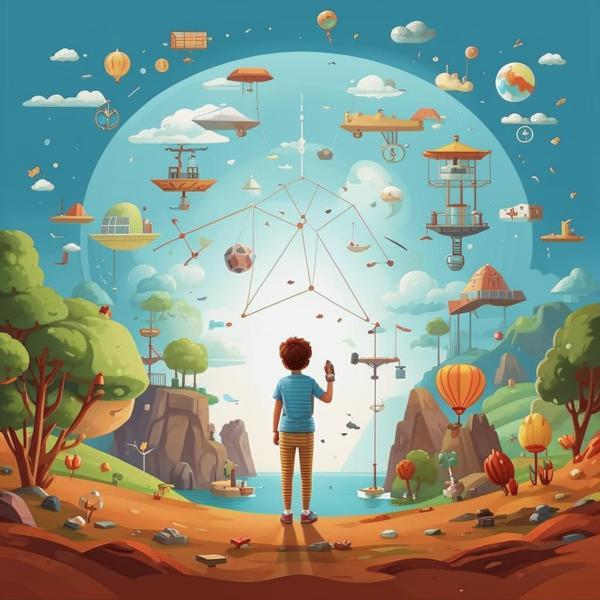

### Определение 🌟
**Влечение** — это чувство, когда ты очень сильно хочешь быть рядом с кем-то или чем-то. Это может быть дружба, любовь или даже интерес к какому-то хобби. Когда ты испытываешь влечение, тебе становится приятно, и ты чувствуешь радость, как будто у тебя внутри что-то светится. Это похоже на [счастье](счастье.md) и [удовольствие](удовольствие.md), когда ты радуешься тому, что происходит вокруг.

### Примеры 🌈
1. **Дружба**: Ты встретил нового друга в школе, и вам очень весело вместе. Ты хочешь проводить с ним больше времени, играть в игры и делиться секретами. Это влечение к дружбе.
   
2. **Хобби**: Ты начал заниматься рисованием и вдруг понял, что это тебе очень нравится. Ты хочешь рисовать каждый день, и это приносит тебе [удовольствие](удовольствие.md) и [радость](радость.md).

3. **Любовь к животным**: Ты увидел милого щенка и сразу влюбился в него. Ты хочешь его погладить, играть с ним и заботиться о нем. Это влечение к животным.

### Способы решения 🛠️
Иногда влечение может быть очень сильным, и ты не знаешь, как с этим справиться. Вот несколько способов:

1. **Поговори с кем-то**: Если ты чувствуешь влечение к кому-то, поговори об этом с родителями или друзьями. Они могут помочь тебе понять свои чувства.

2. **Занимайся любимым делом**: Если ты чувствуешь, что влечение отвлекает тебя от других важных вещей, попробуй заняться чем-то другим, например, спортом или чтением. Это поможет тебе найти баланс.

3. **Не бойся чувств**: Влечение — это нормально! Не стоит его бояться. Просто учись понимать свои чувства и делиться ими с другими.

### Заключение 🎉
Влечение — это замечательное чувство, которое помогает нам находить друзей, увлечения и радоваться жизни. Оно связано с другими позитивными эмоциями, такими как [счастье](счастье.md) и [восторг](восторг.md). Главное — учиться понимать свои чувства и делиться ими с теми, кто тебе близок. Так ты сможешь наслаждаться каждым моментом и делать свою жизнь ярче!