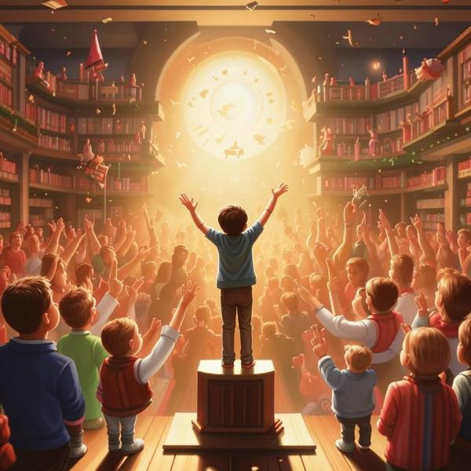

### Определение 🌟
Восхищение — это очень сильное чувство, когда тебе что-то или кто-то очень нравится, и ты чувствуешь радость и удивление от этого. Это как когда ты смотришь на что-то красивое или замечательное и думаешь: "Вау, как здорово!" Восхищение может быть связано с другими позитивными эмоциями, такими как [радость](радость.md) и [удовольствие](удовольствие.md).

### Примеры 🎉
Вот несколько ситуаций, когда ты можешь испытать восхищение:

1. **Природа**: Когда ты гуляешь в парке и видишь красивый закат, который окрашивает небо в яркие цвета. Ты можешь почувствовать восхищение от того, как красиво это выглядит.
   
2. **Искусство**: Если ты смотришь на картину в музее, и она тебе очень нравится, ты можешь сказать: "Как же это здорово!" Это восхищение от искусства.

3. **Спорт**: Когда ты смотришь на своего любимого спортсмена, который делает невероятный трюк или забивает гол, ты можешь почувствовать восхищение от его мастерства.

4. **Друзья**: Если твой друг делает что-то очень крутое, например, рисует или играет на музыкальном инструменте, ты можешь восхититься его талантом.

### Способы решения 💡
Когда ты испытываешь восхищение, это может быть очень приятно, и ты можешь поделиться своими чувствами с другими. Вот несколько способов, как это сделать:

1. **Скажи об этом**: Поделись своими впечатлениями с друзьями или родителями. Скажи им, что именно тебя восхитило и почему.

2. **Запиши свои мысли**: Если тебе нравится рисовать или писать, попробуй создать что-то, вдохновленное тем, что тебя восхитило. Это может быть рисунок, стихотворение или рассказ.

3. **Изучай больше**: Если тебя восхищает что-то конкретное, например, природа или искусство, попробуй узнать о этом больше. Чтение книг или просмотр документальных фильмов может помочь тебе понять, почему это так прекрасно.

### Заключение 🌈
Восхищение — это замечательное чувство, которое помогает нам замечать красоту и удивительные вещи вокруг нас. Оно может сделать нас более счастливыми и вдохновить на творчество. Не забывай делиться своими впечатлениями с другими, ведь это может сделать их день лучше! Восхищение, как и другие позитивные эмоции, такие как [счастье](счастье.md) и [любовь](любовь.md), делает нашу жизнь ярче и интереснее.