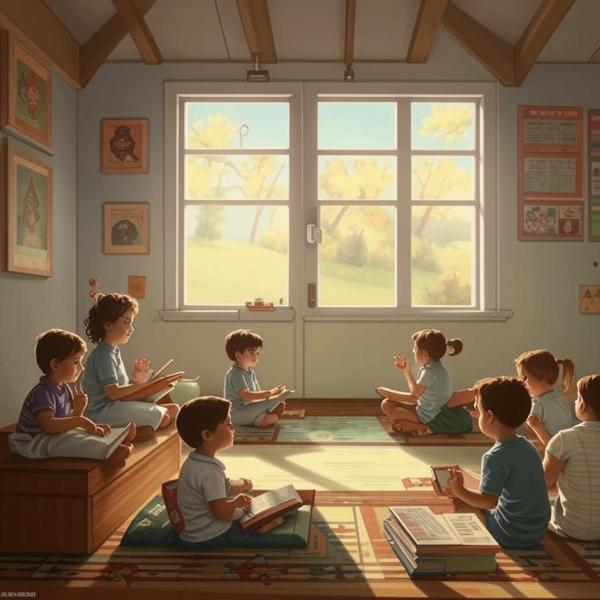

### Определение 🕒

**Время отдыха** — это период, когда ты можешь расслабиться и не делать ничего важного или трудного. Это время, когда ты можешь отдохнуть от учёбы, игр или других дел, чтобы твой мозг и тело могли восстановиться. Время отдыха помогает справиться со [стрессом](стресс.md) и уменьшить [раздражительность](раздражительность.md), которая может возникнуть, если ты слишком долго работаешь или учишься.

### Примеры 🌟

Вот несколько ситуаций, когда ты можешь почувствовать, что тебе нужно время отдыха:

1. **После школы**: Ты пришёл домой после долгого учебного дня, и у тебя много домашних заданий. Ты можешь почувствовать усталость и напряжение. В это время тебе нужно немного отдохнуть, чтобы восстановить силы.

2. **После спортивной тренировки**: Если ты занимался спортом и сильно устал, то время отдыха поможет тебе расслабиться и восстановить энергию.

3. **Во время игры**: Если ты долго играешь в видеоигры или на компьютере, то через некоторое время ты можешь почувствовать, что устаёшь. Время отдыха поможет тебе не стать слишком раздражительным и сохранить удовольствие от игры.

### Способы решения 🛠️

Чтобы хорошо провести время отдыха, можно попробовать следующие способы:

- **Чтение книги**: Найди интересную книгу и почитай её. Это поможет тебе расслабиться и отвлечься от учёбы.
  
- **Прогулка на свежем воздухе**: Погуляй на улице, подыши свежим воздухом. Это поможет тебе почувствовать себя лучше и избавиться от напряжения.

- **Дыхательные упражнения**: Попробуй сделать несколько глубоких вдохов и выдохов. Это поможет тебе успокоиться и снять стресс.

- **Игра с друзьями**: Проведи время с друзьями, играя в настольные игры или на улице. Это поможет тебе отвлечься и повеселиться.

### Заключение 🎉

Время отдыха — это очень важная часть нашей жизни. Оно помогает нам справляться со [стрессом](стресс.md) и [напряженностью](напряженность.md), которые могут возникнуть из-за учёбы или других дел. Не забывай выделять время для отдыха, чтобы чувствовать себя хорошо и быть в хорошем настроении!