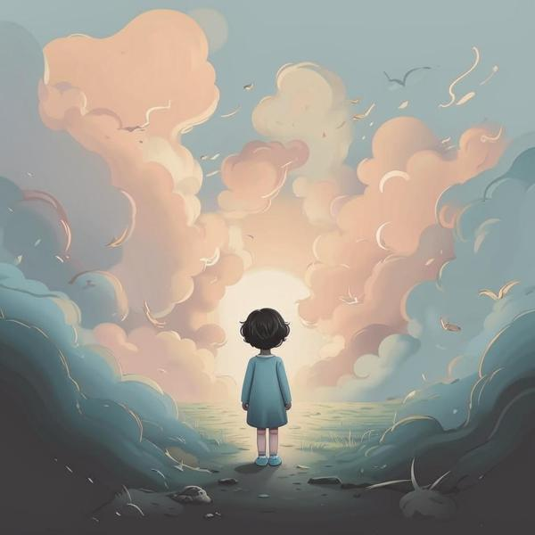

### Определение 🧐
Грусть — это чувство, когда нам становится печально и тоскливо. Это может происходить, когда что-то не так, как мы хотели, или когда мы теряем что-то важное для нас. Грусть может быть связана с другими негативными эмоциями, такими как [недовольство](недовольство.md) или [тревожность](тревожность.md). Когда мы грустим, нам может казаться, что мир вокруг нас становится серым и неинтересным.

### Примеры 🌧️
Вот несколько ситуаций, когда ты можешь почувствовать грусть:

1. **Потеря любимой игрушки**: Если ты потерял свою любимую игрушку, это может вызвать грусть, потому что ты скучаешь по ней и не можешь с ней играть.
   
2. **Ссора с другом**: Если ты поссорился с другом и не можете больше играть вместе, это может сделать тебя грустным, потому что ты скучаешь по весёлым моментам, которые вы проводили вместе.

3. **Неудача на соревнованиях**: Если ты не выиграл в соревнованиях, в которых очень старался, это может вызвать грусть, потому что ты разочарован в себе и своих усилиях.

4. **Переезд**: Если твоя семья переезжает в другой город, ты можешь грустить, потому что оставляешь своих друзей и знакомые места.

### Способы решения 🌈
Когда ты чувствуешь грусть, есть несколько способов, которые могут помочь тебе справиться с этим чувством:

1. **Поговори с кем-то**: Расскажи о своих чувствах родителям, друзьям или учителю. Это может помочь тебе почувствовать себя лучше, потому что ты не будешь один со своей грустью.

2. **Занимайся любимым делом**: Попробуй заняться тем, что тебе нравится, например, рисовать, играть в игры или читать книги. Это может отвлечь тебя от грустных мыслей.

3. **Проведи время на свежем воздухе**: Прогулка на улице или игра на площадке может поднять тебе настроение и помочь забыть о грусти.

4. **Напиши о своих чувствах**: Иногда полезно записать, что ты чувствуешь. Это может помочь тебе понять свои эмоции и сделать их менее тяжелыми.

### Заключение 🌟
Грусть — это нормальное чувство, которое испытывают все люди, и это нормально, что ты иногда грустишь. Важно помнить, что грусть не вечна, и с ней можно справиться. Если ты будешь делиться своими чувствами и находить способы поднять себе настроение, тебе станет легче. Помни, что после грусти всегда приходит радость, и впереди тебя ждут новые приятные моменты!