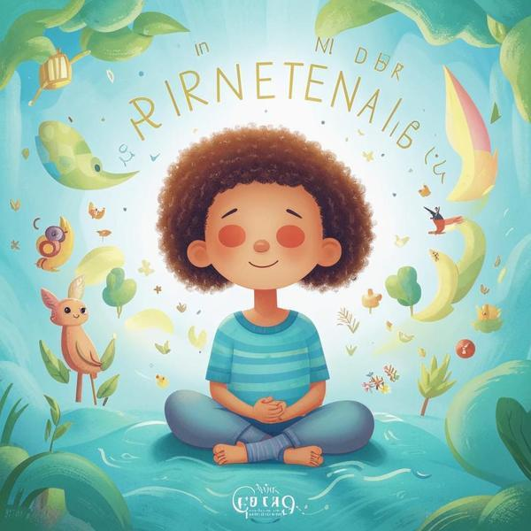

### Определение 🌬️
Дыхание — это процесс, когда мы вдыхаем воздух в наши легкие и выдыхаем его обратно. Это очень важно для нашего тела, потому что воздух содержит кислород, который нужен нам, чтобы жить. Когда мы дышим, мы помогаем своему организму получать энергию и чувствовать себя хорошо. Дыхание также может помочь нам справиться со стрессом, когда мы чувствуем [раздражительность](раздражительность.md) или [напряженность](напряженность.md).

### Примеры 🌟
Вот несколько ситуаций, когда ты можешь почувствовать стресс и, возможно, тебе понадобится дыхание, чтобы успокоиться:

1. **Перед контрольной работой**: Ты можешь волноваться и чувствовать [напряженность](напряженность.md), когда готовишься к контрольной работе. В такие моменты полезно сделать несколько глубоких вдохов, чтобы успокоиться.
   
2. **Когда ссоришься с другом**: Если ты поссорился с другом, это может вызвать [раздражительность](раздражительность.md). Дыхание поможет тебе успокоиться и подумать, как лучше решить конфликт.

3. **На спортивных соревнованиях**: Когда ты участвуешь в соревнованиях, ты можешь чувствовать волнение и стресс. Глубокое дыхание поможет тебе сосредоточиться и показать свои лучшие результаты.

### Способы решения 🛠️
Чтобы научиться правильно дышать и использовать дыхание для борьбы со стрессом, попробуй следующие способы:

1. **Глубокое дыхание**: Сядь удобно, закрой глаза и сделай глубокий вдох через нос, считая до четырех. Затем медленно выдохни через рот, считая до четырех. Повтори это несколько раз.

2. **Дыхательные упражнения**: Попробуй дышать, как будто ты надуваешь шарик. Вдохни глубоко, а затем выдохни, представляя, что шарик становится меньше. Это поможет тебе расслабиться.

3. **Время отдыха**: Найди время, чтобы просто посидеть в тишине и подышать. Это поможет тебе восстановить силы и избавиться от [стресса](стресс.md).

### Заключение 🌈
Дыхание — это не просто то, что мы делаем каждый день. Это важный инструмент, который помогает нам справляться с [стрессом](стресс.md) и чувствовать себя лучше. Когда ты учишься правильно дышать, ты можешь легче справляться с трудными ситуациями, такими как контрольные работы или ссоры с друзьями. Помни, что дыхание — это твой друг, который всегда с тобой и готов помочь!