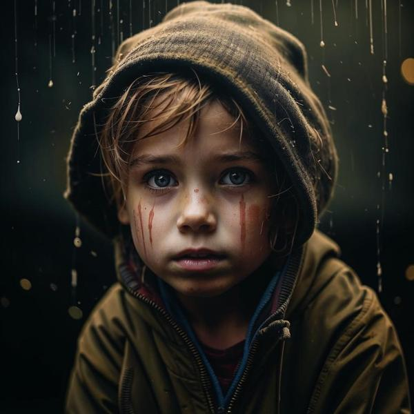

### Определение несчастья 😢

Несчастье — это чувство, когда тебе грустно и плохо, и ты не знаешь, как это исправить. Это может быть связано с тем, что что-то не так в твоей жизни, и ты чувствуешь себя одиноким или потерянным. Иногда несчастье может возникать из-за других негативных эмоций, таких как [грусть](грусть.md) или [раздражение](раздражение.md). Это как когда у тебя плохое настроение, и ты не можешь найти радость в том, что обычно тебе нравится.

### Примеры ситуаций 😔

1. **Потеря любимой игрушки**: Представь, что ты потерял свою любимую игрушку, и ты очень расстроен. Ты можешь чувствовать несчастье, потому что эта игрушка была для тебя важной и приносила радость.

2. **Ссора с другом**: Если ты поссорился с другом и теперь не общаешься с ним, это может вызвать чувство несчастья. Ты можешь чувствовать себя одиноким и грустным, потому что дружба важна.

3. **Неудача на соревнованиях**: Если ты участвовал в соревнованиях и не занял призовое место, ты можешь почувствовать несчастье. Ты старался, но не добился успеха, и это может быть очень обидно.

### Способы решения 🌈

1. **Поговори с кем-то**: Если тебе грустно, попробуй поговорить с родителями, друзьями или учителем. Они могут помочь тебе понять, что ты чувствуешь, и поддержать тебя.

2. **Занимайся любимыми делами**: Попробуй заняться тем, что тебе нравится, например, рисовать, играть в игры или читать книги. Это может помочь отвлечься от плохих мыслей и поднять настроение.

3. **Не бойся просить о помощи**: Если ты чувствуешь, что не можешь справиться с несчастьем, не стесняйся просить о помощи. Это нормально — иногда нам всем нужна поддержка.

### Заключение 🌟

Несчастье — это нормальное чувство, которое может возникнуть у каждого из нас. Важно помнить, что это временное состояние, и с ним можно справиться. Если ты когда-либо чувствуешь себя несчастным, знай, что есть способы улучшить свое настроение, и всегда можно обратиться за помощью к тем, кто тебя поддерживает. Не забывай, что после дождя всегда выходит солнце!