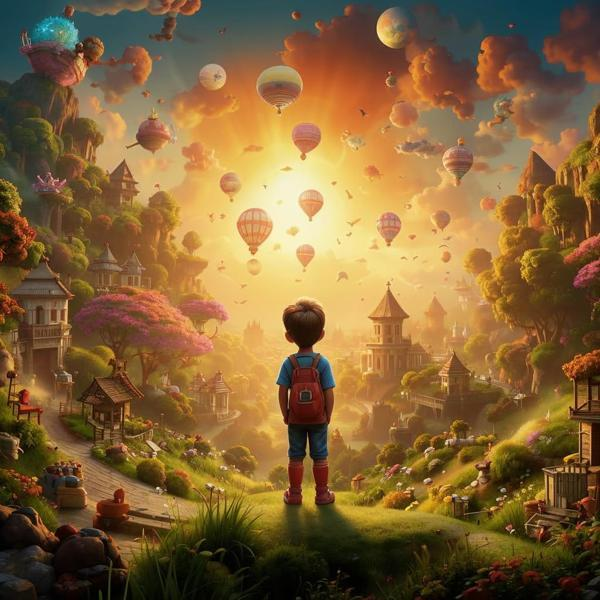

### Определение 🌟
Ностальгия — это чувство, когда ты вспоминаешь что-то хорошее из прошлого и тебе становится немного грустно, потому что этого уже нет. Это как когда ты вспоминаешь, как весело проводил время с друзьями или как хорошо было на каком-то празднике. Ностальгия может быть связана с [счастьем](счастье.md), потому что ты вспоминаешь радостные моменты, но в то же время ты чувствуешь, что эти моменты уже прошли.

### Примеры 🌈
1. **Воспоминания о лете**: Представь, что ты провел летние каникулы на даче с бабушкой и дедушкой. Вы вместе собирали ягоды, катались на велосипеде и играли в игры. Когда ты возвращаешься в школу и вспоминаешь об этом, ты можешь почувствовать ностальгию, потому что эти дни были очень счастливыми, но они уже прошли.

2. **Старые игрушки**: У тебя есть игрушка, с которой ты играл в детстве, но теперь она лежит на полке. Когда ты смотришь на нее, ты вспоминаешь, как весело было играть с ней, и тебе становится немного грустно, что ты уже не играешь так, как раньше. Это тоже ностальгия.

3. **Друзья**: Если твой лучший друг переехал в другой город, ты можешь вспомнить, как вы вместе играли и смеялись. Эти воспоминания могут вызвать ностальгию, потому что ты скучаешь по тем временам, когда вы были вместе.

### Способы решения 💡
Когда ты чувствуешь ностальгию, это нормально, и есть несколько способов, как с этим справиться:

1. **Вспомнить хорошие моменты**: Попробуй вспомнить все радостные моменты, которые были связаны с тем, что ты вспоминаешь. Это может помочь тебе почувствовать [радость](радость.md) от этих воспоминаний.

2. **Создать новые воспоминания**: Вместо того чтобы грустить о прошлом, попробуй сделать что-то новое с друзьями или семьей. Это может быть что-то веселое, например, пойти в парк или устроить праздник. Так ты сможешь создать новые счастливые моменты.

3. **Поговорить с кем-то**: Если тебе грустно, поговори с родителями или друзьями о своих чувствах. Они могут поддержать тебя и помочь понять, что ностальгия — это нормально.

### Заключение 🌟
Ностальгия — это чувство, которое может быть как приятным, так и грустным. Важно помнить, что это нормально вспоминать хорошие моменты из прошлого. Ты можешь использовать эти воспоминания, чтобы чувствовать [счастье](счастье.md) и [радость](радость.md), а также создавать новые, веселые моменты в своей жизни. Не бойся делиться своими чувствами с другими, и помни, что впереди тебя ждут много новых приключений!