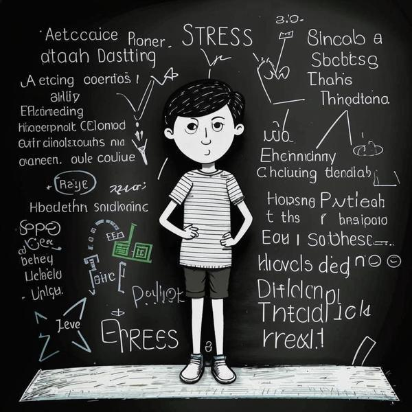

### Определение 📖
Причина стресса — это то, что заставляет нас чувствовать себя напряжённо или беспокойно. Это может быть что-то, что происходит вокруг нас или внутри нас, и из-за этого мы можем чувствовать себя некомфортно. Например, когда у нас много домашних заданий или когда мы переживаем из-за чего-то важного, это может вызвать стресс.

### Примеры 🧒
Вот несколько ситуаций, когда ты, как десятилетний ребенок, можешь испытать стресс:

1. **Школа**: Если у тебя много трудных заданий или ты готовишься к контрольной работе, это может быть причиной стресса. Ты можешь чувствовать себя напряжённым из-за страха получить плохую оценку.
   
2. **Конфликты с друзьями**: Если ты поссорился с другом или не знаешь, как помириться, это может вызывать раздражительность и стресс.

3. **Семейные проблемы**: Если в семье происходят какие-то неприятности, например, ссоры между родителями, это тоже может быть причиной стресса.

4. **Новые ситуации**: Когда ты идёшь в новый класс или на новое мероприятие, это может вызывать волнение и стресс, потому что ты не знаешь, что тебя ждёт.

### Способы решения 🛠️
Чтобы справиться со стрессом, можно использовать разные способы:

1. **Дыхание**: Попробуй сделать несколько глубоких вдохов и выдохов. Это поможет тебе успокоиться и расслабиться. [Дыхание](дыхание.md) — это отличный способ справиться со стрессом.

2. **Время отдыха**: Найди время, чтобы отдохнуть и заняться чем-то приятным, например, поиграть в любимую игру или почитать книгу. [Время отдыха](время_отдыха.md) помогает восстановить силы.

3. **Поговори с кем-то**: Если тебе тяжело, не стесняйся поговорить с родителями или друзьями. Они могут помочь тебе разобраться в ситуации и поддержать.

4. **Заботься о сне**: Хороший сон помогает нам чувствовать себя лучше. Если ты не высыпаешься, это может увеличить уровень стресса. [Сон](сон.md) очень важен для нашего здоровья.

### Заключение 🌈
Причины стресса могут быть разными, и это нормально — иногда чувствовать себя напряжённым. Главное — знать, как с этим справляться. Используй дыхательные упражнения, находи время для отдыха и не бойся делиться своими переживаниями с близкими. Помни, что стресс — это временное состояние, и с ним можно справиться!