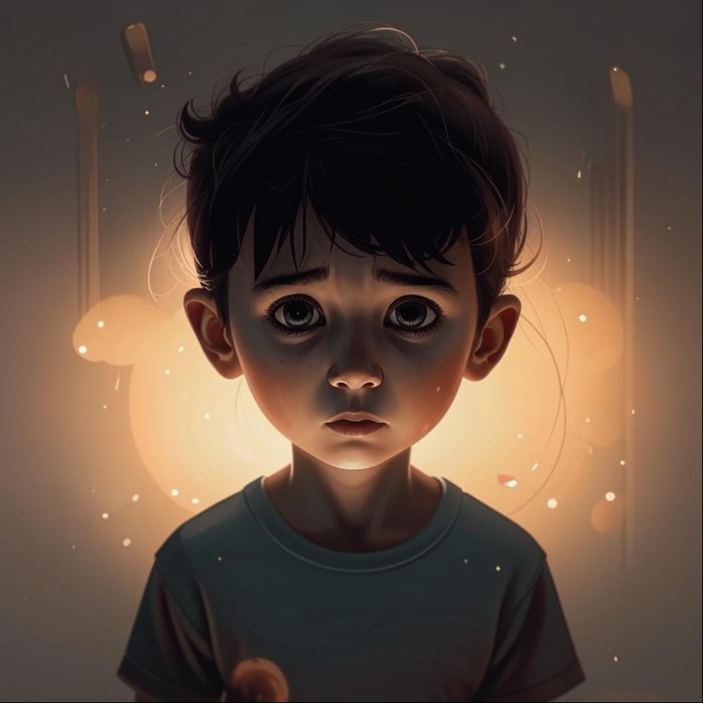

### Определение 📖
Психологический стресс — это состояние, когда ты чувствуешь себя очень напряжённым, беспокойным или подавленным из-за каких-то трудных ситуаций. Это может происходить, когда у тебя много дел, и ты не знаешь, как с ними справиться. Стресс может вызывать такие чувства, как [тревожность](тревожность.md), [недовольство](недовольство.md) и [грусть](грусть.md). 

### Примеры 🌟
Вот несколько ситуаций, когда ты можешь испытать психологический стресс:

1. **Школа**: Если у тебя много домашних заданий, и ты не успеваешь их сделать, ты можешь почувствовать стресс. Это может вызвать [раздражение](раздражение.md) и [неуверенность](неуверенность.md).
   
2. **Спортивные соревнования**: Когда ты готовишься к важному матчу или соревнованию, ты можешь переживать, что не покажешь хороший результат. Это может привести к [тревожности](тревожность.md) и [гневу](гнев.md).

3. **Проблемы с друзьями**: Если у тебя возникли разногласия с другом, это может вызвать [горечь](горечь.md) и [злость](злость.md), а также чувство стресса, потому что ты не знаешь, как всё исправить.

### Способы решения 🛠️
Вот несколько способов, как можно справиться с психологическим стрессом:

1. **Говори о своих чувствах**: Поговори с родителями или друзьями о том, что тебя беспокоит. Это может помочь тебе почувствовать себя лучше и избавиться от [недовольства](недовольство.md).

2. **Делай перерывы**: Если ты чувствуешь, что у тебя много дел, попробуй сделать небольшой перерыв. Погуляй на улице или послушай музыку. Это поможет тебе расслабиться и уменьшить [тревожность](тревожность.md).

3. **Занимайся спортом**: Физическая активность помогает снять напряжение. Играй в футбол, катайся на велосипеде или просто бегай. Это поможет тебе избавиться от [угнетенности](угнетенность.md) и [грусти](грусть.md).

### Заключение 🎉
Психологический стресс — это нормальное чувство, которое может возникнуть у каждого, особенно в трудные моменты. Важно помнить, что ты не одинок, и есть способы справиться с этим состоянием. Говори о своих чувствах, делай перерывы и занимайся спортом, чтобы чувствовать себя лучше. Если ты будешь заботиться о себе, стресс станет менее заметным, и ты сможешь наслаждаться жизнью!