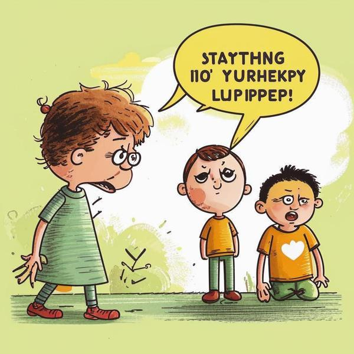

### Определение 📖
**Раздражительность** — это когда ты чувствуешь себя не в настроении и легко злишься на что-то или кого-то. Это может происходить, когда ты испытываешь [стресс](стресс.md) или когда у тебя есть [причина стресса](причины_стресса.md). Например, если ты устал или не выспался, ты можешь стать более раздражительным.

### Примеры 🌟
Вот несколько ситуаций, когда ты можешь почувствовать раздражительность:

1. **Когда ты не выспался**: Если ты лег спать поздно и утром не выспался, ты можешь начать злиться, когда кто-то будет тебя будить или когда что-то пойдет не так.
   
2. **Когда много домашки**: Если у тебя много [трудовой деятельности](трудовая_деятельность.md) и ты не успеваешь сделать все задания, ты можешь начать злиться на себя или на других, кто отвлекает тебя.

3. **Когда кто-то мешает играть**: Если ты играешь в свою любимую игру, а кто-то постоянно отвлекает тебя, это может вызвать раздражение.

### Способы решения 🛠️
Вот несколько способов, как можно справиться с раздражительностью:

1. **Делай перерывы**: Если ты чувствуешь, что становишься раздражительным, попробуй сделать небольшой перерыв. Погуляй на улице или просто посиди в тишине.

2. **Глубокое дыхание**: Используй [дыхание](дыхание.md) как способ успокоиться. Сделай несколько глубоких вдохов и выдохов, чтобы расслабиться.

3. **Поговори с кем-то**: Если ты не можешь справиться с раздражением, поговори с другом или взрослым. Они могут помочь тебе понять, что тебя беспокоит.

### Заключение 🎉
Раздражительность — это нормальная эмоция, которую испытывают все, особенно когда они чувствуют [стресс](стресс.md) или усталость. Важно понимать, что это чувство можно контролировать. Используя простые способы, такие как глубокое дыхание и разговор с кем-то, ты сможешь справиться с раздражительностью и чувствовать себя лучше!