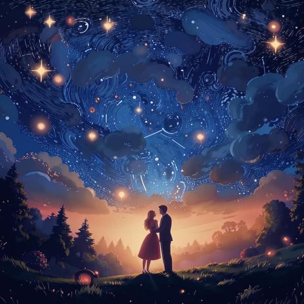

### Определение 🌹

Романтичность — это чувство, когда ты испытываешь что-то особенное и красивое по отношению к другим людям или к жизни в целом. Это может быть связано с любовью, дружбой или даже с природой. Когда ты романтичен, ты видишь мир в ярких цветах и ощущаешь радость от маленьких вещей. Это чувство может напоминать о [счастье](счастье.md) и [восторге](восторг.md), когда ты радуешься чему-то прекрасному.

### Примеры 🌈

1. **Сюрприз для друга**: Ты решил сделать своему другу сюрприз на день рождения. Ты подготовил открытку с добрыми словами и украсил комнату шариками. Когда друг заходит, он улыбается и чувствует себя особенным. Это романтичный момент дружбы!

2. **Прогулка на природе**: Ты гуляешь в парке, и вдруг видишь красивый закат. Небо окрашено в яркие цвета, и ты чувствуешь, как это зрелище наполняет тебя радостью и восхищением. Это романтичный момент, когда ты наслаждаешься природой.

3. **Чтение книги**: Ты читаешь книгу о приключениях и дружбе. В какой-то момент ты чувствуешь, как герои книги становятся тебе близкими, и ты радуешься их успехам. Это тоже романтичный момент, когда ты сопереживаешь персонажам.

### Способы решения 💡

Если ты хочешь испытать романтичность, вот несколько способов:

- **Создавай приятные моменты**: Устраивай маленькие праздники для своих друзей или семьи. Это может быть пикник, вечер настольных игр или просто совместный просмотр фильма.

- **Замечай красоту вокруг**: Обращай внимание на природу, закаты, цветы и даже на улыбки людей. Это поможет тебе чувствовать романтичность в повседневной жизни.

- **Пиши о своих чувствах**: Веди дневник, где ты можешь записывать свои мысли и чувства. Это поможет тебе лучше понять, что делает тебя счастливым и романтичным.

### Заключение 🌟

Романтичность — это замечательное чувство, которое помогает нам видеть красоту в жизни и в отношениях с другими людьми. Это может быть связано с [любовью](любовь.md), [добротой](доброта.md) и [радостью](радость.md). Когда ты романтичен, ты открываешь для себя мир, полный чудес и приятных моментов. Не бойся быть романтичным и делиться своими чувствами с окружающими!