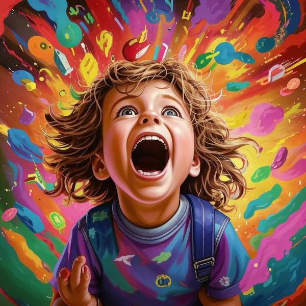

### Определение 🌟
**Страстность** — это сильное и яркое чувство, когда ты очень увлечен чем-то или кем-то. Это как когда ты любишь что-то так сильно, что готов делать для этого много усилий. Например, когда ты увлечен своим хобби, будь то рисование, спорт или игра на музыкальном инструменте, ты чувствуешь страстность. Это чувство может быть связано с [удовольствием](удовольствие.md) и [радостью](радость.md), потому что ты получаешь от этого много положительных эмоций.

### Примеры 🎈
1. **Спорт**: Представь, что ты играешь в футбол и очень хочешь выиграть матч. Ты так увлечен игрой, что забываешь обо всем вокруг. Это страстность!
   
2. **Хобби**: Если ты любишь рисовать и проводишь много времени, создавая свои картины, это тоже страстность. Ты можешь чувствовать [восторг](восторг.md), когда смотришь на свои работы.

3. **Книги**: Когда ты читаешь книгу, которая тебе очень нравится, и не можешь оторваться от нее, это тоже пример страстности. Ты можешь чувствовать [счастье](счастье.md) от того, что погружаешься в интересный мир.

### Способы решения 🛠️
Иногда страстность может быть слишком сильной, и это может отвлекать от других важных вещей, например, учебы или общения с друзьями. Вот несколько способов, как справиться с этим:

1. **Баланс**: Постарайся находить время для своих увлечений, но не забывай про учебу и общение с близкими. Например, можно рисовать по выходным, а в будние дни учиться.

2. **Планирование**: Если ты увлечен чем-то, попробуй составить план, чтобы не забывать о других делах. Например, можно выделить время на занятия спортом и на выполнение домашних заданий.

3. **Общение**: Делись своими увлечениями с друзьями и семьей. Это может сделать твое увлечение еще более интересным и веселым, и ты сможешь испытать [веселье](веселье.md) вместе с ними.

### Заключение 🎉
Страстность — это замечательное чувство, которое помогает нам увлекаться чем-то и получать от этого радость. Важно помнить, что, хотя страстность может быть очень сильной, нужно находить баланс и не забывать о других важных вещах в жизни. Так ты сможешь наслаждаться своими увлечениями и при этом быть счастливым и довольным!

