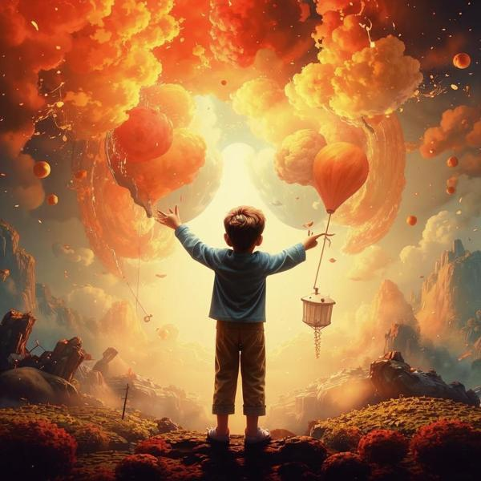

### Определение 🌟
**Страсть** — это очень сильное чувство, когда ты что-то любишь или чем-то увлечен. Это как когда ты играешь в свою любимую игру или занимаешься хобби, и тебе так нравится, что ты забываешь обо всем вокруг. Страсть может быть связана с [удовольствием](удовольствие.md) и [радостью](радость.md), потому что, когда ты чем-то увлечен, ты чувствуешь себя счастливым и довольным.

### Примеры 🎨
1. **Спорт**: Представь, что ты играешь в футбол. Когда ты бежишь за мячом, забиваешь гол и радуешься вместе с командой, ты испытываешь страсть к игре. Это чувство может быть похоже на [восторг](восторг.md), когда ты чувствуешь себя на седьмом небе от счастья.
   
2. **Творчество**: Если ты рисуешь картину и тебе так нравится, что ты не можешь оторваться от холста, это тоже страсть. Ты можешь чувствовать [удовлетворенность](удовлетворенность.md) от того, что создаешь что-то красивое.

3. **Чтение**: Когда ты читаешь книгу, и она так захватывает, что ты не можешь отложить её, это страсть к чтению. Ты можешь испытывать [восхищение](восхищение.md) от приключений героев.

### Способы решения 🛠️
Иногда страсть может быть слишком сильной, и это может отвлекать от других важных дел, например, от учебы. Вот несколько способов, как с этим справиться:

1. **Планирование**: Постарайся выделить время для своей страсти, но не забывай про другие важные вещи, такие как уроки или помощь родителям. Это поможет тебе чувствовать себя [счастливым](счастье.md) и [удовлетворенным](удовлетворенность.md) от того, что ты всё успеваешь.

2. **Разнообразие**: Пробуй разные увлечения. Если ты увлечен только одним делом, попробуй заняться чем-то новым. Это может быть [доброта](доброта.md) к себе, когда ты даешь себе возможность попробовать что-то другое.

3. **Общение**: Делись своей страстью с друзьями или семьей. Это может сделать твое увлечение еще более интересным и веселым, и вы сможете вместе испытывать [веселье](веселье.md).

### Заключение 🎉
Страсть — это замечательное чувство, которое помогает нам наслаждаться жизнью и делать то, что нам нравится. Важно помнить, что страсть должна приносить радость и удовлетворение, а не отвлекать от других важных вещей. Найди баланс между своими увлечениями и другими делами, и ты сможешь наслаждаться жизнью на полную катушку!