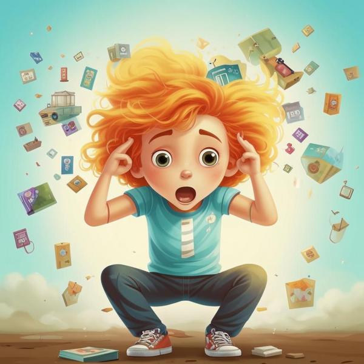

# Что такое стресс? 🤔

**Определение**  
Стресс — это чувство, которое мы испытываем, когда нам становится трудно или страшно. Это может быть связано с разными ситуациями, когда мы чувствуем себя напряженными или раздражительными. Стресс может возникать, когда у нас много дел, и мы не знаем, как с ними справиться. Например, когда ты готовишься к важному экзамену или когда у тебя много домашних заданий, ты можешь почувствовать стресс.

---

**Примеры**  
Вот несколько ситуаций, когда ты можешь испытать стресс:

1. **Трудная контрольная работа** 📚: Когда ты готовишься к контрольной, и тебе кажется, что ты не успеешь выучить все, это может вызвать стресс.
2. **Конфликт с друзьями** 😟: Если ты поссорился с другом, это может сделать тебя раздражительным и напряженным.
3. **Нехватка времени на отдых** ⏳: Если у тебя много кружков и занятий, и ты не успеваешь отдохнуть, это тоже может вызвать стресс.
4. **Сложные отношения с учителем** 👩‍🏫: Если учитель требует от тебя слишком много, и ты не знаешь, как это сделать, ты можешь почувствовать напряжение.

---

**Способы решения**  
Есть много способов справиться со стрессом. Вот некоторые из них:

1. **Дыхательные упражнения** 🌬️: Когда ты чувствуешь стресс, попробуй глубоко подышать. Вдохни медленно через нос, а затем выдохни через рот. Это поможет тебе успокоиться.
2. **Время отдыха** 🛌: Найди время, чтобы отдохнуть и поиграть. Это поможет тебе расслабиться и забыть о проблемах.
3. **Общение с друзьями** 🗣️: Поговори с другом о том, что тебя беспокоит. Иногда просто поговорить о своих чувствах может помочь.
4. **Забота о сне** 😴: Убедись, что ты хорошо спишь. Сон помогает восстановить силы и справиться со стрессом.

---

**Заключение**  
Стресс — это нормальное чувство, которое может возникать у каждого, даже у детей. Важно знать, как с ним справляться, чтобы не чувствовать себя плохо. Если ты будешь использовать способы, такие как [дыхание](дыхание.md), [время отдыха](время_отдыха.md) и общение с друзьями, ты сможешь легче справляться со стрессом и чувствовать себя лучше! 😊