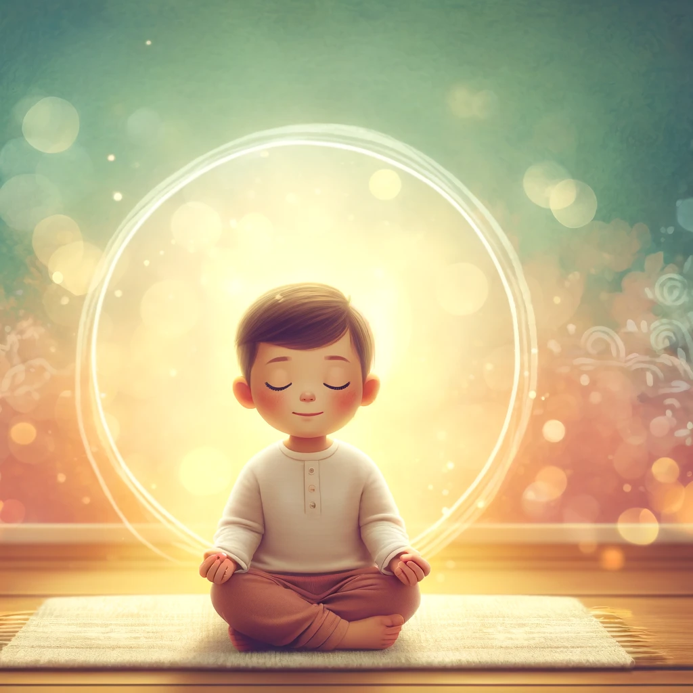

**Что это такое?**  
Медитация – это когда мы сидим тихо, закрываем глаза и сосредотачиваемся на своём дыхании. А дыхательные упражнения – это специальные способы дыхания, которые помогают нам расслабиться.

**Для чего это нужно?**  
Медитация и дыхательные упражнения помогают нам успокоиться, если мы чем-то расстроены или устали. Они учат нас контролировать эмоции и чувствовать себя лучше.

**Примеры:**

- Закрыть глаза и глубоко подышать, когда переживаешь перед выступлением или экзаменом.
    
- Делать «воздушный шарик» – надувать живот, вдыхая носом, и медленно выдыхать ртом.
    
- Представлять, что ты сидишь на облаке и просто наблюдаешь за своими мыслями, как за облаками в небе.
    

**Как это помогает?**  
Когда мы правильно дышим, наш мозг получает больше кислорода, и мы быстрее успокаиваемся. Медитация помогает лучше засыпать и меньше волноваться.
