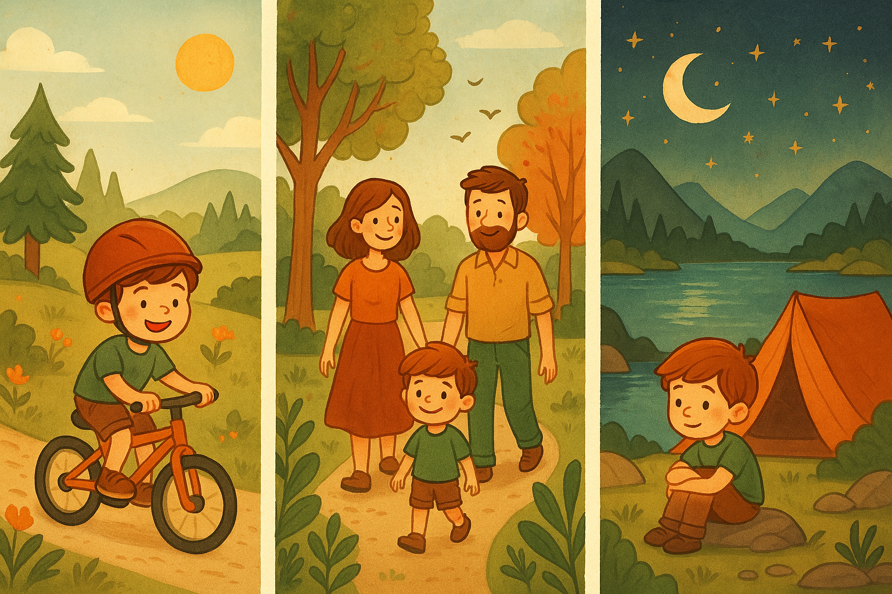

**Что это такое?**  
[Отдых](Отдых.md) на природе – это когда мы проводим время на свежем воздухе: в лесу, в парке, у реки или в горах.

**Для чего это нужно?**  
Природа помогает нам расслабиться, дышать чистым воздухом и получать заряд энергии. Когда мы гуляем среди деревьев или слушаем пение птиц, наш организм [отдыхает](Как_правильно_отдыхать.md), а настроение улучшается.

**Примеры:**

- Прогулки в парке с семьёй или друзьями.
    
- Поход в лес с палатками, где можно разжечь костёр и смотреть на звёзды.
    
- Катание на велосипеде или качание на качелях на детской площадке.
    
- Купание в озере или море, игра в песке.
    

**Как это помогает?**  
Когда мы бываем на природе, наш мозг [отдыхает](Как_правильно_отдыхать.md) от шума и гаджетов. Мы лучше спим, становимся спокойнее и радостнее.
