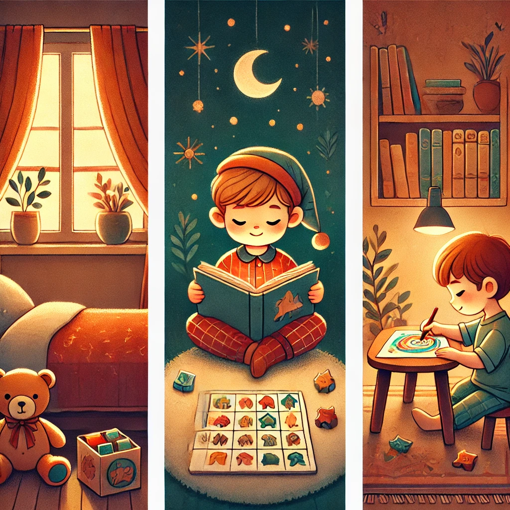

**Что это такое?**  
Это спокойные занятия, которые помогают расслабиться и успокоиться перед [сном](Сон.md) или после активных игр.

**Для чего это нужно?**  
После беготни и шума важно немного посидеть в тишине, чтобы наш мозг подготовился к [отдыху](Отдых.md). Спокойные игры помогают расслабиться, снять напряжение и почувствовать себя уютно.

**Примеры:**

- Чтение книги перед [сном](Сон.md).
    
- Рисование или раскрашивание.
    
- Собирательство пазлов или конструкторов.
    
- Игра в настольные игры, например, в шахматы или «Мемо» (игра на запоминание картинок).
    

**Как это помогает?**  
Когда мы играем в тихие игры, наш мозг [отдыхает](Как_правильно_отдыхать.md), мы меньше устаём и чувствуем себя спокойными. Это помогает хорошо засыпать и видеть приятные [сны](Сон.md)!
