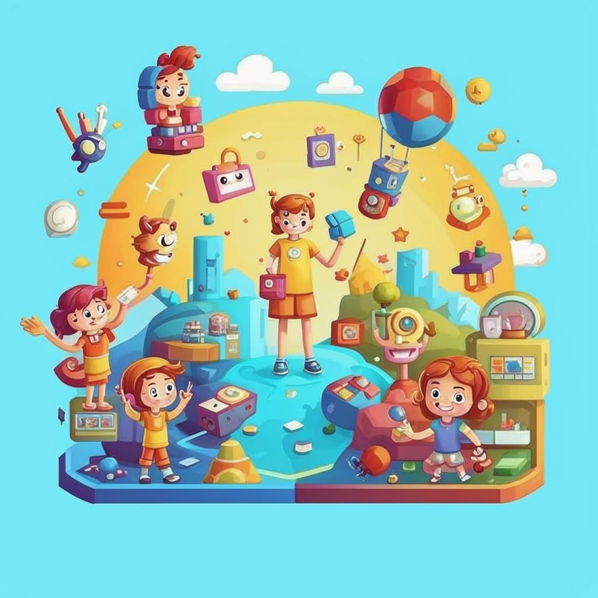

### 🎮 *Геймифицированные Платформы* — Учись играючи!

#### Что это?
Представьте себе, что вы учитесь... играя! Это возможно благодаря геймифицированным платформам. Такие сайты превращают учебу в игру, где нужно проходить уровни, зарабатывать очки и получать награды. Всё, как в любимых играх, но теперь еще и знания приобретаются!

#### Как это работает?
Допустим, вам нужно научиться умножению. Вместо обычного урока вы попадаете в виртуальную школу, где есть задание — спасти кота от злого волшебника. Чтобы победить, нужно правильно решить несколько примеров. Чем быстрее справляетесь, тем больше очков получаете. И вот уже кот спасён, а вы узнали новую тему!  
🤔 А вы бы хотели учиться таким образом?

#### Где это используют?
Примеры популярных геймифицированных платформ:
- **Kahoot**: Здесь можно устраивать викторины с друзьями прямо [онлайн](Как_узнавать_новое_Онлайн.md).
- **Duolingo**: Языковой тренажёр, который напоминает игру, где каждый уровень приближает вас к новым словам и предложениям.
- **Prodigy Math Game**: Математика превращается в фэнтезийное приключение, где каждое уравнение — ключ к победе над монстрами.

#### Почему это круто?
1. **Учеба становится интересной**. Когда [обучение](Совместное_обучение.md) похоже на игру, оно перестает казаться скучным.
2. **Легко запоминать**. Игра помогает лучше усваивать информацию, потому что мозг активируется и воспринимает всё ярче.
3. **Нет стресса**. Никаких экзаменов и оценок — только веселье и прогресс.
4. **Можно играть с друзьями**. Некоторые игры позволяют соревноваться друг с другом, делая процесс ещё веселее.

#### Есть ли сложности?
Иногда бывает сложно сосредоточиться, ведь хочется больше играть, чем учиться. Но если соблюдать баланс между развлечением и учебой, всё получится!
Совет эксперта: Установите таймер на время игры, чтобы точно знать, когда пора остановиться.

#### Занимательные факты
- Игровые элементы появились даже в некоторых университетских [курсах](Массовые_открытые_онлайн-курсы_(MOOC).md)! Например, студенты получают баллы за участие в обсуждениях и выполнение заданий.
- Исследователи доказали, что игровая форма улучшает память и концентрацию внимания.

#### Вывод
Учиться играючи — отличная идея! С геймификацией учёба превращается в настоящее приключение, которое приносит удовольствие и полезные знания одновременно. Так что вперед, покорять новые вершины знаний вместе с любимыми играми! 😊

---
Не забудьте заглянуть в другие разделы нашей детской энциклопедии, чтобы узнать про другие способы онлайн-обучения!
