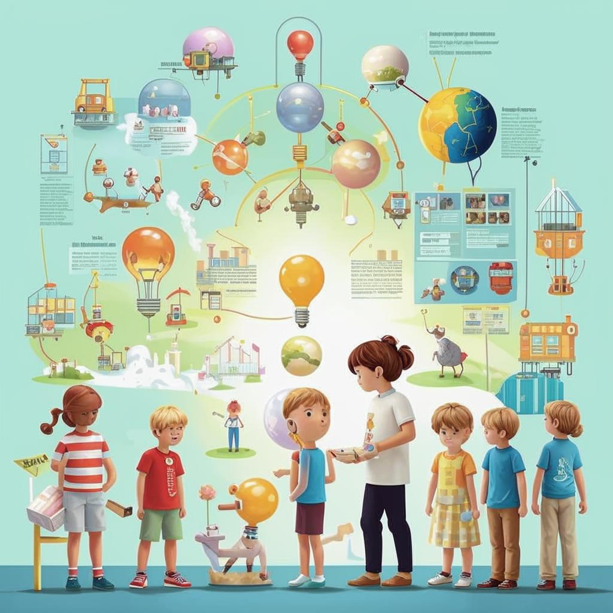

### Заголовок

🌟 **Погружаемся в мир [интерактивных](Интерактивное_и_практическое_обучение.md) симуляций!**  

---

#### Введение 🤔

Представьте себе возможность стать настоящим капитаном космического корабля, исследовать подводные глубины океана или даже управлять собственным городом — всё это возможно благодаря *[интерактивным](Интерактивное_и_практическое_обучение.md) симуляциям*! Это удивительные программы, которые позволяют нам погружаться в виртуальные миры и учиться чему-то новому прямо там!

---

#### Что это такое?

[Интерактивная](Интерактивное_и_практическое_обучение.md) симуляция — это специальная программа, которая создаёт реалистичный виртуальный мир, где мы можем взаимодействовать с объектами и людьми, решать задачи и изучать новые темы. Всё происходит так, будто мы находимся внутри игры, но цель здесь — получить знания и умения, которые пригодятся в реальной жизни.

---

#### Как это работает?

Вы запускаете программу на компьютере или мобильном устройстве, выбираете сценарий и начинаете действовать. Например, вы можете:

- Управлять самолетом, следуя инструкциям пилота.
- Строить дома и планировать городское пространство.
- Исследовать клетки организма под микроскопом.
  
Каждый ваш выбор влияет на развитие событий. Вы видите результат действий сразу же, что помогает лучше понимать изучаемый предмет.

---

#### Где это используют?

Эти технологии широко применяются в разных сферах:

- **Образование**: Школьники учатся проводить химические реакции без риска, школьники-экологи моделируют экосистемы.
- **Медицина**: Будущие врачи тренируются оперировать пациентов в виртуальной реальности.
- **Космос**: Астронавты готовятся к полётам, управляя космическими кораблями.
- **Игровая индустрия**: Многие компьютерные игры включают элементы образовательных симуляций.

---

#### Почему это круто?

Вот несколько главных плюсов:

1. **Реалистичность**. Симуляции создают ощущение настоящего мира, что делает процесс [обучения](Совместное_обучение.md) интересным и запоминающимся.
   
2. **Безопасность**. Можно экспериментировать сколько угодно раз, не боясь ошибиться.

3. **Гибкость**. Каждый ученик выбирает свою скорость освоения материала.

4. **Мотивация**. Игровой подход вызывает желание развиваться дальше.

---

#### Есть ли сложности?

Иногда возникают такие проблемы:

- **Технические требования**. Нужен мощный компьютер или специальное оборудование.
- **Ограниченность сценариев**. Не все области пока охвачены хорошими симуляциями.

Совет: Если техника ограничена, ищите лёгкие веб-приложения или пробуйте бесплатные версии программ.

---

#### Занимательные факты ❗️

- Первая известная образовательная симуляция была создана ещё в 1960-х годах для подготовки астронавтов NASA.
- Сегодня многие компании разрабатывают симуляции специально для школьников, чтобы сделать учёбу веселее и эффективнее.

---

#### Вывод ✨

[Интерактивные](Интерактивное_и_практическое_обучение.md) симуляции открывают перед нами двери в фантастические миры знаний. Они помогают глубже погрузиться в тему, развивают критическое мышление и творческое воображение. Так что смело включайте эти инструменты в своё [учебное](Учебные_материалы.md) путешествие — оно обещает быть захватывающим!

---

А какие симуляции вам хотелось бы попробовать? Напишите в комментариях, и давайте вместе откроем новые горизонты познания! 😊
