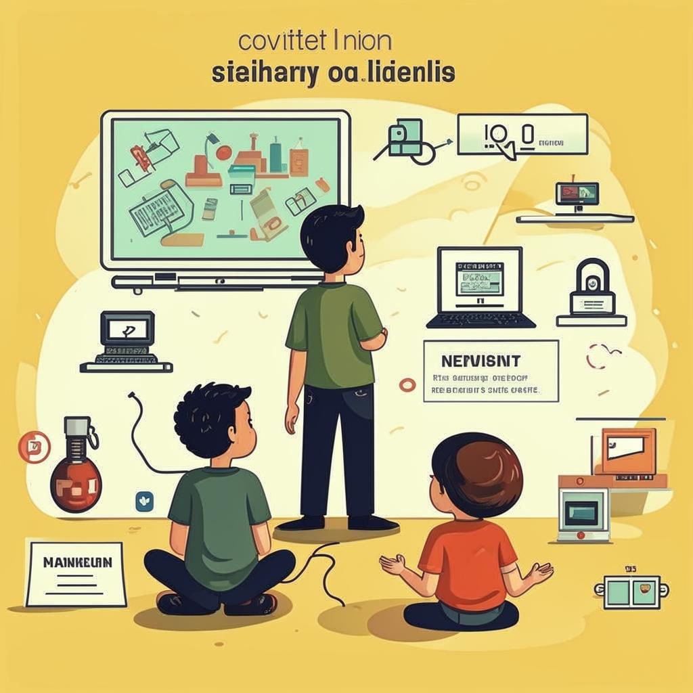

# 🌐 **Мир знаний за экраном: Как Узнавать Новое Онлайн**
 

## *Привет!*

Представьте себе волшебный сундук, полный интересных [книг](Электронные_книги_и_статьи.md), игр и приключений... Но этот сундук — ваш компьютер или смартфон! Сегодня мы поговорим о том, как учиться новому прямо в интернете, не выходя из дома!

---

### 🔍 **Зачем нам нужны знания из интернета?**

Интернет — огромный кладезь информации. Здесь можно найти всё: от уроков рисования до сложных наук вроде астрономии. И самое главное — можно научиться всему этому самостоятельно, когда тебе удобно!

---

### ✨ **Что это такое?**

[Обучение](Совместное_обучение.md) онлайн — это процесс получения новых знаний через интернет-ресурсы. Это могут быть уроки, [курсы](Массовые_открытые_онлайн-курсы_(MOOC).md), игры или даже общение с людьми, которые уже знают много интересного.

---

### ⚙️ **Как это работает?**

Вот несколько простых шагов, как начать изучать что-то новое онлайн:

1. Выбираешь тему, которую хочешь изучить.
2. Искать подходящие ресурсы: сайты, [приложения](Образовательные_мобильные_приложения.md), видеоблоги.
3. Учишься по урокам, играешь в образовательные игры или смотришь видеоролики.
4. Проверяешь себя тестами или выполняешь задания.
5. Общение с единомышленниками помогает лучше усвоить материал.

---

### 🏆 **Где это используют?**

Сегодня существует огромное количество мест, где можно учить что угодно онлайн:

- **YouTube:** там миллионы каналов, посвящённых [обучению](Совместное_обучение.md).
- **Coursera:** [платформа](Геймифицированные_платформы.md) с бесплатными и платными [курсами](Массовые_открытые_онлайн-курсы_(MOOC).md) от лучших университетов мира.
- **Khan Academy:** сайт с [интерактивными](Интерактивное_и_практическое_обучение.md) уроками по математике, физике и другим предметам.
- **TikTok:** короткие ролики с лайфхаками и научными фактами.
- **EduBirdie:** [блог](Образовательные_блоги.md) с полезными советами для школьников и студентов.

---

### 😎 **Почему это круто?**

1. **Можно учиться бесплатно.** Множество ресурсов предлагают бесплатные [курсы](Массовые_открытые_онлайн-курсы_(MOOC).md) и материалы.
   
2. **Учёба становится интересной.** Есть [геймификация](Геймифицированные_платформы.md) — элементы игры в [обучении](Совместное_обучение.md), например, зарабатывание очков за правильные ответы.

3. **Учеба доступна везде.** Можно заниматься из любой точки мира, где есть интернет.

4. **Нет строгих сроков.** Ты учишь тогда, когда удобно именно тебе.

---

### 🤷‍♂️ **Есть ли сложности?**

Да, конечно, бывают трудности. Например:

- Иногда сложно организовать своё время.
- Не всегда понятно, какой ресурс выбрать.
- Нужно уметь фильтровать недостоверную информацию.

Но есть решение: планирование своего расписания и выбор проверенных источников поможет избежать проблем.

---

### 💡 **Занимательные факты**

- Знаете ли вы, что каждый день в мире создаются миллиарды гигабайт новой информации?
  
- Если бы всю эту информацию напечатали в [книгах](Электронные_книги_и_статьи.md), понадобилось бы столько бумаги, сколько весит планета Земля!

---

### 📃 **Заключение**

Итак, теперь вы знаете, что [обучение](Совместное_обучение.md) онлайн — это простой и удобный способ получить новые знания. Важно помнить: главное здесь — желание учиться и умение искать полезную информацию. Начните с малого, и вскоре вы откроете для себя целый мир удивительных открытий!

---

*Совет эксперта:* Найдите интересующий вас предмет и попробуйте пройти хотя бы один бесплатный [курс](Массовые_открытые_онлайн-курсы_(MOOC).md). Поверьте, это увлекательно и полезно! 👉

---

А какие темы вам хотелось бы изучить онлайн? Делитесь своими идеями в комментариях ниже!
