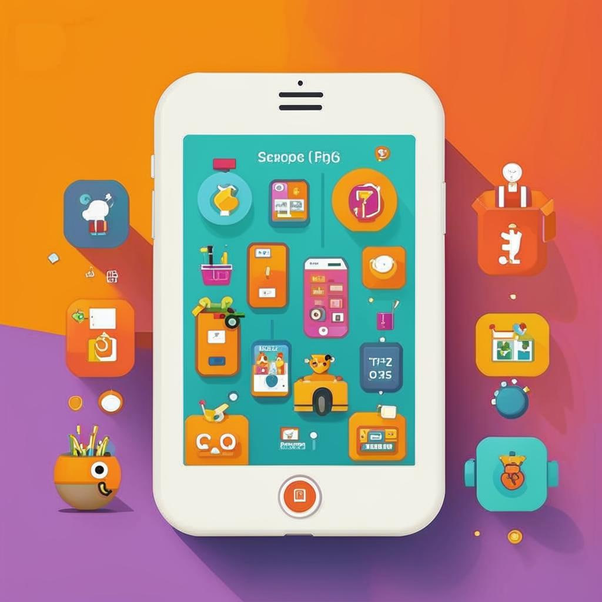

### 📱 Учись играючи! Всё про образовательные мобильные приложения
 

#### Введение  
Представьте себе волшебный мир знаний прямо у вас в кармане! Современные смартфоны — это не только игры и соцсети, но и настоящая школа в миниатюре. Сегодня мы поговорим о **образовательных мобильных приложениях**, которые помогают учиться весело и эффективно!

---

#### Что это такое?
Образовательные мобильные приложения — это программы для смартфонов и планшетов, которые созданы специально для [обучения](Совместное_обучение.md). Они могут учить математике, языкам, истории, науке и многому другому. Такие приложения часто выглядят как игры, но внутри скрываются настоящие уроки!

---

#### Как это работает?
Мобильные приложения позволяют изучать предметы в [интерактивной](Интерактивное_и_практическое_обучение.md) форме. Например, вы можете проходить тесты, решать головоломки, собирать пазлы, играть в викторины или даже управлять виртуальными экспериментами. Это делает процесс учёбы интересным и увлекательным.

Примеры из жизни:
🔸 *«Дуолинго»* помогает выучить новый язык через короткие упражнения-игры.
🔹 *«Khan Academy Kids»* предлагает занятия по математике, чтению и искусству для маленьких учеников.
🔷 *«Prodigy Math Game»* превращает решение уравнений в приключения.

---

#### Где это используют?
Такие приложения используются дома, в школе, в поездках — везде, где есть смартфон или планшет. Их особенно любят школьники, ведь учиться можно в любое время и в любом месте.

Популярные [платформы](Геймифицированные_платформы.md):
✨ *App Store*
⭐ *Google Play*
🌟 *Amazon Appstore*

---

#### Почему это круто?
1️⃣ Приложения делают учебу интересной благодаря [геймификации](Геймифицированные_платформы.md).
2️⃣ Можно заниматься в удобное время и в удобном месте.
3️⃣ Лёгкость отслеживания прогресса.
4️⃣ Множество разных предметов на выбор.
5️⃣ Подходит для любого уровня подготовки.

---

#### Есть ли сложности?
Иногда сложно выбрать подходящее приложение среди множества вариантов. Некоторые платные приложения требуют покупки подписки. Чтобы избежать проблем, лучше заранее изучить отзывы и рекомендации.

Советы эксперта:
💡 Попробуйте бесплатные версии приложений перед покупкой.
💡 Установите таймер, чтобы контролировать время игр и занятий.
💡 Используйте разные приложения для разнообразия уроков.

---

#### Занимательные факты
👉 Многие учёные считают, что мобильные приложения улучшают память и концентрацию.
👈 Исследования показывают, что игровая форма [обучения](Совместное_обучение.md) повышает интерес к предметам.
👇 Уже существуют приложения, которые учат языку жестов и азбуке Морзе!

---

#### Вывод
Образовательные мобильные приложения — отличный инструмент для тех, кто хочет учиться весело и результативно. Благодаря им знания становятся доступными каждому, независимо от возраста и места проживания. Так что вперед, загружайте новые приложения и открывайте для себя удивительный мир науки и творчества!

---

А какие приложения вам уже нравятся? Какие темы хотели бы изучить дальше? Делитесь своими идеями и находками в комментариях!
