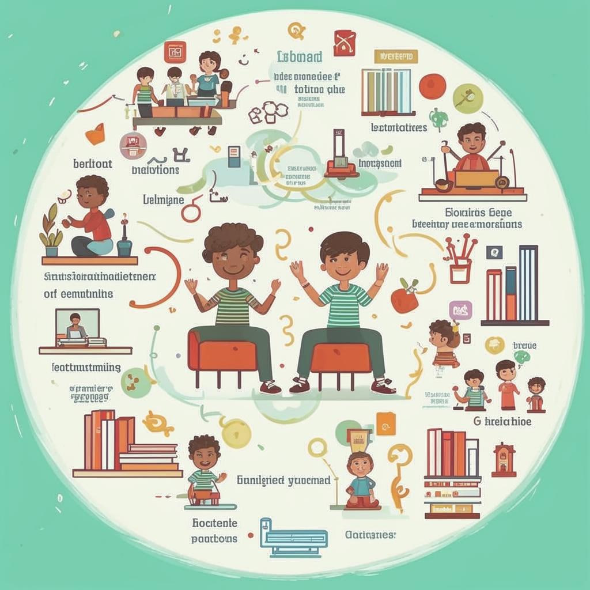

### 🌟 Изучаем вместе: сила совместного обучения! 🌟

#### Введение  
Представьте себе такую ситуацию: вы решили научиться готовить пиццу. Можно прочитать [книгу](Электронные_книги_и_статьи.md) рецептов, посмотреть видеоуроки... Но представьте, как здорово будет, если рядом окажется друг, который тоже хочет учиться этому искусству! Вы будете делиться идеями, помогать друг другу, смеяться над неудачами — и результат точно получится вкуснее!

Это и есть **совместное обучение**: когда несколько человек объединяются, чтобы изучать что-то новое, помогая друг другу достигать целей. И сегодня мы расскажем вам всё самое важное про этот замечательный способ познания мира!

---

#### Что это такое?
Совместное обучение — это процесс, когда два или более человека учатся чему-либо одновременно, обмениваясь знаниями и опытом. Это похоже на дружбу, где каждый приносит свою уникальность, и вместе получается нечто большее, чем сумма частей.

---

#### Как это работает?
Допустим, вы хотите изучить новый язык программирования. Один ваш друг уже немного разбирается в нём, другой хорошо рисует схемы алгоритмов, а третий обожает искать ошибки в коде. Все вместе вы можете создать команду мечты! Например:
- Кто-то объясняет сложное правило.
- Другой помогает визуализировать процессы.
- Третий тестирует решения.
И вот ваша команда достигает успеха быстрее и веселее, чем если бы вы работали самостоятельно.

---

#### Где это используют?
Этот метод активно применяется в школах, университетах и даже среди взрослых профессионалов. Вот некоторые популярные места, где можно встретить совместное обучение:
- **Онлайн-группы**. Например, на [платформах](Геймифицированные_платформы.md) вроде Coursera или Khan Academy часто создаются чаты, где участники [курсов](Массовые_открытые_онлайн-курсы_(MOOC).md) помогают друг другу решать задания.
- **[Форумы](Форумы_и_сообщества.md)**. Здесь ученики задают вопросы, делятся успехами и ошибками, получая обратную связь от опытных пользователей.
- **[Социальные сети](Социальные_сети.md)**. Многие создают группы, посвящённые интересам, где обмениваются статьями, книгами и видеоматериалами.
- **Школьные проекты**. Классические совместные работы на уроках истории, биологии или математики — отличный пример такого подхода.

---

#### Почему это круто?
Вот несколько плюсов, которые делают совместное обучение таким привлекательным:
1. **Помощь друга**. Когда сложно разобраться самому, товарищ придёт на помощь.
2. **Разнообразие идей**. Вместе рождаются новые мысли и подходы.
3. **Мотивация**. Работая бок о бок, легче сохранять энтузиазм и двигаться вперёд.
4. **Навыки общения**. Учимся договариваться, распределять обязанности и уважать мнение другого.
5. **Эмоциональная поддержка**. Трудности преодолеваются легче, когда знаешь, что тебя поддерживают друзья.

---

#### Есть ли сложности?
Да, иногда возникают препятствия. Важно помнить, что...
- Не все готовы сразу доверять другим свои идеи.
- Могут возникать споры о правильности решений.
Но есть способы преодолеть эти проблемы:
- Договоритесь заранее о правилах совместной работы.
- Научитесь выслушивать мнения других людей, сохраняя уважение.
- Если возникает конфликт, обсудите проблему спокойно и найдите компромисс.

---

#### Занимательные факты
💡 Знаете ли вы, что многие великие открытия были сделаны благодаря сотрудничеству? Например, теория относительности Эйнштейна родилась во многом благодаря обсуждением с друзьями-физиками.

---

#### Вывод
Совместное обучение — это мощный инструмент для достижения новых высот. Оно объединяет таланты разных людей, создаёт атмосферу поддержки и делает путь к знаниям интересным и радостным. Попробуйте найти единомышленников, соберите команду мечты и откройте для себя удивительный мир знаний вместе!

Так что, дорогие ребята, кто готов стать частью команды великих открытий? ✨
