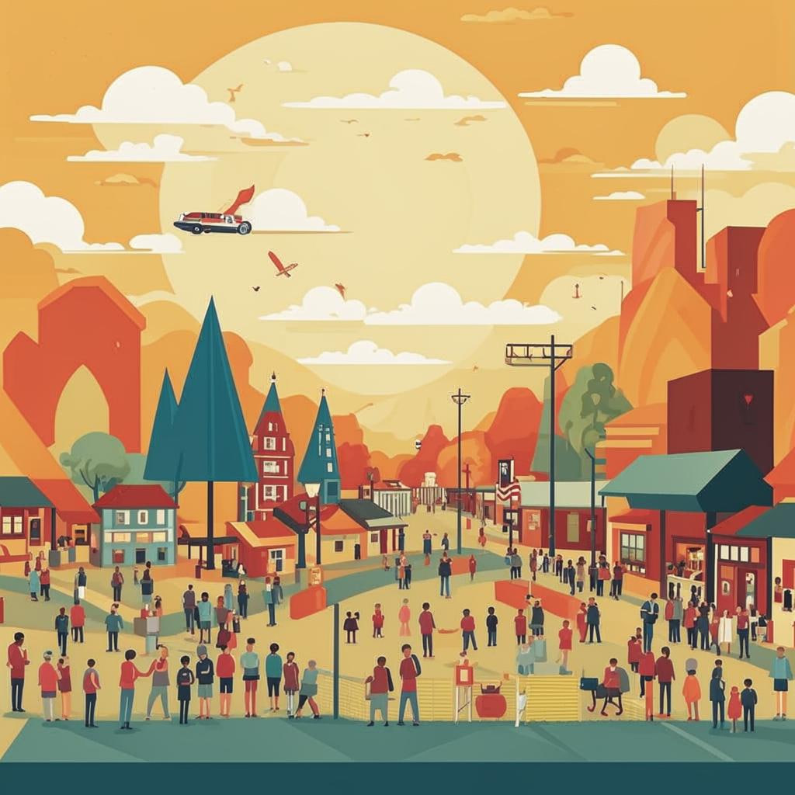

### 🌟 Заглянем в мир сообществ и мероприятий! 🌟
  

#### Введение  
Представьте себе волшебный портал, где собираются единомышленники — ребята, увлечённые одними интересами. Здесь каждый день происходят удивительные события: проводятся конкурсы, встречи, мастер-классы... Это место, где можно делиться своими идеями, учиться новому и заводить друзей!

---

#### Что это такое?
[Сообщество](Форумы_и_сообщества.md) — это группа людей, объединённых общими целями или интересами. Например, любители робототехники, программирования или рисования. Мероприятие — это событие, которое организуется для участников [сообщества](Форумы_и_сообщества.md). Оно может быть [онлайн](Как_узнавать_новое_Онлайн.md) (в виде [вебинаров](Вебинары.md), конкурсов) или офлайн (выставки, фестивали).

---

#### Как это работает?
Вот пример из жизни: представим, что вы любите рисовать комиксы. Вы можете найти [сообщество](Форумы_и_сообщества.md) художников-комиксистов в интернете, вступить туда и начать общаться с ребятами, которые тоже любят рисовать. Они будут выкладывать свои работы, давать советы и устраивать соревнования. Если вам захочется встретиться лично, организаторы могут устроить фестиваль комикс-творчества, куда приглашают всех желающих.

---

#### Где это используют?
* **[Форумы](Форумы_и_сообщества.md)**: [Платформы](Геймифицированные_платформы.md) вроде Reddit или тематические [форумы](Форумы_и_сообщества.md).
* **[Социальные сети](Социальные_сети.md)**: Группы в VK, Telegram-каналы.
* **Специализированные сайты**: Сайты с фан-клубами игр, [книг](Электронные_книги_и_статьи.md), фильмов.
* **Онлайн-платформы**: [Конференции](Виртуальные_конференции_и_саммиты.md) Twitch, Discord-серверы.

---

#### Почему это круто?
💡 Общение с теми, кто разделяет ваши интересы, помогает быстрее развиваться.
💻 Участие в мероприятиях расширяет кругозор и дарит новые впечатления.
👉 Возможность показать себя миру и получить обратную связь от профессионалов.
🎁 Шанс завести настоящих друзей и соратников.

---

#### Есть ли сложности?
Иногда бывает сложно выбрать подходящее [сообщество](Форумы_и_сообщества.md) среди множества вариантов. Или может показаться, что другие участники уже знают намного больше вас. Но не переживайте! Вот несколько советов:
1. Не бойтесь начинать общение первым.
2. Прислушивайтесь к советам опытных участников.
3. Участвуйте активно — это поможет быстро освоиться.

---

#### Занимательные факты
✨ Знаете ли вы, что многие известные компании начинались именно с небольших [сообществ](Форумы_и_сообщества.md) энтузиастов? Например, Microsoft выросла из группы программистов, которые собирались вместе и обменивались опытом.

---

#### Вывод
[Сообщества](Форумы_и_сообщества.md) и мероприятия — это отличный способ погружаться в любимое дело, находить новых друзей и постоянно расти над собой. Так что смело открывайте дверь в этот волшебный мир и наслаждайтесь процессом познания!

---

❓ Вопрос: А какие [сообщества](Форумы_и_сообщества.md) заинтересовали бы тебя? Может, есть хобби, которому хотелось бы посвятить время?

🧠 Совет эксперта: Попробуй искать не только большие [сообщества](Форумы_и_сообщества.md), но и маленькие локальные клубы — там проще наладить контакт с участниками и сразу погрузиться в атмосферу творчества и учёбы.
