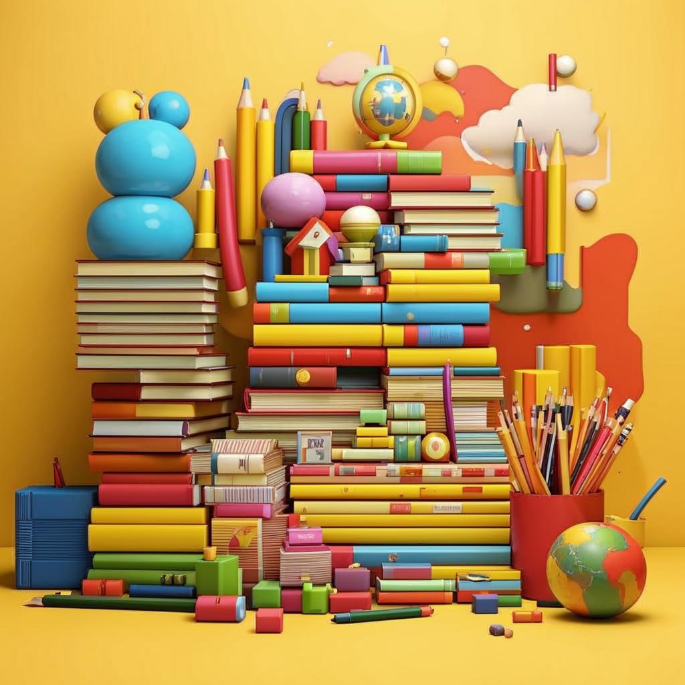

### 🌟 Узнавайте Новое Каждый День! 🌟

#### Заголовок:  
📚 *Учебные Материалы* — Путеводители По Миру Знаний!

---

#### Введение:  
Представьте себе огромный сундук, полный сокровищ... Но внутри не золото, а знания! Эти знания спрятаны в [книгах](Электронные_книги_и_статьи.md), [статьях](Электронные_книги_и_статьи.md), видеоуроках и даже [приложениях](Образовательные_мобильные_приложения.md) на телефоне. Всё это — учебные материалы, которые помогают нам учиться новому каждый день. И самое удивительное — всё это доступно прямо сейчас благодаря Интернету!

---

#### Что Это Такое?
Учебные материалы — это информация, которую мы используем для [обучения](Совместное_обучение.md). Они бывают разными: от [книг](Электронные_книги_и_статьи.md) до видеороликов. С помощью учебных материалов можно изучать любые темы: историю, математику, языки, рисование и многое другое. Например, учебник по математике — это тоже учебный материал, который помогает решать задачи.

---

#### Как Это Работает?
Вы можете найти учебные материалы в разных местах. Вот несколько примеров:

- **Электронные [книги](Электронные_книги_и_статьи.md)**: Скачали [книгу](Электронные_книги_и_статьи.md) про динозавров? Это учебный материал! Читая её, вы узнаете много интересного о древних существах.
- **[Онлайн](Как_узнавать_новое_Онлайн.md) [курсы](Массовые_открытые_онлайн-курсы_(MOOC).md)**: Есть специальные сайты, где учителя выкладывают уроки. Вы смотрите видео, слушаете объяснения и выполняете задания. Так можно научиться играть на гитаре или готовить блюда.
- **[Приложения](Образовательные_мобильные_приложения.md)**: Существуют программы для телефона, которые учат иностранным языкам. Просто открываете [приложение](Образовательные_мобильные_приложения.md), выбираете урок и начинаете учить слова.

---

#### Где Это Используют?
Вот некоторые популярные места, где можно найти учебные материалы:

- **YouTube**: Здесь тысячи уроков по разным предметам. Хотите узнать, как нарисовать кошку? Найдите видеоуроки!
- **Coursera и Khan Academy**: [Платформы](Геймифицированные_платформы.md) с [курсами](Массовые_открытые_онлайн-курсы_(MOOC).md) по многим дисциплинам. Можно получить [сертификаты](Онлайн-курсы_с_сертификатами.md) после завершения [курса](Массовые_открытые_онлайн-курсы_(MOOC).md).
- **Библиотеки**: Да-да, обычные библиотеки! Там есть масса бумажных [книг](Электронные_книги_и_статьи.md), которые также являются учебными материалами.

---

#### Почему Это Круто?
1. **Доступность**: Учебные материалы часто бесплатны или стоят недорого. Многие [книги](Электронные_книги_и_статьи.md) и [курсы](Массовые_открытые_онлайн-курсы_(MOOC).md) можно скачать бесплатно.
2. **Разнообразие**: Можно выбрать тему, которая вам интересна. Любите музыку? Изучайте сольфеджио! Интересуетесь космосом? Погружайтесь в астрономические открытия!
3. **Гибкость**: Не нужно ходить в школу или университет. Учиться можно дома, в парке или даже в дороге.

---

#### Есть Ли Сложности?
Иногда бывает сложно разобраться, какой материал лучше подходит именно вам. Чтобы избежать путаницы, попробуйте такие советы:

- Начните с простого материала, чтобы освоиться.
- Если тема сложная, ищите разные источники — иногда один автор объясняет лучше другого.
- Делайте перерывы между занятиями, чтобы мозг успевал усвоить новую информацию.

---

#### Занимательные Факты:
✨ Знали ли вы, что первые электронные [книги](Электронные_книги_и_статьи.md) появились ещё в конце XX века? Тогда они были большими и тяжёлыми, совсем не такими удобными, как современные планшеты.

✨ Сейчас существуют целые виртуальные школы, где ученики учатся полностью [онлайн](Как_узнавать_новое_Онлайн.md). Даже экзамены там проходят через компьютер!

---

#### Вывод:
Учебные материалы — это волшебные ключи к новым знаниям. Они позволяют каждому человеку открыть для себя новые горизонты, будь то история древнего мира или наука будущего. Главное — помнить, что учиться можно весело и интересно, особенно когда вокруг столько ресурсов! 😊

Так что выбирайте свою первую [книгу](Электронные_книги_и_статьи.md), включайте первое видео и отправляйтесь в путешествие по миру знаний!
