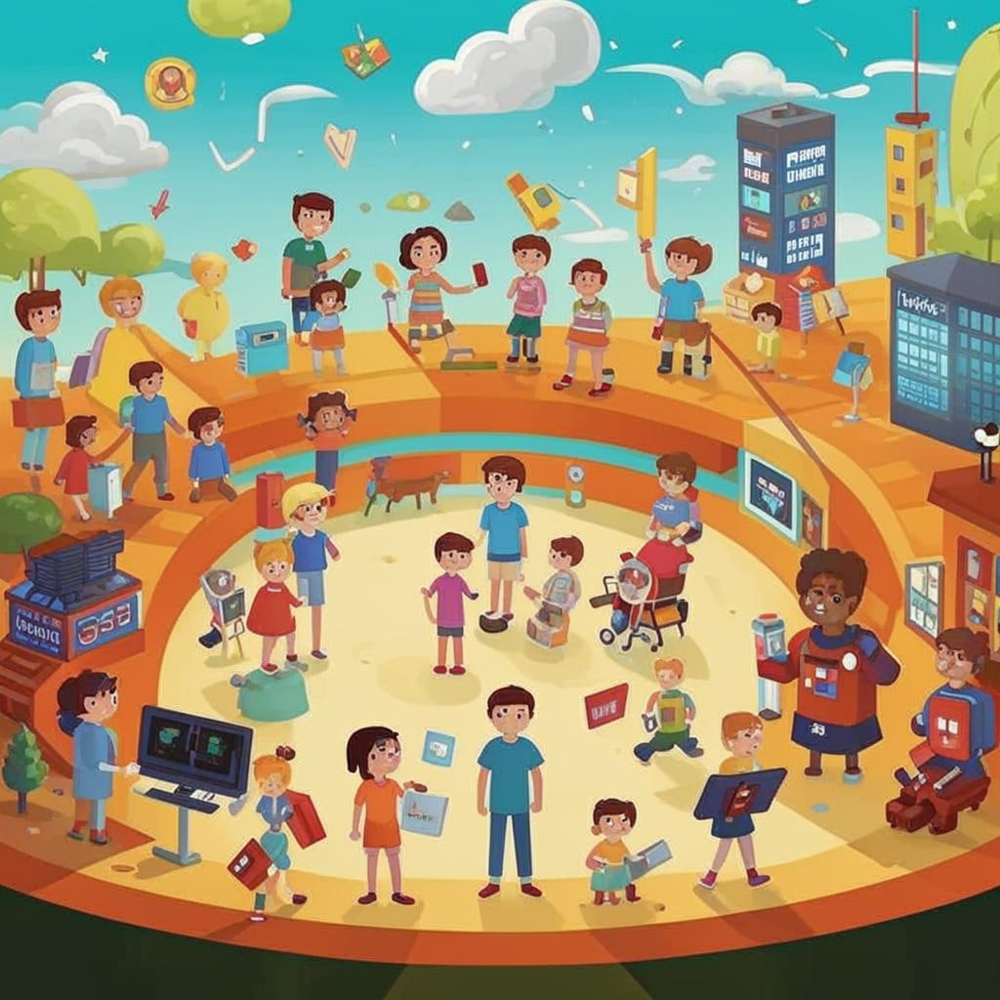

### Заголовок

🌟 *Онлайн-клубы знаний: Где найти друзей и умные идеи!* 🌟  
 

---

#### Введение

Представьте себе место, где каждый день происходят удивительные открытия — новые друзья, невероятные истории и море полезной информации. И всё это прямо в интернете! Это мир форумов и сообществ, который поможет тебе стать настоящим экспертом во всём, что интересно!

---

#### Что это такое?

Форум — это виртуальная площадка, где люди общаются друг с другом через тексты. Они задают вопросы, делятся идеями и помогают решать проблемы. А сообщество — это группа людей с одинаковыми интересами, которые собираются вместе, чтобы обмениваться знаниями и опытом. 😎

**Сноска:** Форум (от латинского "forum") изначально означал площадь в древнем Риме, где собирались граждане обсудить важные дела. Сегодня форумы стали цифровыми площадками для общения!

---

#### Как это работает?

На форумах пользователи создают темы обсуждения, пишут комментарии и отвечают другим участникам. Например, ты можешь задать вопрос про свою любимую игру или попросить совета по математике. Другие участники обязательно откликнутся и предложат решения!

**Пример из жизни:** Если ты играешь в Minecraft, наверняка знаешь сайт Mojang Forums, где игроки постоянно делятся секретами новых карт и хитростей игры. Так же работают многие другие тематические площадки.

---

#### Где это используют?

Форумы и сообщества существуют практически везде! Вот несколько примеров:

- **Reddit** — огромная [платформа](Геймифицированные_платформы.md) с тысячами разных разделов ("субреддитов"), от кулинарии до программирования.
- **Habrahabr** — популярный ресурс среди программистов и IT-специалистов.
- **Dota 2 Forum** — игровой форум для поклонников Dota 2.
- **VK-сообщества** — [социальные](Социальные_сети.md) группы в ВКонтакте, посвящённые разным хобби и интересам.

---

#### Почему это круто?

Вот несколько причин, почему стоит попробовать общаться на форумах и в сообществах:

1. **Новые знания**: Ты сможешь быстро находить нужную информацию и учиться у опытных участников.
2. **Друзья по интересам**: Найди единомышленников и обсудите любимые темы.
3. **Практика письма**: Общение развивает навыки письменной речи.
4. **Помощь и поддержка**: Всегда найдётся кто-то, готовый ответить на твой вопрос.

---

#### Есть ли сложности?

Иногда бывает сложно разобраться с правилами форума или встретить грубых пользователей. Но есть способы избежать проблем:

- Следуй правилам сайта.
- Будь вежливым и уважительным.
- Игнорируй негатив.
- Сообщай администрации о нарушениях.

---

#### Занимательные факты

- Знаете ли вы, что первый веб-сайт был форумом? Его создал Тим Бернерс-Ли в 1991 году.
- Reddit сегодня объединяет более 430 миллионов активных пользователей ежемесячно!
- Многие компании запускают собственные форумы для поддержки клиентов.

---

#### Вывод

Форумы и сообщества — это уникальные места, где можно учиться новому, заводить друзей и делиться своими увлечениями. Попробуй зарегистрироваться хотя бы на одном форуме и почувствуй себя частью большого мира знаний! 🚀

---

**Совет эксперта:** Начните с малого — выберите тему, которая вам интересна, и напишите первое сообщение. Не бойтесь ошибаться, ведь здесь ценятся любопытство и желание познавать новое!
