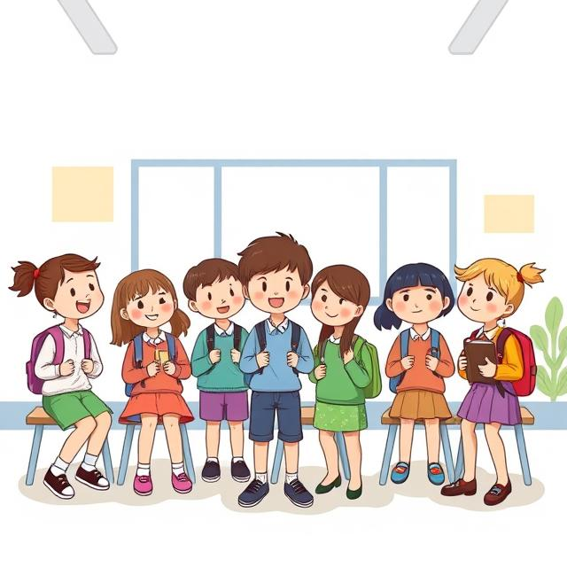
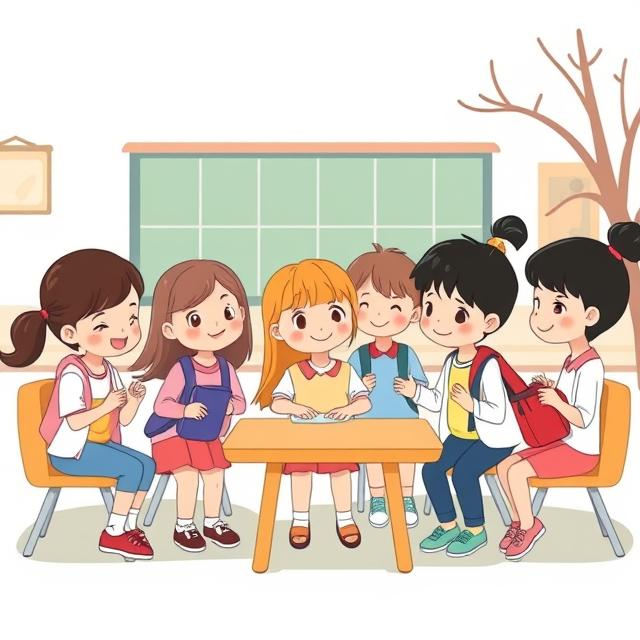

# 🏫 Твой класс — маленькая вселенная дружбы и знаний

Сейчас мы поговорим о самом уютном месте в школе — о твоём классе. Это не просто комната с партами и доской, а настоящий волшебный мир, где ты проводишь так много важных и интересных моментов своей жизни.

## 👫 Ты и твоя школьная семья

Каждое утро ты приходишь в свой класс и видишь родные лица одноклассников. Эти ребята — твоя школьная семья на целый год! Вместе вы смеётесь над шутками, переживаете перед контрольными, помогаете друг другу разобраться в сложных темах. Даже если иногда вы ссоритесь, как все братья и сёстры, вы обязательно миритесь, потому что ваш класс — это команда!

Ваш учитель в этой семье — как мудрый наставник. Он не только объясняет новые темы, но и помогает вам научиться дружить, работать вместе, поддерживать друг друга. Помнишь, как вы всем классом готовили тот весёлый спектакль на Новый год? Или как болели за своих на спортивных соревнованиях? Вот это и есть настоящая классная жизнь!

## 📚 Ваш общий дом знаний

Ваш классный кабинет — это особенное место. Здесь пахнет мелом и школьными завтраками, на стенах висят ваши лучшие рисунки и грамоты, а на полке стоят общие трофеи с конкурсов. В этом кабинете вы вместе узнаёте, что дважды два — четыре, как пишется слово "счастье" и почему осенью листья меняют цвет.

Каждая парта в классе хранит свои маленькие секреты. Вот за этой сидит отличник Ваня, который всегда поможет с математикой. А вот там — весёлая Маша, которая умеет рассказывать такие смешные истории на переменах. И твоё место — самое важное, потому что оно ТВОЁ, и без тебя класс был бы совсем другим!

## 🎉 Классные традиции — ваша магия

У каждого класса постепенно появляются свои традиции — то, что делает вас неповторимыми. Может быть, вы всем классом поёте песню перед сложной контрольной? Или у вас есть особый способ поздравлять именинников? А может, вы собираете общую коллекцию наклеек или ведёте классный дневник с забавными случаями?

Эти традиции — как волшебные ниточки, которые связывают вас вместе. Через много лет, когда вы все станете взрослыми, вы будете с теплотой вспоминать эти маленькие ритуалы, которые делали вашу школьную жизнь такой особенной.

## 🌟 Ты — важная часть своего класса

Знаешь, в чём самая большая ценность класса? В том, что в нём есть ТЫ! Ты со своим характером, улыбкой, способностями и даже маленькими недостатками. Без тебя ваш класс был бы другим — ведь каждый человек приносит что-то своё, неповторимое.

Не бойся проявлять себя, предлагать идеи, участвовать в общих делах. Твой вклад важен! Даже если тебе кажется, что ты "не самый умный" или "не самый талантливый" — это неправда. Ты нужен своему классу именно таким, какой ты есть. Вместе вы — как пазл, где каждая деталь на своём месте.

## 💖 Школьные годы — навсегда

Когда ты вырастешь, ты поймёшь, что школьный класс — это одна из самых тёплых и светлых страниц в книге твоей жизни. Здесь ты нашёл первых настоящих друзей, пережил первые победы и неудачи, научился важным вещам, которые пригодятся тебе всегда.

Цени каждый день в своём классе, береги отношения с одноклассниками, создавайте вместе добрые воспоминания. Пусть ваш класс будет местом, куда хочется приходить, где тебя понимают и принимают. Ведь школа — это не только уроки, но и люди, с которыми ты её проходишь. И поверь, эти школьные друзья могут остаться с тобой на всю жизнь! ✨

