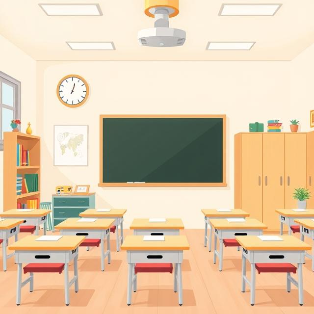

# 🏠 Классная комната — твой второй дом в школе!

Теперь мы поговорим о месте, где ты проводишь большую часть своего школьного времени — о твоей классной комнате. Это не просто помещение с партами и доской, а настоящий волшебный мир, где происходят удивительные вещи каждый день!

## 🎨 Как устроена твоя классная комната?

Твоя классная комната — это особое пространство, созданное специально для тебя и твоих одноклассников. Здесь есть:

- **Удобные парты**, за которыми вы пишете, рисуете и мечтаете ✏️  
- **Доска**, превращающаяся то в поле для задач, то в холст для идей 🖍️  
- **Стенды** с вашими лучшими работами и важной информацией 📌  
- **Книжные полки** с учебниками и интересными книгами 📚  
- **Окна**, через которые врывается солнечный свет и свежий воздух ☀️  

А ещё в некоторых классах есть настоящие мини-лаборатории, музыкальные инструменты или спортивные уголки — всё зависит от того, какие предметы вы там изучаете!

## 🤝 Почему классная комната так важна?

Это место становится особенным, потому что здесь:  
- Ты встречаешься с друзьями каждое утро 👋  
- Учишься новому вместе с одноклассниками 🧠  
- Переживаешь весёлые и трогательные моменты 😊  
- Чувствуешь себя частью команды — вашего класса 🤝  
- Можешь проявить свою индивидуальность через творчество 🎨  

Помнишь, как вы всем классом украшали комнату к Новому году? Или как готовили стенгазету? Эти моменты делают пространство по-настоящему вашим!

## 🌱 Как сделать классную комнату ещё лучше?

Ты тоже можешь влиять на то, какой будет ваша классная комната:  
- Бережно относись к мебели и оборудованию ♻️  
- Предлагай идеи по оформлению — может, сделаем уголок природы? 🌱  
- Участвуй в уборке и поддержании порядка 🧹  
- Создавай вместе с одноклассниками атмосферу доброты и уважения 💖  
- Придумывай традиции для вашего класса (например, еженедельные "минутки доброты") ✨  

Когда все вместе заботятся о классе, он становится по-настоящему уютным и родным!

## 🏆 Твоя парта — твоя территория

Место, где ты сидишь — это маленький кусочек классной комнаты, который принадлежит именно тебе. Ты можешь:  
- Аккуратно хранить там свои вещи 🎒  
- Украсить его в рамках правил школы (красивая подставка для ручек, фото в уголке) 🖼️  
- Содержать в чистоте и порядке 🧼  
- Чувствовать себя там комфортно и безопасно 😌  

Помни, что твоё место в классе — это отражение тебя самого. Пусть оно будет таким же аккуратным и добрым, как ты!

## 💫 Классная комната — начало больших открытий

Когда-нибудь ты вырастешь, но воспоминания о твоей классной комнате останутся с тобой навсегда. Именно здесь ты:  
- Сделал свои первые открытия 🔍  
- Нашёл настоящих друзей 👫  
- Научился работать в команде 🤝  
- Понял, что ошибки — это ступеньки к успеху 💪  

Береги это особенное место, вноси в него что-то своё, и пусть каждый день в твоей классной комнате будет наполнен радостью открытий! Ведь именно с этих парт начинаются большие мечты и великие свершения! 🚀

> "Школьный класс — это место, где обычные стены наполняются детскими голосами и превращаются в пространство для чудес!"

