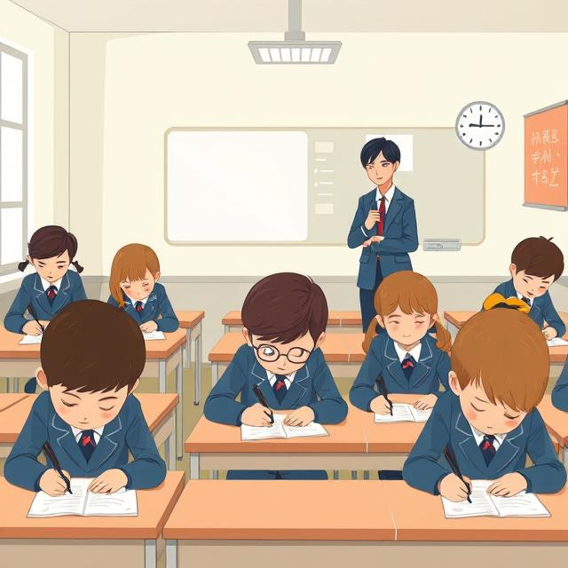

# 📝 Экзамен — не страшно, а интересно! 😊

Сейчас мы обсудим такое важное событие школьной жизни, как экзамен. Не пугайся этого слова — на самом деле экзамены бывают совсем не страшными, а даже интересными, если правильно к ним подготовиться!

## 🧠 Что такое экзамен?

Экзамен — это как большая проверка твоих знаний, но не такая, как обычная контрольная работа. Это особенный день, когда ты можешь показать всё, чему научился за год или даже за несколько лет. Представь, что ты спортсмен, который долго тренировался, и теперь пришло время показать свои умения на соревнованиях!

Экзамены бывают разные. В начальной школе это могут быть простые проверочные работы. А вот в старших классах ребята сдают ОГЭ (в 9 классе) и ЕГЭ (в 11 классе) — это очень важные экзамены, которые помогают поступить в колледж или университет. Но тебе пока рано о них беспокоиться — когда придёт время, ты обязательно со всем справишься!

## 🤔 Почему экзамены полезны?

Знаешь, зачем вообще нужны экзамены? Они помогают:
- Понять, какие темы ты усвоил хорошо 👍
- Увидеть, над чем нужно ещё поработать 📚
- Научиться справляться с волнением перед важными событиями 🧘
- Почувствовать гордость за свои знания и труд 🏆

Экзамен — это не "страшный монстр", а просто возможность проверить себя. Даже если что-то не получится с первого раза — не беда! Главное не оценки, а знания, которые останутся с тобой навсегда.

## 🎯 Как готовиться к экзаменам?

Лучший способ хорошо сдать экзамен — готовиться к нему понемногу весь год, а не в последнюю ночь! Вот несколько полезных советов:

1. **Слушай внимательно на уроках** — так ты поймёшь материал сразу, и потом будет легче.
2. **Делай домашние задания** — это как тренировка перед большим матчем.
3. **Задавай вопросы учителю**, если что-то непонятно — не стесняйся!
4. **Повторяй материал по частям** — лучше по 20 минут каждый день, чем 5 часов подряд перед экзаменом.
5. **Не забывай отдыхать** — перед экзаменом обязательно выспись и не волнуйся!

## 🌟 ОГЭ и ЕГЭ — что это?

Когда ты подрастёшь, тебе предстоит познакомиться с важными экзаменами:
- **ОГЭ** сдают в 9 классе — это как итог всей средней школы
- **ЕГЭ** сдают в 11 классе — он нужен для поступления в вузы

Но знаешь что? Когда ты дойдёшь до этих экзаменов, ты будешь уже совсем взрослым и подготовленным! Твои учителя помогут тебе разобраться во всём, и ты обязательно справишься. А пока просто учись с удовольствием и не переживай о далёком будущем.

## 💪 Ты справишься!

Главное помни — экзамены придумали не для того, чтобы кого-то запугать, а чтобы помочь понять свои сильные стороны. Ты умный, способный и обязательно со всем справишься! А если будет трудно — рядом всегда будут учителя и родители, которые тебя поддержат.

Каждый экзамен — это шаг вперёд в твоём развитии. Сегодня ты волнуешься перед контрольной, завтра уверенно сдашь ОГЭ, а потом — кто знает? — может быть, защитишь диссертацию! Верь в себя, и у тебя всё получится! 🚀

