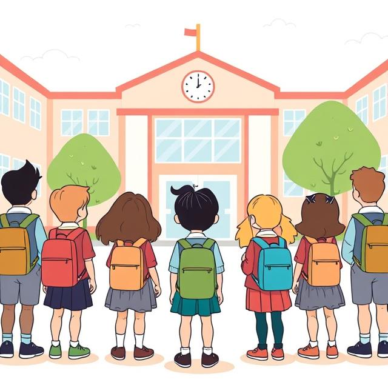
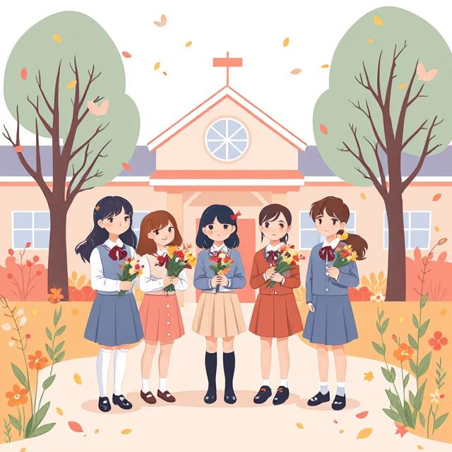

# 🏫 Школа — твой второй дом

Школа — это удивительное место, где ты проводишь большую часть своего времени. Здесь ты не только учишься, но и находишь друзей, участвуешь в интересных мероприятиях и постепенно становишься взрослее. Давай разберёмся, что делает школу таким особенным местом.

## 📚 Учёба — основа школьной жизни

Каждый день ты приходишь в школу, чтобы узнавать новое. На уроках учителя рассказывают тебе о разных науках: математике, русском языке, окружающем мире. Ты решаешь задачи, пишешь упражнения, проводишь опыты. Это как собирать пазл — с каждым уроком картина мира становится всё яснее и интереснее.

Домашние задания помогают закрепить то, что ты узнал в школе. Когда ты аккуратно выполняешь их, то становишься более внимательным и ответственным.

Контрольные работы и экзамены показывают, насколько хорошо ты усвоил материал. Не стоит их бояться — это просто проверка твоих знаний!

## 👫 Социальная жизнь в школе

В школе у тебя есть целый класс — ребята, с которыми ты видишься каждый день. Вы вместе учитесь, играете на переменах, готовитесь к праздникам.

Учитель — это не просто человек, который объясняет уроки. Он помогает тебе разобраться в сложных вопросах, поддерживает, когда что-то не получается, и радуется твоим успехам.

## 🎭 Внеучебные мероприятия

В школе происходит много интересного помимо обычных уроков! Ты можешь участвовать в весёлых праздниках — выступать на концертах, показывать свои таланты в конкурсах. Для тех, кто хочет развивать свои увлечения, есть разные кружки — можно заниматься рисованием, пением, робототехникой или чем-то ещё, что тебе нравится. Любишь движение? Присоединяйся к спортивным соревнованиям! А ещё классно ездить всем классом на экскурсии — это возможность увидеть новые места и узнать много интересного. Все эти занятия помогают тебе раскрыть свои способности, найти новых друзей и сделать школьную жизнь ещё увлекательнее.

## 🏢 Школьные помещения

В школе много разных кабинетов:

 - Классы, где проходят уроки

 - Спортивный зал для физкультуры

 - Библиотека с интересными книгами

 - Столовая, где можно вкусно поесть

Каждый день ты ходишь по школьным коридорам, встречаешь знакомых учителей и ребят. Со временем школа становится для тебя таким же привычным и уютным местом, как твой дом.

## 💡 Почему школа так важна?

Школа даёт тебе не только знания. Здесь ты учишься:

- Дружить и работать в команде

- Быть самостоятельным

- Преодолевать трудности

- Не бояться отвечать у доски

- Вежливо общаться со окружающими

Когда ты вырастешь, то будешь с теплотой вспоминать свои школьные годы — первую учительницу, смешные случаи на переменах, волнение перед контрольными. Эти воспоминания останутся с тобой навсегда!

Школа — это начало большого пути. Всё, что ты узнаёшь здесь, пригодится тебе в будущем. Поэтому старайся учиться хорошо, не бойся задавать вопросы и получать удовольствие от каждого школьного дня!
Всегда верь в свои силы!

