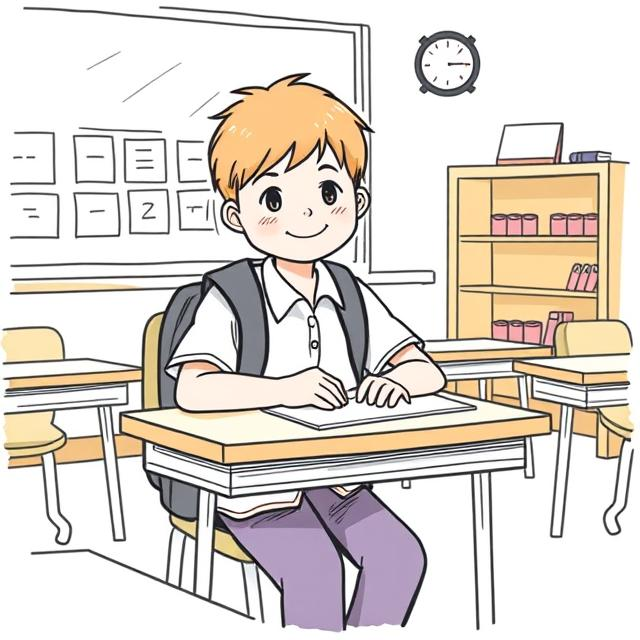
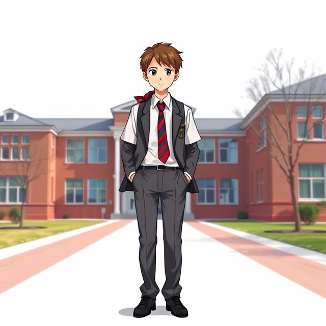
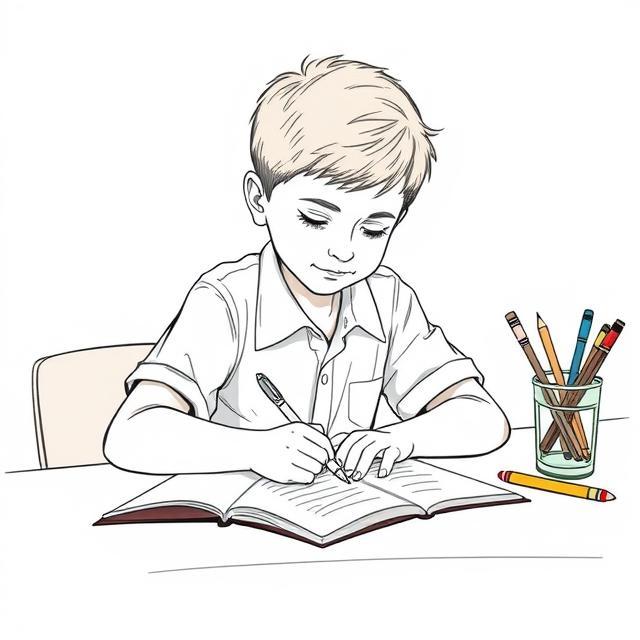

# 🎒 Ты - ученик! Самый важный человек в школе 😊

Ты знаешь, что именно ты, ученик, - самый главный человек в школе? Да-да, не удивляйся! Ведь без тебя и твоих одноклассников школа была бы просто большим пустым зданием. Это ты наполняешь её жизнью, смехом, вопросами на уроках и радостью открытий.

## 🌟 Ты - настоящий исследователь

Каждое утро, когда ты надеваешь школьную форму и аккуратно складываешь в рюкзак учебники и тетрадки, ты отправляешься в удивительное путешествие за знаниями. На уроках математики ты становишься отважным путешественником, который разгадывает хитрые числовые загадки. Когда открываешь учебник по природоведению, перед тобой распахивается дверь в мир удивительных научных открытий. А на уроках чтения ты переносишься в волшебные страны, где происходят невероятные приключения.

Твой учитель в этом путешествии - как опытный проводник. Он знает все тропинки в стране знаний и всегда готов помочь, если ты вдруг заплутал среди сложных задач или непонятных правил. Но самое главное - это твоё желание узнавать новое и задавать вопросы. Помни, нет глупых вопросов, есть только те, на которые мы ещё не нашли ответ!

## 🤝 Твой класс - твоя школьная семья

Твой класс - это особое место, где ты проводишь много времени со своими одноклассниками. Вместе вы не просто сидите за партами - вы учитесь дружить, помогать друг другу, работать в команде. Когда вы всем классом готовитесь к школьному празднику, распределяете роли в спектакле или вместе переживаете перед контрольной работой - вы становитесь настоящей командой.

А какие весёлые бывают перемены! Можно обсудить с друзьями новый фильм, поменяться наклейками, поделиться бутербродом или просто вместе посмеяться над смешной историей. Эти минуты отдыха между уроками иногда запоминаются на всю жизнь. И хотя иногда вы можете поссориться, настоящая дружба всегда побеждает - вы же одна команда!

## 🏆 Маленькие победы каждый день

Каждый школьный день приносит тебе новые достижения, даже если ты сам этого пока не замечаешь. Вот ты сегодня выучил стихотворение - это победа! Справился с трудной задачкой по математике - ещё одна победа! Помог однокласснику разобраться с упражнением - это вообще замечательно! А если получил хорошую оценку - значит, твой труд не прошёл зря.

Но знаешь что? Даже если что-то не получилось с первого раза - это тоже важно. Ошибки - они как ступеньки лестницы, ведущей к успеху. Ведь когда ты ошибаешься и потом находишь правильное решение, ты запоминаешь это намного лучше. Главное - не бояться пробовать снова и не стесняться просить помощи у учителя или родителей.

## 🎨 Ты создаёшь школьную жизнь

Школа - это не только уроки и домашние задания. Здесь столько интересных возможностей проявить себя! Может быть, ты любишь петь - тогда школьные концерты ждут твоего участия. Нравится мастерить что-то своими руками - добро пожаловать в кружок моделирования. Любишь спорт - участвуй в соревнованиях за честь класса.

А ещё ты можешь придумывать интересные идеи для школьной жизни. Может, организовать выставку рисунков или устроить день самоуправления? Твоя фантазия и инициатива делают школьные будни ярче и интереснее для всех - и для тебя, и для твоих друзей, и даже для учителей!

## 💪 Ты - создатель своего будущего

Когда ты сидишь на уроке и старательно выводишь буквы в тетради, ты, может быть, не задумываешься, что прямо сейчас создаёшь своё будущее. Все эти знания, которые ты получаешь в школе - они как кирпичики, из которых строится твоя взрослая жизнь.

Возможно, именно сейчас на уроке биологии ты открываешь в себе будущего врача. Или решая математические задачи, обнаруживаешь, что мог бы стать отличным инженером. А может, выступая на школьном концерте, ты делаешь первые шаги к актёрской карьере? Кем бы ты ни стал, помни - всё начинается здесь, в школе, за твоей партой.

## ✨ Ты - единственный такой!

Самый важный секрет, который я хочу тебе открыть: на всей планете нет другого такого ученика, как ты! Ты уникален со своими способностями, характером, мечтами и взглядом на мир. Твоя улыбка, твой смех, твой способ решать задачи - всё это неповторимо.

Школа - это место, где ты можешь раскрыть все свои таланты. Не бойся проявлять себя, задавать вопросы, высказывать своё мнение. Верь в себя, даже когда что-то не получается. Помни, что твои учителя и родители всегда готовы тебя поддержать.

Так что гордись тем, что ты - ученик! Это почётное звание, которое открывает перед тобой тысячи дорог в будущее. Учись с радостью, дружи с одноклассниками, уважай учителей, не бойся трудностей - и у тебя всё получится! Вперёд, к новым знаниям и открытиям! 🚀

