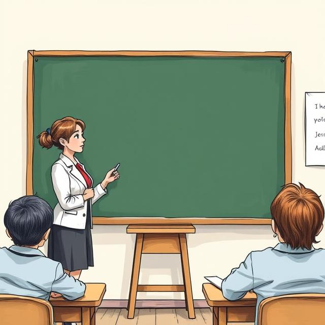
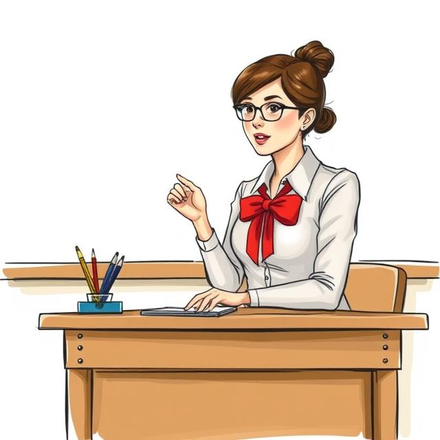
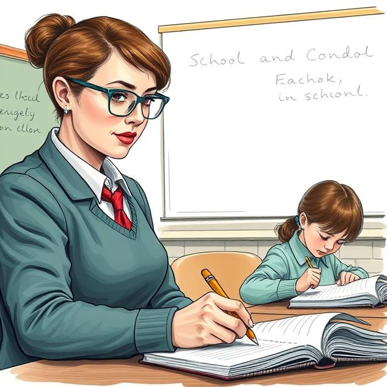

# Учитель

Давай поговорим о самом важном человеке в школе после тебя — об учителе. Учитель — это как волшебник, который открывает перед тобой целый мир знаний. Но не думай, что он просто стоит у доски и что-то рассказывает — на самом деле его работа гораздо интереснее!

## Кто такой учитель?

Учитель — это твой проводник в стране знаний. Каждое утро он встречает тебя в классе с улыбкой, даже если за окном хмурая погода. Он знает миллион способов объяснить сложную тему так, чтобы она стала понятной. Когда ты не можешь решить задачу, учитель не даст готовый ответ, но подскажет, как найти решение самому.

Представь, что учитель — это садовник, а ты и твои одноклассники — молодые росточки. Он поливает вас знаниями, защищает от "вредных жучков" ошибок и радуется, когда вы "расцветаете", понимая новую тему. Иногда приходится и "пропалывать" — напоминать о дисциплине, но только потому, что хочет, чтобы вы выросли хорошими людьми.

Учителя бывают разные: одни рассказывают так интересно, что хочется слушать не отрываясь, другие придумывают весёлые игры для запоминания правил, третьи показывают удивительные опыты. Но всех их объединяет одно — они искренне верят в своих учеников и переживают за каждого.

Запомни: учитель — не строгий надзиратель, а твой помощник и друг. Он всегда готов поддержать, если ты стараешься, и порадоваться твоим успехам. А когда ты вырастешь, возможно, именно школьный учитель останется в твоей памяти как человек, который помог тебе сделать первые шаги к мечте!

## Как стать учителем?

Чтобы стать учителем, нужно сначала закончить школу, а затем поступить в университет или педагогическое училище. Там учат, как работать с детьми, как объяснять сложные темы, как проводить уроки. После окончания учебного заведения учитель получает диплом и может начать работать в школе.

## Какие сложности могут быть у учителя?

Работа учителем может быть сложной. Он сталкивается с разными проблемами:
- **Дисциплина** — бывает сложно поддерживать порядок в классе, если ученики шумят или не слушаются.
- **Нагрузка** — учителя часто перегружены работой. У них много занятий, проверок, подготовка к урокам.
- **Разные ученики** — учитель работает с разными детьми. Некоторые могут быстро понять материал, а другие будут отставать, и учителю нужно уделить внимание каждому.
- **Конфликты** — иногда учитель сталкивается с конфликтами, например, между учениками или с родителями.
  
## Учитель как пример для учеников

Учителя часто становятся примером для своих учеников. Дети смотрят на своих учителей и учат их не только знаниям, но и правильному поведению. Учителя помогают ученикам развивать моральные ценности, такие как честность, уважение, трудолюбие и заботу о других.

## Учителя в разных странах

Учителя по всему миру играют схожие роли, но в разных странах могут быть небольшие различия. Например, в некоторых странах учителя могут работать только в школах, а в других странах учителя могут работать в университетах и колледжах. В некоторых странах профессия учителя очень уважаема, а в других — менее ценится.

## Когда учитель отдыхает?

Даже учителям нужен отдых! Они радуются каникулам не меньше учеников. В это время они готовятся к новым урокам, придумывают интересные задания или просто отдыхают, чтобы с новыми силами вернуться в школу.

Помни, что учитель всегда готов тебе помочь, если что-то непонятно. Он переживает за твои успехи и радуется, когда у тебя всё получается!

## Учитель в истории

Существует много известных учителей в истории, которые оставили свой след в науке и обществе. Например, великий учитель Сократ, который учил людей философии и задавал вопросы, которые заставляли людей думать. Или Мари Кюри, которая стала учёным и преподавателем, получившей Нобелевскую премию за свои научные исследования.

## Заключение

Учитель — это не просто человек, который преподаёт в школе. Это человек, который влияет на будущее детей, помогает им развиваться и становиться лучше. Профессия учителя очень важна, ведь без учителей невозможно было бы научить детей важным знаниям и жизненным урокам. Учителя вдохновляют детей на большие достижения и учат их быть лучшими версиями себя!

