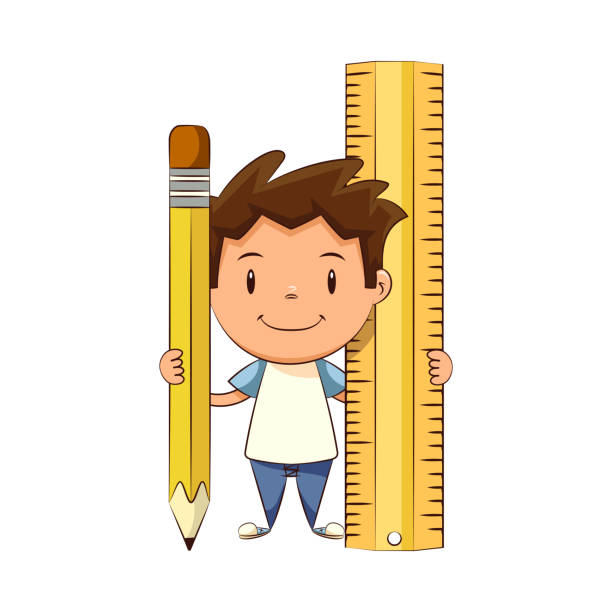
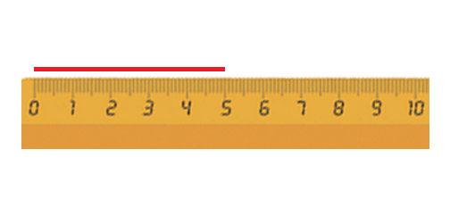
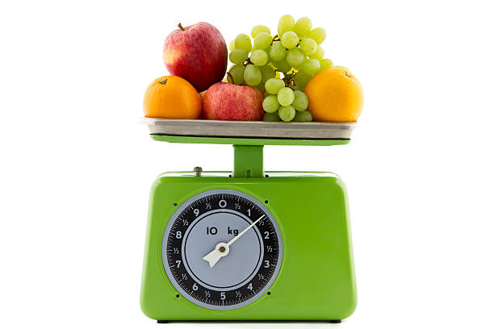
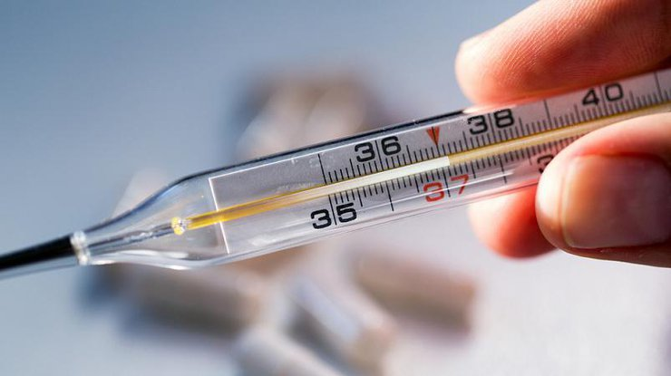
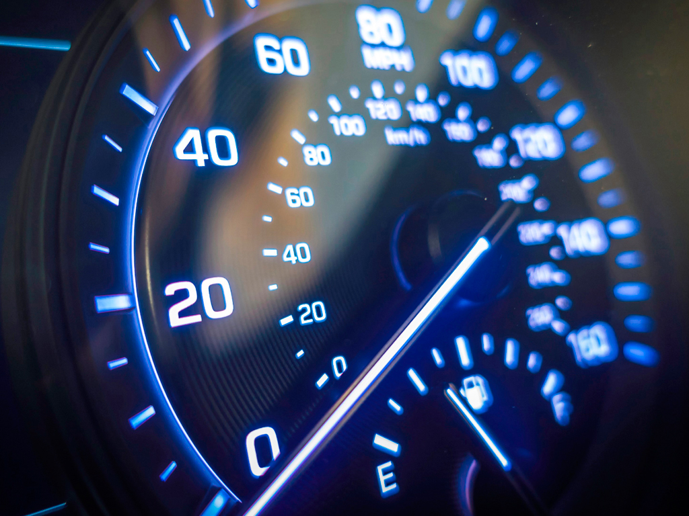

# 📏 [Методы](../scientific-method/scientific-methon.md) измерения

## Что такое измерение?  
Измерение — это процесс, когда мы определяем, насколько что-то большое, длинное, тяжёлое или быстрое. Например, чтобы узнать, какая длина твоего стола или сколько весит твой рюкзак, ты используешь разные инструменты для измерений. Иногда перед началом измерений можно выдвинуть [гипотезу](../scientific-method/hypotesis.md) о том, каким будет результат.

> **Измерение** помогает нам понять, как большие или маленькие вещи вокруг нас!

## 📏 Разные способы измерения

### 1️⃣ Измерение длины  
Когда ты хочешь узнать, насколько длинная твоя игрушка или стол, ты используешь линейку или измерительную ленту. Эти инструменты измеряют длину и показывают, сколько сантиметров или метров в объекте. 

Для измерения длины могут использоваться:

- Линейка  
- Измерительная лента  
- Мерная палочка  

Во время измерения можно проводить [наблюдения](../scientific-method/watching.md) за объектом, чтобы убедиться, что данные точные.

### 2️⃣ Измерение веса  
Когда мы хотим узнать, сколько что-то весит, мы используем **весы**. Это могут быть кухонные весы или даже специальные весы в магазинах, которые показывают вес в килограммах.

Пример:

- Веса на кухне могут помочь узнать вес фруктов, например, яблок.
- Механические или электронные весы используются, чтобы узнать вес человека или вещей.

### 3️⃣ Измерение времени  
Чтобы измерить время, мы используем **часы** или **секундомер**. Например, если ты хочешь узнать, сколько времени ты играешь или сколько длится игра, можно посмотреть на часы.  

- Часы показывают время в часах, минутах и секундах.  
- Секундомер помогает засекать очень точное время, например, сколько секунд ты можешь пробежать.  

### 4️⃣ Измерение температуры  
Если ты хочешь узнать, какая температура на улице или в комнате, для этого используют **термометры**. Температура измеряется в градусах Цельсия (°C) или Фаренгейта (°F).  

Пример:  

- Летнее солнце жаркое, а термометр показывает высокую температуру.  
- Зимой температура может быть очень низкой, и термометр показывает минус.  

### 5️⃣ Измерение скорости  
Когда ты хочешь узнать, как быстро движется какой-то объект, например, машина или велосипед, для этого есть **спидометр**. Он показывает, с какой скоростью движется транспортное средство.  

Пример:  

- Спидометр в машине показывает скорость в километрах в час (км/ч) или милях в час (миль/ч).  
  

## 🎯 Зачем нам нужны [методы](../scientific-method/scientific-methon.md) измерения?  
Измерения помогают нам делать важные вещи, например:
- Строить дома и машины.
- Готовить еду (ведь иногда важно точно знать, сколько чего положить!).
- Играть в спортивные игры, чтобы узнать, кто быстрее.

Все вокруг нас можно измерить разными способами: длина, вес, время и даже температура. [Методы](../scientific-method/scientific-methon.md) измерения помогают нам лучше понимать окружающий мир и точно выполнять задачи.

## 🔍 Где используются измерения?  
- В науке 🧪 — для точных экспериментов, проверки [гипотез](../scientific-method/hypotesis.md) и выдвижения [теорий](../scientific-method/theory.md).  
- В спорте 🏃 — для измерения времени и расстояний.  
- В кулинарии 🍰 — чтобы точно следовать рецептам.  

Теперь попробуй сам! Возьми линейку, весы, часы или термометр и измерь, что тебя окружает. Сделай [наблюдения](../scientific-method/watching.md) и подумай, какие выводы можно из них сделать! Это интересно! 😊
