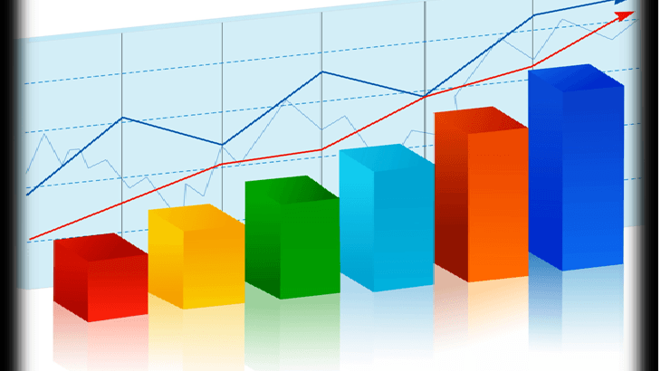

# 📊 Что такое статистика?  

## Представь, что ты исследователь! 🔍  
Представь, что ты хочешь узнать, какие напитки любят твои друзья. Ты спрашиваешь 10 человек, и каждый называет свой любимый напиток. В итоге у тебя получается много разных ответов. Но как понять, какой напиток нравится большинству? Вот тут на помощь приходит **статистика**!  

> **Статистика** — это способ собирать информацию, анализировать её и делать выводы.  

  

## 📋 Простые шаги статистического [анализа](../data-collection-and-analysis/analysis.md)  

### 1️⃣ Сбор данных  
Для начала нужно собрать данные. Ты спросил у друзей, какой напиток им нравится, и записал их ответы. Эти ответы и будут твоими данными. Чем больше данных ты соберешь, тем точнее будут твои выводы!  

Перед сбором данных можно выдвинуть [гипотезу](../scientific-method/hypotesis.md) о том, какой напиток окажется самым популярным.  

### 2️⃣ Организация данных  
Теперь, когда у тебя есть все данные, нужно их организовать. Например, ты можешь записать ответы в таблицу или нарисовать график, чтобы легче было увидеть, какие напитки выбирали чаще всего.  

Во время работы с данными важно проводить [наблюдения](../scientific-method/watching.md), чтобы заметить интересные закономерности.  

  

### 3️⃣ Среднее значение  
Иногда полезно узнать, какое число встречается в среднем. Например, если ты записал, сколько дней в неделю твои друзья пьют определённый напиток, ты можешь посчитать среднее количество.  

Допустим, твои друзья пьют кофе 1, 3, 5, 4, 3 и 2 раза в неделю. Чтобы узнать среднее, нужно сложить все числа и разделить на количество людей:  

$$
\frac{(1+3+5+4+3+2)}{6} = 3
$$

Значит, в среднем каждый твой друг пьёт кофе 3 раза в неделю!  

  

### 4️⃣ Мода  
**Мода** — это то, что встречается чаще всего. Например, если больше всего людей выбрали один и тот же напиток, это и будет мода. Если 7 из 10 человек сказали, что их любимый напиток — чай, значит, чай — это самая популярная мода!  

  

### 5️⃣ Выводы  
Теперь ты знаешь:  
✅ Как собирать данные.  
✅ Как организовывать данные, чтобы было проще их анализировать.  
✅ Что такое среднее значение и как его считать.  
✅ Что такое мода, и как найти самый популярный выбор!   

## 🔍 Где используется статистика?  
- В науке 🧪 — учёные используют статистику для [анализа](../data-collection-and-analysis/analysis.md) экспериментов и проверки [гипотез](../scientific-method/hypotesis.md).  
- В спорте 🏆 — статистика помогает тренерам понять, как улучшить результаты спортсменов.  
- В магазинах 🛒 — продавцы используют статистику, чтобы узнать, какие товары продаются лучше всего.  

Теперь ты попробуй сам! Запиши, сколько раз в день ты играешь, читаешь или гуляешь, и посчитай среднее количество! Проведи [наблюдения](../scientific-method/watching.md) и попробуй сделать выводы! Это интересно! 😊
