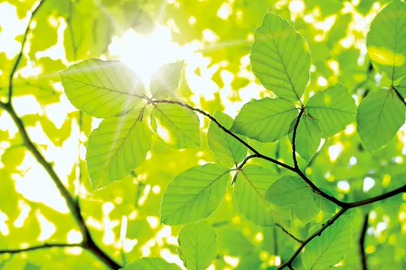
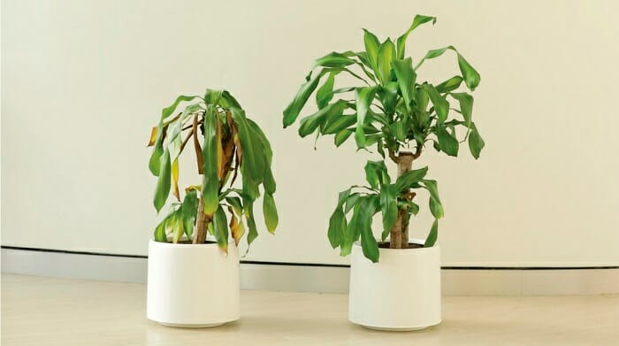
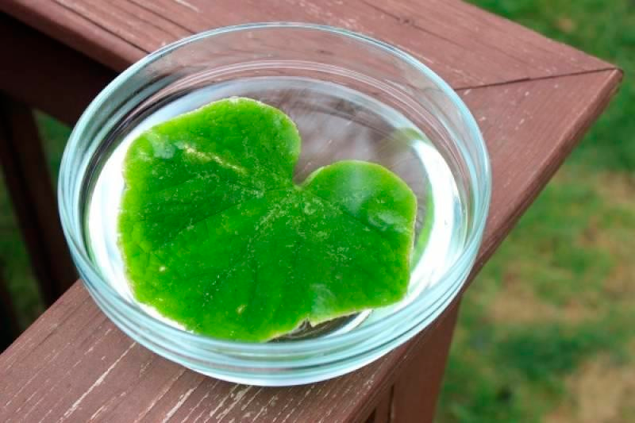

### **Биологические эксперименты: исследуем мир живого!**  

**Привет, юный натуралист!** 🌿🔬  

Ты когда-нибудь задумывался, почему растения тянутся к свету, как муравьи находят дорогу домой или почему хлеб плесневеет? Ответы на эти вопросы даёт **биология** — наука о живых организмах. А самые интересные открытия в ней делают с помощью **биологических экспериментов**!  

---  

### **Что такое биологический эксперимент?**  
Это способ изучения живых существ: растений, животных, грибов и даже бактерий! Учёные наблюдают, сравнивают и ставят опыты, чтобы понять, как устроена жизнь.  

**Например**, если ты хочешь узнать, **нужен ли свет растениям**, можно:  
1. Взять два одинаковых ростка фасоли.  
2. Один поставить на солнце, а другой — в тёмный шкаф.  
3. Через неделю сравнить их — и увидишь, что растение без света стало бледным и слабым!  

---  

### **Как провести биологический эксперимент?**  
1. **Задай вопрос** (Что хочешь узнать?)  
   *Пример:* «Влияет ли музыка на рост растений?»  
2. **Выдвинь [гипотезу](../scientific-method/hypotesis.md)** ([Предположение](../scientific-method/hypotesis.md))  
   *Пример:* «Возможно, под классическую музыку они растут лучше!»  
3. **Подготовь материалы**  
   *Пример:* 3 одинаковых растения, колонки, разные жанры музыки.  
4. **Проведи опыт**  
   - Одному растению включай классику, другому — рок, третье оставь в тишине.  
   - Поливай их одинаково и измеряй рост через 2 недели.  
5. **Запиши результаты**  
   *Пример:* «Растение с классикой выросло на 2 см выше!»  
6. **Сделай вывод**  
   *Пример:* «Музыка действительно влияет на рост, но не всякая!»  

---  

### **Топ-3 увлекательных биологических эксперимента**  

#### **1. «Дышащий» лист** 🌱  
**Что нужно:**  
- Свежий лист (например, с дерева), стакан с водой, соломинка.  
**Что делать:**  
Опусти лист в воду и подожди. Через час увидишь **пузырьки** на его поверхности — это кислород, который выделяет растение!  
**Секрет:** Так растения «дышат» (фотосинтез).  

#### **2. Дрожжи-путешественники** 🍞  
**Что нужно:**  
- Дрожжи, сахар, тёплая вода, воздушный шарик, бутылка.  
**Что делать:**  
Смешай дрожжи, сахар и воду в бутылке, надень шарик на горлышко. Через час он **надуется**!  
**Секрет:** Дрожжи — это живые грибки, они выделяют CO₂, когда «едят» сахар.  

#### **3. Невидимая жизнь в капле воды** 💧  
**Что нужно:**  
- Лужа (или вода из пруда), пипетка, микроскоп (или сильная лупа).  
**Что делать:**  
Рассмотри каплю под увеличением — ты увидишь **микроскопических существ**!  
**Секрет:** В воде живут инфузории, амёбы и другие крошечные организмы.  

---  

### **Почему биология — это важно?**  
Благодаря биологическим экспериментам люди:  
- Выращивают **урожай** (например, создают новые сорта пшеницы).  
- Лечат **болезни** (изучают бактерии и вирусы).  
- Сохраняют **редких животных** (например, панд или тигров).  

**Биология — это наука, которая окружает нас каждый день: в парке, дома и даже в твоём бутерброде!** 🐜  
