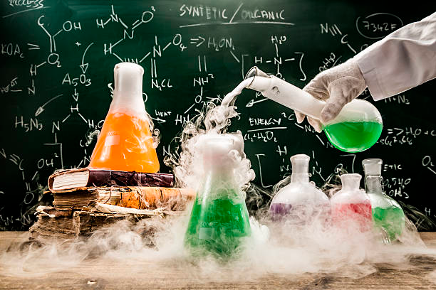
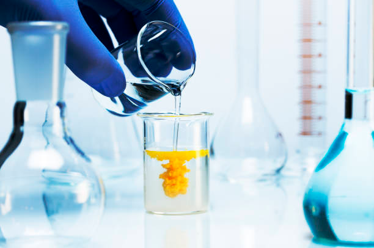
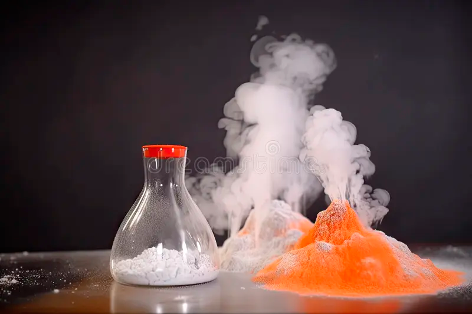

### **Химические эксперименты: магия превращений у тебя дома!**  

**Привет, юный алхимик!** 🧪✨  

Ты когда-нибудь видел, как шипит газировка или ржавеет гвоздь? Это не просто случайности — это **химия в действии**! Химические эксперименты — это как волшебство, только вместо заклинаний тут работают **молекулы и реакции**. Давай узнаем, как стать настоящим химиком-фокусником!  

---  

### **Что такое химический эксперимент?**  
Это опыт, где вещества встречаются, **превращаются** в новые и иногда делают что-то неожиданное: меняют цвет, взрываются пузырьками или даже исчезают!  

**Например**, если смешать уксус и соду, получится бурная пена — это углекислый газ (тот самый, что в газировке!) убегает из жидкости.

---  

### **Как провести химический эксперимент безопасно?**  
1. **Спроси разрешения у взрослых** (химия — это серьёзно!).  
2. **Надень перчатки/очки**, если работаешь с чем-то едким (например, уксусом).  
3. **Записывай [наблюдения](../scientific-method/watching.md)** (что смешал → что получилось).  

---  

### **Топ-3 крутых химических опыта для дома**  

#### **1. Вулкан из соды и лимонной кислоты** 🌋  
**Что нужно:**  
- Сода, лимонная кислота (или уксус), вода, пищевой краситель.  
**Что делать:**  
Смешай в стакане соду и краситель, потом добавь лимонную кислоту с водой — будет извержение, как у настоящего вулкана!  
**Секрет:** Кислота и щёлочь (сода) бурно реагируют, выделяя пузыри CO₂.  

#### **2. Невидимые чернила** 🕵️♂️  
**Что нужно:**  
- Молоко, ватная палочка, утюг.  
**Что делать:**  
Напиши молоком на бумаге, дай высохнуть, потом нагрей лист — буквы проявятся!  
**Секрет:** Белки молока темнеют при нагревании быстрее, чем бумага.  

#### **3. Железный детектив** 🧲  
**Что нужно:**  
- Измельчённые хлопья с железом (например, обогащённые витаминами), магнит, вода.  
**Что делать:**  
Раствори хлопья в воде, поднеси магнит к стенке стакана — увидишь, как «чёрные песчинки» (железо!) прилипнут к нему!  
**Секрет:** В еде действительно есть микроскопическое железо — его добывают магнитом.  

---  

### **Почему химия — это важно?**  
Благодаря химическим экспериментам люди:  
- Придумали **лекарства** (например, аспирин из коры ивы).  
- Создали **пластмассу, краски, даже конфетки с шипучкой**!  
- Узнали, как **очищать воду** или делать экологичное топливо.  

**Помни: каждый великий химик когда-то начинал с простых опытов — так что бери колбу (или стакан) и вперёд, к открытиям!** 🌟  