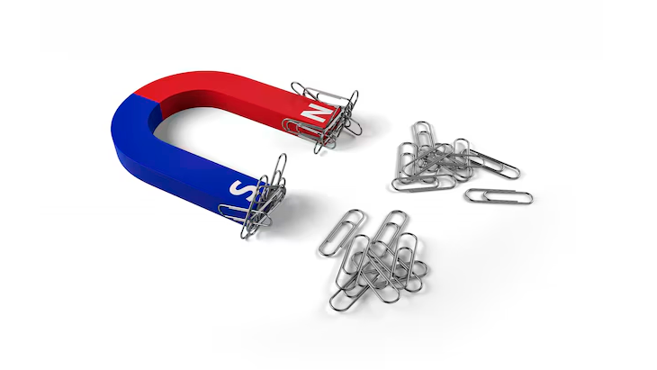
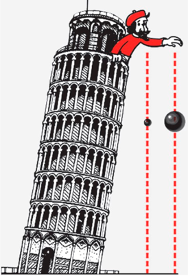
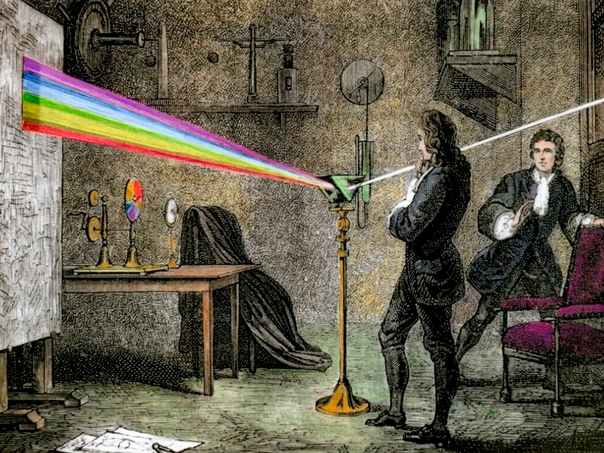
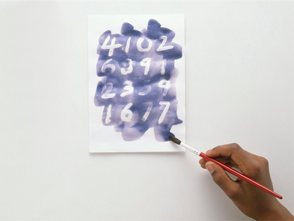

### **Физический эксперимент: как учёные раскрывают тайны природы?**  

**Привет, будущий учёный!** 🔍  

Ты наверняка любишь разгадывать загадки. А знаешь, чем занимаются физики? Они разгадывают **главные загадки Вселенной** — почему предметы падают вниз, как светит Солнце и почему магниты притягиваются. И делают они это с помощью **физических экспериментов**!  

#### **Что такое физический эксперимент?**  
Это не просто игра или случайный опыт. Это **точный [научный метод](../scientific-method/scientific-methon.md)**, который помогает проверить, как работает природа. Учёные задают вопрос, придумывают способ проверить его на практике, а потом делают выводы.  

**Например**, если ты хочешь узнать, **зависит ли скорость падения предмета от его веса**, можно провести такой опыт:  
1. Взять два шарика разного веса (например, теннисный и металлический).  
2. Поднять их на одну высоту и отпустить одновременно.  
3. Засечь, какой упадёт быстрее.  

Оказывается, если нет воздуха (как в вакууме), они упадут **одновременно**! Это открыл ещё Галилей, и это важный закон физики!  

---  

### **Как правильно провести физический эксперимент?**  
Чтобы всё получилось, нужно действовать **по шагам**:  

1. **Задать вопрос** (Что мы хотим узнать?)  
   *Пример:* "Почему лёд тает быстрее на металле, чем на дереве?"  

2. **Выдвинуть [гипотезу](../scientific-method/hypotesis.md)** ([Предположение](../scientific-method/hypotesis.md))  
   *Пример:* "Может, металл лучше проводит тепло?"  

3. **Подготовить материалы** (Что нужно для опыта?)  
   *Пример:* Две одинаковые льдинки, металлическая и деревянная пластинки, часы.  

4. **Провести опыт** (Главный этап!)  
   - Положить льдинки на разные поверхности.  
   - Засечь время, за которое они растают.  

5. **Записать результаты** (Что произошло?)  
   *Пример:* "Лёд на металле растаял за 5 минут, а на дереве — за 10!"  

6. **Сделать вывод** (Объяснение)  
   *Пример:* "Металл действительно проводит тепло лучше, поэтому лёд на нём тает быстрее!"  

---  

### **Знаменитые физические эксперименты, которые изменили мир**  
🔹 **Опыт Галилея с падающими телами** (XVII век)  
   Он бросал шары с Пизанской башни, чтобы доказать: все предметы падают с одинаковым ускорением (если нет сопротивления воздуха).  

🔹 **Эксперимент Ньютона с призмой** (1666 год)  
   Он пропустил солнечный луч через стеклянную призму и увидел **радугу**! Так люди узнали, что белый свет состоит из разных цветов.  

🔹 **Опыт Эрстеда с магнитом и током** (1820 год)  
   Когда он включил электрический ток рядом с компасом, стрелка дёрнулась! Так открыли связь между электричеством и магнетизмом.  

---  

### **Можно ли провести физический эксперимент дома?**  
Конечно! Вот простые, но удивительные опыты:  

#### **1. Невидимые чернила (теплопередача)**  
- Выдави лимонный сок, напиши им что-то на бумаге и дай высохнуть.  
- Потом нагрей лист лампой — надпись проявится!  
**Физика:** Сок темнеет при нагревании из-за химической реакции.  

#### **2. Лодка на мыльной тяге (поверхностное натяжение)**  
- Вырежи из картона лодочку с прорезью сзади.  
- Опусти её в воду и капни в прорезь жидкое мыло.  
- Лодка поплывёт вперёд!  
**Физика:** Мыло разрушает поверхностное натяжение воды, создавая "толкающую" силу.  

---  

### **Почему физические эксперименты — это круто?**  
- Они помогают **понять мир** (почему небо голубое, как летают самолёты).  
- Благодаря им изобрели **телефоны, компьютеры, космические ракеты**.  
- Ты можешь **стать первооткрывателем**! Например, узнать, как форма бумажного самолётика влияет на дальность полёта.  

**Главное — никогда не переставай задавать вопросы и искать на них ответы. Мир полон чудес, и они ждут, чтобы их обнаружили! 😊**