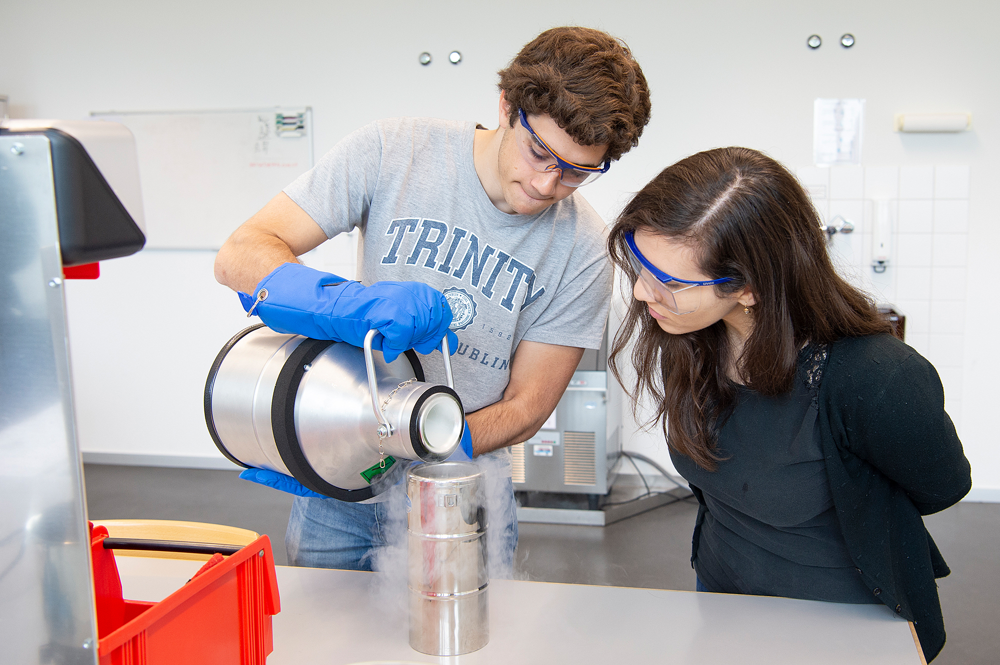
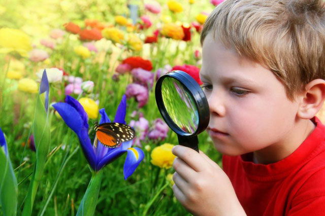

# Типы экспериментов

Наука — это весело! Учёные проводят эксперименты, чтобы узнавать новое об окружающем мире. Но эксперименты бывают разными. Давай разберёмся, какие они бывают!

## 🏠 Лабораторные эксперименты

Это такие эксперименты, которые проводят в специальном месте — [лаборатории](../laboratory/laboratory.md). Там учёные могут всё контролировать, например, температуру, освещение и другие условия.

🧪 **Пример:** Ты смешиваешь лимонный сок и соду в стакане и наблюдаешь, как появляются пузырьки. Это происходит, потому что кислота (лимон) и сода (щелочь) вступают в реакцию.

---

## 🌳 Полевые эксперименты

Такие эксперименты проводятся прямо в природе или в реальной жизни, а не в [лаборатории](../laboratory/laboratory.md). В них сложнее контролировать условия, но зато можно увидеть, как всё работает по-настоящему!

🌱 **Пример:** Ты сажаешь цветы в разную почву и смотришь, где они растут лучше. Ты не можешь управлять солнцем и дождём, но зато узнаешь, какая почва лучше для растений!

---

## 🏙 Натурные эксперименты

В таких экспериментах учёные не вмешиваются, а просто наблюдают за тем, что уже происходит в мире. Они смотрят на изменения и делают выводы.

👀 **Пример:** Ты замечаешь, что люди, которые едят больше фруктов, реже болеют. Ты не заставляешь их есть фрукты, а просто наблюдаешь за их питанием и здоровьем.

---

## 🔎 Итог

Теперь ты знаешь, что эксперименты бывают разными:

- **Лабораторные** 🏠 – проводятся в специальных местах с полным контролем условий.
- **Полевые** 🌳 – проводятся в реальном мире, где условия сложнее контролировать.
- **Натурные** 🏙 – учёные просто наблюдают, не вмешиваясь в происходящее.