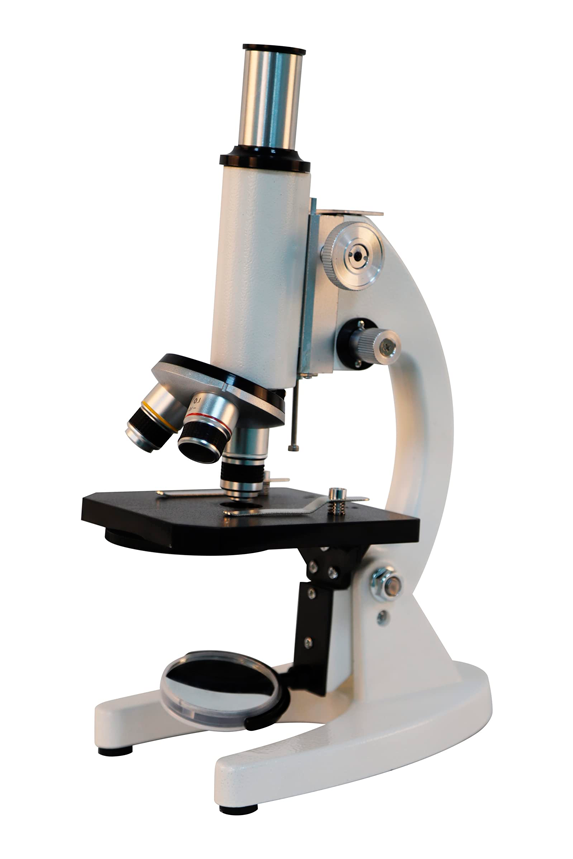
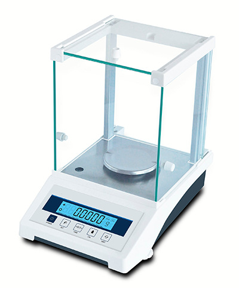
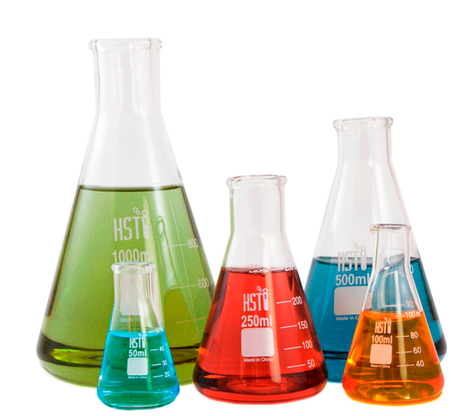
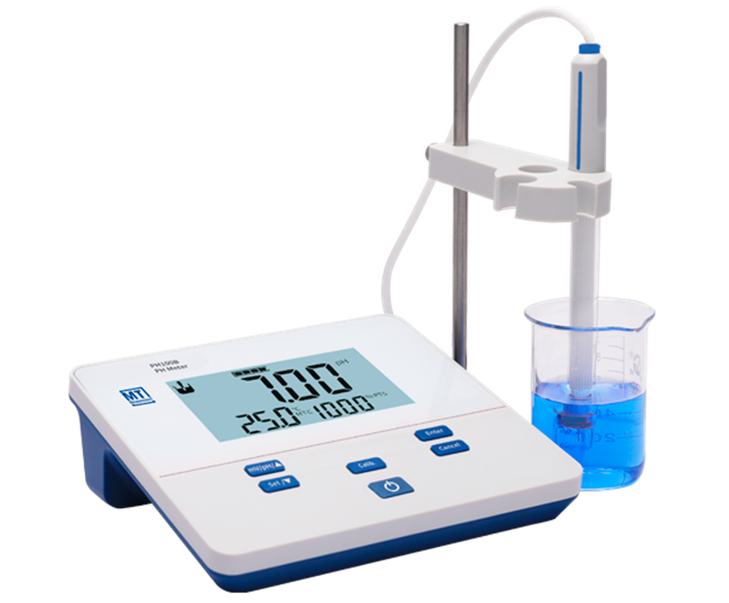
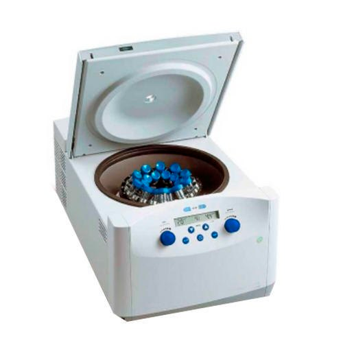
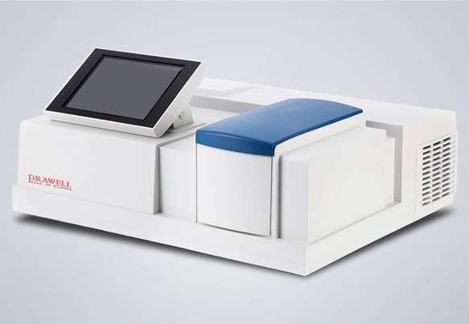
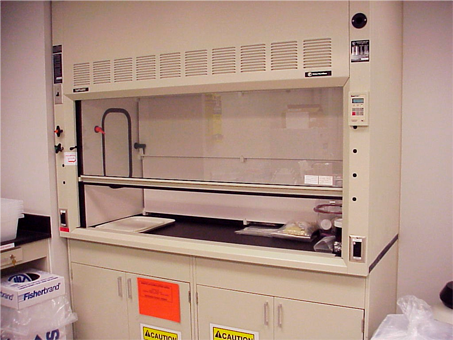
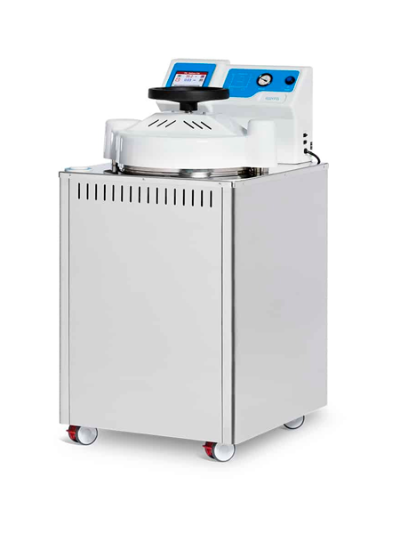
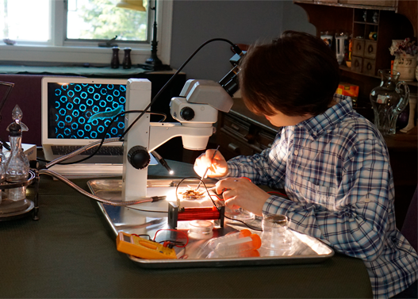

### **Лабораторное оборудование — твои научные помощники!**

Привет, будущий учёный! Когда ты заходишь в [лабораторию](../laboratory/laboratory.md), первое, что бросается в глаза — это множество странных приборов и приспособлений. Каждый из них — как волшебный инструмент, который помогает проводить **[наблюдения](../scientific-method/watching.md)**, ставить **эксперименты** и делать **[измерения](../data-collection-and-analysis/measurement.md)**. Давай познакомимся с самыми важными!

---

### **1. Основные инструменты для любых экспериментов**

#### **Микроскоп — увеличительное стекло учёного**
- Помогает рассматривать то, что не видно глазу: клетки, бактерии, кристаллы
- Используется в **[биологических экспериментах](../experiment-types/biological-experiment.md)**
- Интересный факт: самый мощный микроскоп может увеличивать в 10 000 раз!

#### **Весы — точные измерители веса**
- Бывают электронные (как в магазине) и аналитические (сверхточные)
- Нужны для **[измерений](../data-collection-and-analysis/measurement.md)** в химических и [физических экспериментах](../experiment-types/physical-experiment.md)
- Попробуй дома: взвесь одинаковые на вид яблоки — они могут отличаться!

#### **Пробирки и колбы — научная посуда**
- В них смешивают жидкости в **[химических экспериментах](../experiment-types/chemical-experiment.md)**
- Разные формы для разных задач:
  - Колба Эрленмейера — для перемешивания
  - Пробирки — для маленьких проб
  - Чашка Петри — для выращивания бактерий

---

### **2. Специальное оборудование для сложных опытов**

#### **pH-метр — детектор кислотности**
- Измеряет, насколько вещество кислое или щелочное
- Важен для **[анализа](../data-collection-and-analysis/analysis.md)** в химии и биологии
- Домашний эксперимент: проверь pH лимона и мыла!

#### **Центрифуга — машинка для разделения**
- Раскручивает пробирки с огромной скоростью
- Используется в **[биологических экспериментах](../experiment-types/biological-experiment.md)** для отделения клеток от жидкости
- Принцип как в стиральной машине при отжиме!

#### **Спектрофотометр — измеритель цвета**
- Определяет, сколько света поглощает вещество
- Помогает в **[анализе](../data-collection-and-analysis/analysis.md)** химического состава
- Работает как твои глаза, но в 1000 раз точнее!

---

### **3. Оборудование для [безопасности](../laboratory/safety-rules.md)**

#### **Вытяжной шкаф — защитник от вредных паров**
- Стеклянный ящик с вентиляцией
- Используется при работе с едкими веществами в **[химических экспериментах](../experiment-types/chemical-experiment.md)**
- Принцип работы: вредные пары сразу улетают в трубу!

#### **Автоклав — научная скороварка**
- Стерилизует оборудование паром под давлением
- Крайне важен для **[повторяемости экспериментов](../experimental-design/replication-and-reproducibility.md)** в биологии
- Температура внутри — как в самой горячей бане!

---

### **Как учёные выбирают оборудование?**
Перед экспериментом они:
1. Формулируют **[гипотезу](../scientific-method/hypotesis.md)**
2. Продумывают **[экспериментальный дизайн](../experimental-design/experimental_design.md)**
3. Подбирают инструменты для **[измерений](../data-collection-and-analysis/measurement.md)** и **[анализа](../data-collection-and-analysis/analysis.md)**
4. Проверяют, обеспечат ли они **[повторяемость экспериментов](../experimental-design/replication-and-reproducibility.md)**

---

### **Домашняя мини-[лаборатория](../laboratory/laboratory.md)**
Хочешь почувствовать себя учёным? Тебе понадобится:
1. Увеличительное стекло (микроскоп)
2. Кухонные весы
3. Пипетка (можно использовать шприц без иглы)
4. Прозрачные стаканы разной формы (колбы)
5. Термометр (для **[измерений](../data-collection-and-analysis/measurement.md)** температуры)

Попробуй провести простой **[физический эксперимент](../experiment-types/physical-experiment.md)**: измерь, как быстро тает лёд в воде разной температуры. Не забудь записать результаты — это твои первые научные данные!

---

**Запомни:** Даже самый крутой прибор — всего лишь инструмент. Главное — твоё любопытство и аккуратность! Какое оборудование тебе хотелось бы попробовать в работе? 🔍⚗️🧫
