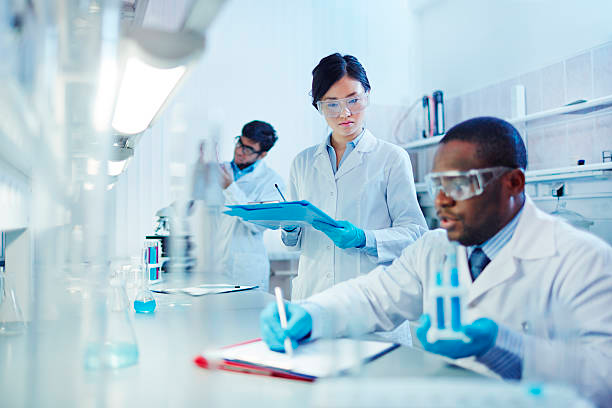
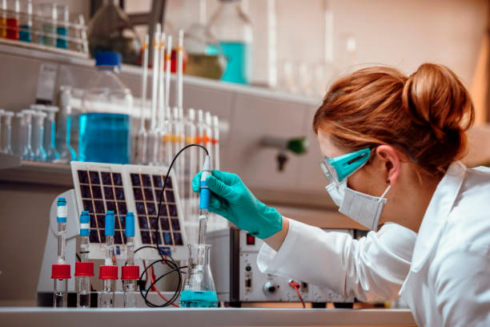

### **Лаборатория — удивительная научная мастерская**  

Привет, юный исследователь! Ты когда-нибудь задумывался, где учёные проводят свои эксперименты? Где они смешивают разноцветные жидкости, выращивают необычные бактерии или испытывают новые материалы? Всё это происходит в **лаборатории** — специальной комнате (а иногда и целом здании!), наполненной пробирками, микроскопами, компьютерами и другими крутыми штуками.  

### **Зачем нужны лаборатории?**  
Представь, что ты хочешь узнать, почему листья зелёные, как работает батарейка или что будет, если смешать уксус и соду. Просто так, на глаз, это не проверить — нужны точные инструменты и безопасное место. Вот для этого и существуют лаборатории!  

Учёные приходят сюда, чтобы:  
- Проверять **[гипотезы](../scientific-method/hypotesis.md)** (то есть свои [предположения](../scientific-method/hypotesis.md)). Например: «Если поливать растение газировкой, оно вырастет быстрее?»  
- Проводить **[наблюдения](../scientific-method/watching.md)** — внимательно следить за тем, что происходит в эксперименте.  
- Делать **[измерения](../data-collection-and-analysis/measurement.md)** — записывать температуру, вес, размеры и другие данные.  
- Анализировать результаты — сравнивать, вычислять и делать выводы.  

### **Какие бывают лаборатории?**  
Лаборатории бывают очень разными, в зависимости от того, что в них изучают:  

1. **Биологические лаборатории**  
   Здесь работают с растениями, животными, бактериями. Например, можно:  
   - Провести **[биологический эксперимент](../experiment-types/biological-experiment.md)**: вырастить две одинаковые фасоли, но одну поливать обычной водой, а другую — сладкой, и посмотреть, какая вырастет быстрее.  
   - Изучить под микроскопом клетки лука или капли воды из пруда.  

2. **Химические лаборатории**  
   Тут смешивают вещества, наблюдают за реакциями и даже создают новые материалы! Например:  
   - Проводят **[химический эксперимент](../experiment-types/chemical-experiment.md)**: смешивают соду и уксус, чтобы увидеть бурную пену (это выделяется углекислый газ — тот самый, что в газировке!).  
   - Проверяют, какие вещества растворяются в воде, а какие — нет.  

3. **Физические лаборатории**  
   В них изучают электричество, свет, силу трения и другие законы природы. Например:  
   - Проводят **[физический эксперимент](../experiment-types/physical-experiment.md)**: собирают электрическую цепь из батарейки и лампочки, чтобы понять, как работает ток.  
   - Испытывают, какие предметы притягиваются магнитом, а какие — нет.  

### **Как учёные проводят эксперименты?**  
Чтобы эксперимент получился правильным, нужно следовать **[научному методу](../scientific-method/scientific-methon.md)**:  

1. **Задать вопрос** (например: «Правда ли, что лёд тает быстрее в солёной воде?»).  
2. **Придумать [гипотезу](../scientific-method/hypotesis.md)** ([предположение](../scientific-method/hypotesis.md): «Да, потому что соль меняет свойства воды»).  
3. **Провести эксперимент** (взять два стакана — с простой и солёной водой — и бросить в них по кубику льда).  
4. **Сделать [наблюдения](../scientific-method/watching.md) и [измерения](../data-collection-and-analysis/measurement.md)** (засечь время, записать результаты).  
5. **Проанализировать данные** (понять, в каком стакане лёд растаял быстрее).  
6. **Сделать вывод** (подтвердилась [гипотеза](../scientific-method/hypotesis.md) или нет).  

Важно, чтобы эксперимент можно было **[повторить](../experimental-design/replication-and-reproducibility.md)** — то есть другой учёный должен получить такие же результаты, если сделает всё так же.  

### **Почему лаборатории — это круто?**  
Потому что именно здесь совершаются открытия! Без лабораторий у нас не было бы:  
- Лекарств от болезней.  
- Новых материалов (например, пластика или сверхлёгких сплавов для самолётов).  
- Технологий вроде телефонов и компьютеров.  

Так что, если тебе нравится исследовать мир, возможно, однажды ты тоже окажешься в лаборатории — с колбой в руках и миллионом вопросов в голове! 🔍⚗️🧪  

**Хочешь попробовать?** Проведи простой эксперимент дома: положи в два стакана с водой по ложке соли, а в третий налей чистую воду. Опусти в каждый сырое яйцо — в каком оно будет плавать? Это тоже наука!
