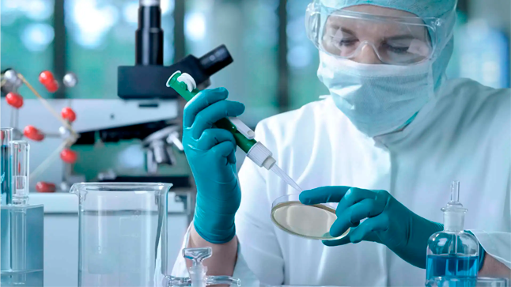
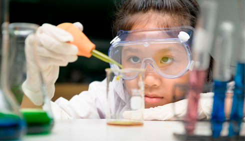
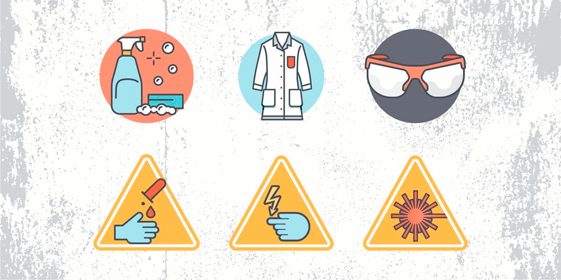

### **Техника безопасности — твой надёжный щит в [лаборатории](../laboratory/laboratory.md)**  

Привет, юный исследователь! Ты уже знаешь, что [лаборатория](../laboratory/laboratory.md) — это место для удивительных открытий. Но чтобы эксперименты приносили только радость, нужно соблюдать **технику безопасности**. Давай разберёмся, как учёные защищают себя, используя **[научный метод](../scientific-method/scientific-methon.md)**, **[гипотезы](../scientific-method/hypotesis.md)** и другие важные правила!  

### **Почему безопасность — это научный подход?**  

Учёные не просто так надевают халаты и очки. Они действуют по **[научному методу](../scientific-method/scientific-methon.md)** даже в вопросах безопасности:  
1. **[Наблюдение](../scientific-method/watching.md)** (замечают потенциальные опасности)  
2. **[Гипотеза](../scientific-method/hypotesis.md)** ("Если я не надену очки, брызги могут попасть в глаза")  
3. **Эксперимент** (проверяют защитные средства)  
4. **Вывод** (убеждаются, что правила работают)  

### **5 главных правил умного исследователя**  

#### 1. **Защитная экипировка — твоя броня**  
- Халат = защита от пятен и брызг  
- Очки = щит для глаз (помни про **[переменные в эксперименте](../experimental-design/variables-in-experiment.md)** — даже вода под давлением может быть опасна!)  
- Перчатки = невидимые рукавицы против химикатов  

#### 2. **Правило "Никаких сюрпризов"**  
Перед экспериментом учёные:  
- Выдвигают **[гипотезы](../scientific-method/hypotesis.md)** о возможных опасностях  
- Продумывают **[экспериментальный дизайн](../experimental-design/experimental_design.md)** безопасного проведения опыта  
- Готовят нейтрализаторы для кислот и щелочей  

#### 3. **Зона строгого контроля**  
В [лаборатории](../laboratory/laboratory.md) есть особые места для:  
- **[Биологических экспериментов](../experiment-types/biological-experiment.md)** (работа с микроорганизмами)  
- **[Химических экспериментов](../experiment-types/chemical-experiment.md)** (реактивы под замком)  
- **[Физических экспериментов](../experiment-types/physical-experiment.md)** (защита от излучения)  

#### 4. **Чистота — залог безопасности**  
После опытов важно:  
- Мыть руки (особенно после **[биологических экспериментов](../experiment-types/biological-experiment.md)**)  
- Утилизировать отходы по правилам  
- Проводить **[анализ](../data-collection-and-analysis/analysis.md)** рабочего места  

#### 5. **План "Спасатель"**  
Каждый учёный знает:  
- Где огнетушитель  
- Как работает экстренный душ  
- Куда бежать при утечке газа  

### **Проверь себя: безопасный эксперимент**  

Попробуй под [наблюдением](../scientific-method/watching.md) взрослых:
1. Надень "боевую экипировку" (очки для плавания, перчатки, фартук)  
2. Проведи **[химический эксперимент](../experiment-types/chemical-experiment.md)** с пищевыми продуктами:  
   - Смешай уксус и соду в раковине  
   - Пронаблюдай реакцию  
3. Сделай **[анализ](../data-collection-and-analysis/analysis.md)**: какие меры защиты были действительно нужны?  

**Запомни:** Настоящие учёные не боятся экспериментов, потому что знают — безопасность и наука идут рука об руку! Теперь ты готов к своим первым открытиям с умом и защитой! 🛡️🔬
