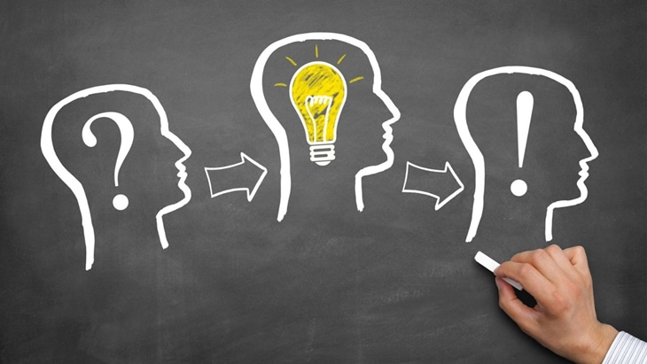

# Гипотеза — научное "А что, если...?" 💡

Гипотеза — это как первый шаг в увлекательном квесте. Когда ты видишь что-то интересное и предлагаешь разумное объяснение, которое ещё нужно проверить. Представь, что ты детектив, который только нашёл первую подсказку!

## Как придумывают гипотезы?
1. **Увидел странное** 👀
   *Пример*: Почему хлеб в пакете покрылся плесенью, а в хлебнице — нет?
2. **Придумал версии** 🤔
   - Может, в пакете было влажно?
   - Или там меньше воздуха?
   - А может, свет не проникает?

> 🧪 Главное правило: гипотеза должна быть **проверяемой**. Не "это домовой испортил хлеб", а "если оставить хлеб во влажном месте, он заплесневеет быстрее".

## Примеры детских гипотез:
### 🐌 Почему улитки оставляют след?
- *Гипотеза*: "Может, это как смазка, чтобы им было легче ползти?"
- *Как проверить*: Провести пальцем по следу — он скользкий? Посадить улитку на сухую бумагу — ей тяжелее?

### 🌱 Почему растение тянется к окну?
- *Гипотеза*: "Наверное, ему нравится свет!"
- *Эксперимент*: Поверни горшок другой стороной — через день листья развернутся?

## Чем гипотеза отличается от [теории](../scientific-method/theory.md)?
- **Гипотеза** — как черновик: "Думаю, птицы летят на юг из-за холода" ❄️
- **[Теория](../scientific-method/theory.md)** — как готовый учебник: миграция зависит от температуры, длины дня и генетики 📚

## 3 весёлых способа проверить гипотезы:
1. **[Метод](../scientific-method/scientific-methon.md) исключения** ✂️
   *Пример*: Если предположил, что муравьи идут за сахаром, положи рядом мёд — что выберут?
2. **Контрольный образец** 🆚
   Два растения: одно поливаешь, другое нет (всё остальное одинаково!).
3. **[Наблюдение](../scientific-method/watching.md) за временем** ⏳
   Засеки, за сколько секунд кубик льда растает в стакане с водой и без неё.

🔎 **Игра в учёного**:
1. Заметил, что кошка бежит к миске, когда слышит звон ложки.
2. Выдвинул гипотезу: "Она связывает звук с едой".
3. Проверь: позвони ложкой, когда не собираешься кормить — она придёт?

*Гипотезы — это искры, из которых разгораются научные открытия! Чем больше проверяешь своих "а что, если", тем ближе становишься к разгадкам тайн природы.*